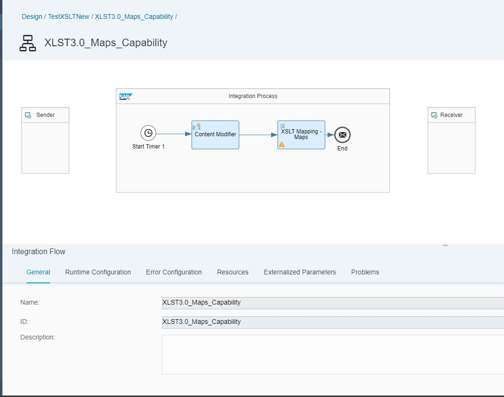
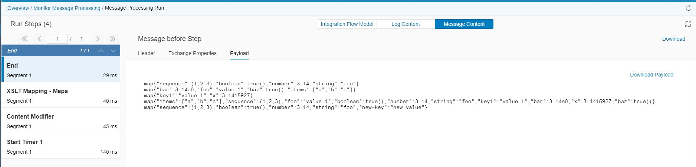

# Use Map data structures in XSLT Mapping

|[Kamlesh Zanje](https://github.com/kamleshzanje)|
----|----|

Utilize [Map](https://www.w3.org/TR/xslt-30/#map) data structures in XSLT Mappings flow step.
The Resource property holds the link to the XSLT source file that needs to be modified.

[Download the integration flow Sample](XLST3.0_Maps_Capability.zip)
## Recipe


Step|Code|Why?
----|----|----
Declare namespace for Map  |xmlns:map="http://www.w3.org/2005/xpath-functions/map"|Namespace declaration required to leverage map functions.
Create map using [XPath 3.1 map constructor](https://www.w3.org/TR/xpath-31/#id-map-constructors)||A Map is created using a MapConstructor
Create map from a JSON string using the [parse-json function](https://www.w3.org/TR/xpath-functions/#func-parse-json)|fn:parse-json($json-text as xs:string?) as item()?|Parses a string supplied in the form of a JSON text, returning the results typicallyin the formof a map or array.
Create map using [xsl:map and xsl:map-entry instructions](https://www.w3.org/TR/xslt-30/#map-instructions)||Two instructions are added to XSLT to facilitate the construction of maps.
Merge several maps into a map using [map:merge](https://www.w3.org/TR/xpath-functions/#func-map-merge)| |Returns a map that combines the entries from a number of existing maps.
Get a new map reference after each [map:put](https://www.w3.org/TR/xpath-functions/#func-map-put) call| | Returns a map containing all the contents of the supplied map, but with an additional entry, which replaces any existing entry for the same key.
Get a new map reference after each [map:remove](https://www.w3.org/TR/xpath-functions/#func-map-remove) call| | Returns a map containing all the entries from a supplied map, except those having a specified key.


## References
* [Map specification in XSLT 3.0](https://www.w3.org/TR/xslt-30/#map)
* [All Map functions specificed in XPath 3.1](https://www.w3.org/TR/xpath-functions/#map-functions)
* [Saxonica - Functions available for Map](https://www.saxonica.com/html/documentation/functions/map/)
* [SAP Help - Create XSLT Mapping](https://help.sap.com/viewer/368c481cd6954bdfa5d0435479fd4eaf/Cloud/en-US/5ce1f15f54244d4aa557e9c79d93a684.html)
* [Cloud Platform Integration – XSLT Mapping is enriched with XSLT 3.0 specification](https://blogs.sap.com/2019/04/16/cloud-platform-integration-xslt-mapping-is-enriched-with-xslt-3.0-specification/)
* [What is new in XSLT 3.0](https://www.w3.org/TR/xslt-30/#whats-new-in-xslt3)

## Sample integration flow
The integration flow depicted in the recipe is very simple which contains start timer and XSLT Mapping step through which we can leverage the benefits of XSL 3.0 specification that shall use the inbuild maps functions.



### Sample Script
This is the script used in the sample integration flow which starts with namespace declaration for maps and then uses different functions of maps to show it's rich capability.
* [map-constructors](https://www.w3.org/TR/xpath-31/#id-map-constructors)
* [parse-json](https://www.w3.org/TR/xpath-functions/#func-parse-json)
* [map-merge](https://www.w3.org/TR/xpath-functions/#func-map-merge)
* [map-put](https://www.w3.org/TR/xpath-functions/#func-map-put)


```
<?xml version="1.0" encoding="UTF-8"?>
<xsl:stylesheet xmlns:xsl="http://www.w3.org/1999/XSL/Transform"
    xmlns:xs="http://www.w3.org/2001/XMLSchema"
    xmlns:math="http://www.w3.org/2005/xpath-functions/math"
    xmlns:map="http://www.w3.org/2005/xpath-functions/map"
    xmlns:array="http://www.w3.org/2005/xpath-functions/array"
    exclude-result-prefixes="xs math map array"
    version="3.0">

  <xsl:output method="adaptive" indent="yes"/>

  <!-- a map constructed with XPath 3.1 map constructor https://www.w3.org/TR/xpath-31/#id-map-constructors -->
  <xsl:param name="map1" as="map(*)" select="map { 'string' : 'foo', 'number' : 3.14, 'boolean' : true(), 'sequence' : (1, 2, 3) }"/>

  <xsl:param name="json-string" as="xs:string">
      {
        "foo" : "value 1",
        "bar" : 3.14,
        "baz" : true,
        "items" : ["a", "b", "c" ]
      }
  </xsl:param>

  <!-- a map constructed from a string containing JSON using the parse-json function https://www.w3.org/TR/xpath-functions/#func-parse-json -->
  <xsl:param name="map2" as="map(*)" select="parse-json($json-string)"/>

  <!-- a map constructed using the XSLT xsl:map and xsl:map-entry instructions https://www.w3.org/TR/xslt-30/#map-instructions -->
  <xsl:param name="map3" as="map(*)">
      <xsl:map>
          <xsl:map-entry key="'key1'" select="'value 1'"/>
          <xsl:map-entry key="'x'" select="3.1415927"/>
      </xsl:map>
  </xsl:param>

  <!-- a map constructed by merging several maps using the map:merge function https://www.w3.org/TR/xpath-functions/#func-map-merge -->
  <xsl:param name="map4" as="map(*)" select="map:merge(($map1, $map2, $map3))"/>

  <!-- a map constructed by putting a new value into an existing map using the map:put function https://www.w3.org/TR/xpath-functions/#func-map-put -->
  <xsl:param name="map5" as="map(*)" select="map:put($map1, 'new-key', 'new value')"/>

  <xsl:template match="/">
      <xsl:sequence select="$map1, $map2, $map3, $map4, $map5"/>
  </xsl:template>

</xsl:stylesheet>
```


### Sample Output
Output of the maps function can be experienced in the Monitor's message processing view.


