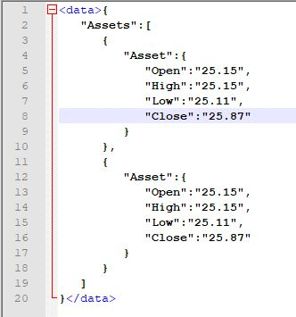

# Convert JSON to XML using XSLT Mappings

|[Kamlesh Zanje](https://github.wdf.sap.corp/I043359 )|
----|----|

This recipe converts and incoming file in JSON format into XML format

[Download the integration flow sample](XSLT_30__JSON_To_XML.zip)
## Recipe

Step|Code|Why?
----|----|----
Declare namespace for xpath functions [Namespace](http://www.w3.org/2005/xpath-functions)|```xmlns:xsl="http://www.w3.org/1999/XSL/Transform" xmlns:math="http://www.w3.org/2005/xpath-functions/math" xmlns:xs="http://www.w3.org/2001/XMLSchema" ```| Import of the function libraries in the XSLT
Function:json-to-xml usage [usage](https://www.saxonica.com/html/documentation/functions/fn/json-to-xml.html)||Parses a string supplied in the form of a JSON text, returning the results in theformof an XML document node


## References
* [Saxonica - json-to-xml function](https://www.saxonica.com/html/documentation/functions/fn/json-to-xml.html)
* [SAP Help - Create XSLT Mapping](https://help.sap.com/viewer/368c481cd6954bdfa5d0435479fd4eaf/Cloud/en-US/5ce1f15f54244d4aa557e9c79d93a684.html)
* [Cloud Platform Integration – XSLT Mapping is enriched with XSLT 3.0 specification](https://blogs.sap.com/2019/04/16/cloud-platform-integration-xslt-mapping-is-enriched-with-xslt-3.0-specification/)
* [What is new in XSLT 3.0](https://www.w3.org/TR/xslt-30/#whats-new-in-xslt3)


## Sample integration flow
The integration flow depicted in the recipe is very simple which contains start timer, content modifier to feed the payload and XSLT Mapping step through which we can leverage the benefit of XSL 3.0 specification that shall convert the JSON payload to XML.


### Sample Script
This is the script used in the sample integration flow which starts with namespace declaration and then uses the templates to convert the json to xml.
```
<?xml version="1.0" encoding="UTF-8"?>

<xsl:stylesheet
      xmlns:xsl="http://www.w3.org/1999/XSL/Transform"
      xmlns:math="http://www.w3.org/2005/xpath-functions/math"
      xmlns:xs="http://www.w3.org/2001/XMLSchema"
      exclude-result-prefixes="xs math"
      version="3.0">

  <xsl:mode
      streamable="yes" />

  <xsl:output
      indent="yes" />

  <xsl:template
      match="data">
    <xsl:copy>
      <xsl:apply-templates
            select="json-to-xml(.)/*"/>    
    </xsl:copy>
  </xsl:template>

  <xsl:template
        match="*[@key]"
        xpath-default-namespace="http://www.w3.org/2005/xpath-functions">
      <xsl:element name="{@key}">
          <xsl:apply-templates/>
      </xsl:element>
  </xsl:template>

</xsl:stylesheet>

```

### Sample Input
The JSON provided in this image should be feed in the message body of the content modifier - "JSON Payload".


### Sample Output
Output of the JSON to XML conversion can be experienced in the Monitor's message processing view.

