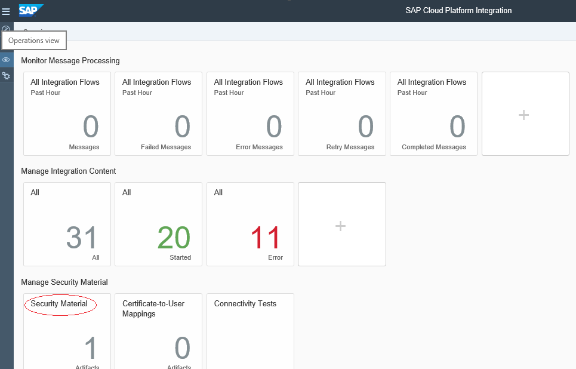
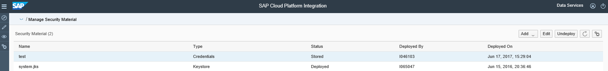
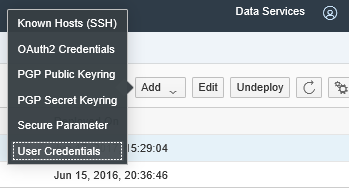
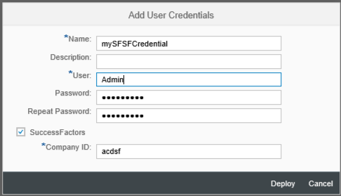
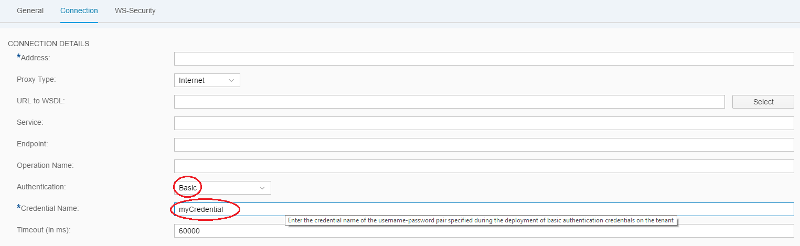

# About Credentials

\| [Recipes by Topic](../../readme.md ) \| [Recipes by Author](../../author.md ) \| [Request Enhancement](https://github.com/SAP-samples/cloud-integration-flow/issues/new?assignees=&labels=Recipe%20Fix,enhancement&template=recipe-request.md&title=Improve%20About-Credentials ) \| [Report a bug](https://github.com/SAP-samples/cloud-integration-flow/issues/new?assignees=&labels=Recipe%20Fix,bug&template=bug_report.md&title=Issue%20with%20About-Credentials ) \| [Fix documentation](https://github.com/SAP-samples/cloud-integration-flow/issues/new?assignees=&labels=Recipe%20Fix,documentation&template=bug_report.md&title=Docu%20fix%20About-Credentials ) \|

 | [Meghna Shishodiya](https://github.com/author-profile ) |
----|----|

This recipe provides an overview on why we need Credentials and how to use them in SAP Cloud Platform integration

## Recipe

**Credential:**
Credential is a means of using user-password in a Cloud Platform Integration process.
You need to use user-password when connecting to a system via basic authentication.

**Need for credentials:**
If user-password is configured as a part of the scenario configuration, even though the password shows as masked characters on the screen, it is stored as plain text in the system. Due to the overhead involved and the corresponding performance implication of storing the entire scenario configuration as encrypted, only sensitive information is stored by the system as encrypted. In order to mark the user-password as sensitive information, we create a special artifact called *credentials* and deploy it explicitly on the tenant.

**Creating a credential artifact:**
In order to create a credential, go to the *Operations view* in your *web interface* and click on *Security Material*:

Clicking on *Security Material* launches the following screen:

Click on the *Add* dropdown and select *User Credentials*:

On clicking on *User Credentials*, the *Add User Credential* pop-up like the one below comes up:

Give a unique name to this credential. User and password field should be filled with the username and password to connect to the backend system. An optional *Description* can be entered to adds more details to the credential. Click on *Deploy* to store the credential on the tenant in an encrypted form.

**Creating a SuccessFactor credential:**

The same procedure can be used to create a SuccessFactor credential. A SuccessFactor credential needs a company ID additionally - click on the *SuccessFactor* checkbox to enable the *Company ID* textbox.

Click on *Deploy* to store the credential on the tenant in an encrypted form.

**Using a credential:**
In channel configuration, enter the name of the credential (not the user name) in the *Credential Name* field:

