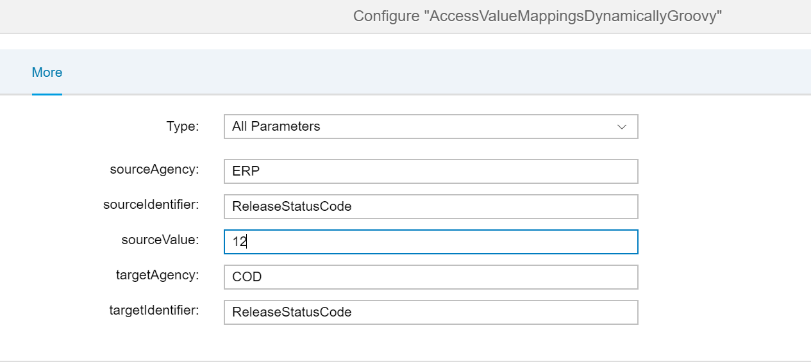

# Accessing Value Mappings from Groovy script
\| [Recipes by Topic](../../readme.md ) \| [Recipes by Author](../../author.md ) \| [Request Enhancement](https://github.com/SAP-samples/cloud-integration-flow/issues/new?assignees=&labels=Recipe%20Fix,enhancement&template=recipe-request.md&title=Improve%20Accessing%20value%20mappings%20from%20Groovy%20script ) \| [Report a bug](https://github.com/SAP-samples/cloud-integration-flow/issues/new?assignees=&labels=Recipe%20Fix,bug&template=bug_report.md&title=Issue%20with%20Accessing%20value%20mappings%20from%20Groovy%20script ) \| [Fix documentation](https://github.com/SAP-samples/cloud-integration-flow/issues/new?assignees=&labels=Recipe%20Fix,documentation&template=bug_report.md&title=Docu%20fix%20Accessing%20value%20mappings%20from%20Groovy%20script ) \|

|[Sharad Dixit](https://github.com/sharadiiita)|
----|----|

Use ```ITApiFactory.getApi()``` to get ```ValueMappingAPI``` class that can be used to retrieve the mappings.

[Download the integration flow Sample](AccessValueMappingsFromScript.zip)


## Recipe
Step|Code|Why?
----|----|----
Import classes | ```com.sap.it.api.ITApiFactory;``` ```com.sap.it.api.mapping.ValueMappingApi;```|
Get a handle to ```ITApiFactory```  | ```def valueMapApi         = ITApiFactory.getApi(ValueMappingApi.class, null);```|
Retrieve the Value Mappings| ```def value = valueMapApi.getMappedValue(sourceAgency, sourceIdentifier, sourceValue, targetAgency, targetIdentifier); ```|Input the source and target schema for the value mappings and source value for which value mapping need to be retrieved  
Print the output value | ```messageLog.addAttachmentAsString("Output : Target Value Mapping is  ", value, "text/plain");```| Output the selected value mapping.


## Sample integration flow
We have a scheduler set at "Run Once". A Content Modifier will take user input values for which value mapping need to be retrieved. If retrieval is successful then iflow will log corresponding output values else it will log value not found.





### Sample Script
This is the script used in the sample
```
import com.sap.gateway.ip.core.customdev.util.Message;
import java.util.HashMap;
import com.sap.it.api.ITApiFactory;
import com.sap.it.api.ITApi;
import com.sap.it.api.mapping.ValueMappingApi;

def Message processData(Message message) {
    //Body

    def valueMapApi         = ITApiFactory.getApi(ValueMappingApi.class, null);
    def map                 = message.getProperties();

    def sourceAgency        = map.get("sourceAgency");
    def sourceIdentifier    = map.get("sourceIdentifier");
    def sourceValue         = map.get("sourceValue");
    def targetAgency        = map.get("targetAgency");
    def targetIdentifier    = map.get("targetIdentifier");

    def value = valueMapApi.getMappedValue(sourceAgency, sourceIdentifier, sourceValue, targetAgency, targetIdentifier);

    def messageLog = messageLogFactory.getMessageLog(message);
    if (messageLog != null ) {
        if ( value != null ){
        messageLog.addAttachmentAsString("Output : Target Value Mapping is  ", value, "text/plain");
        }
        else{
            messageLog.addAttachmentAsString("Output : Target Value Mapping is  ", "Not Found", "text/plain");
        }
    }
    return message;
}
```

### Sample Input
In input we want to retrieve target value mapping for ```sourceValue``` "SHARAD"\
\


### Sample Output
Output Value mapping is printed for the given source value.\
\

