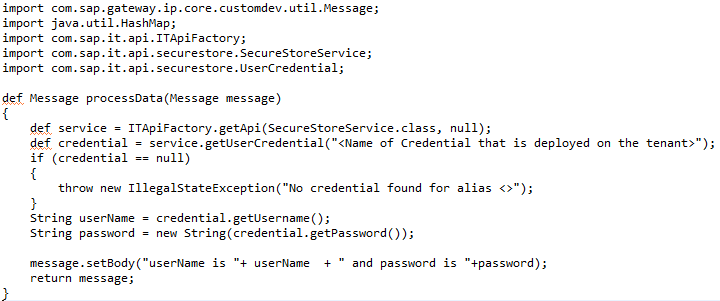

# Accessing credentails from a script

\| [Recipes by Topic](../../readme.md ) \| [Recipes by Author](../../author.md ) \| [Request Enhancement](https://github.com/SAP-samples/cloud-integration-flow/issues/new?assignees=&labels=Recipe%20Fix,enhancement&template=recipe-request.md&title=Improve%20Accessing-credentails-from-a-script ) \| [Report a bug](https://github.com/SAP-samples/cloud-integration-flow/issues/new?assignees=&labels=Recipe%20Fix,bug&template=bug_report.md&title=Issue%20with%20Accessing-credentails-from-a-script ) \| [Fix documentation](https://github.com/SAP-samples/cloud-integration-flow/issues/new?assignees=&labels=Recipe%20Fix,documentation&template=bug_report.md&title=Docu%20fix%20Accessing-credentails-from-a-script ) \|

 | [Meghna Shishodiya](https://github.com/author-profile ) |
----|----|

This recipe will provide step by step explanation on how to retrieve credentials through a script.

[Download the integration flow Sample](AccessCredentialFromScript.zip)

## Recipe

The user/password configured in a deployed credential can be accessed programmatically from a script with the help of the **getUserCredential** api of the **SecureStoreService** class.

**Classes needed:**
com.sap.it.api.securestore.SecureStoreService;
com.sap.it.api.securestore.UserCredential;

**Method signature:**

```
public UserCredential getUserCredential(String alias)
```


**Sample Code:**

Get a handle to the **SecureStoreService** service:

```
def service = ITApiFactory.getApi(SecureStoreService.class, null);

```

Retrieve the target value using:

```
def credential = service.getUserCredential("<Name of Credential that is deployed on the tenant>");
```

Finally retrieve the username and password from the credential object:

```
String userName = credential.getUsername();
String password = new String(credential.getPassword());
```


**Example:**



The above code will print the retrieved user and password to the message payload (body).


### Related Recipes
* [upstream-recipe-name](../upstream-recipe-folder-name)
* [alternate-recipe-name](../alternate-recipe-folder-name)
