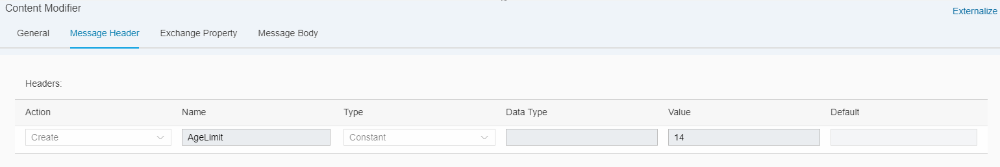

# Accessing header or exchange property in XPATH expressions

\| [Recipes by Topic](../../readme.md ) \| [Recipes by Author](../../author.md ) \| [Request Enhancement](https://github.com/SAP-samples/cloud-integration-flow/issues/new?assignees=&labels=Recipe%20Fix,enhancement&template=recipe-request.md&title=Improve%20Accessing-header-or-exchange-property-in-XPATH-expressions ) \| [Report a bug](https://github.com/SAP-samples/cloud-integration-flow/issues/new?assignees=&labels=Recipe%20Fix,bug&template=bug_report.md&title=Issue%20with%20Accessing-header-or-exchange-property-in-XPATH-expressions ) \| [Fix documentation](https://github.com/SAP-samples/cloud-integration-flow/issues/new?assignees=&labels=Recipe%20Fix,documentation&template=bug_report.md&title=Docu%20fix%20Accessing-header-or-exchange-property-in-XPATH-expressions ) \|

 | [Meghna Shishodiya](https://github.com/author-profile ) |
----|----|

This recipe shows how to access a header or property from an XPATH

[Download the reuseable integration flow](Accessing-Headers-in-XPATH.zip)

## Recipe

Assume you set a header _AgeLimit_ is configured with a value 14.


You have a message with the following payload and you now want to filter all students who are 14 and above:
```
<School>
	<Grade>
<Student>
		<Name>Amit</Name>
		<Age>10</Age>
	   </Student>
	<Student>
		<Name>Varun</Name>
		<Age>11</Age>
	</Student>
	<Student>
		<Name>Vijay</Name>
		<Age>9</Age>
	</Student>
	<Student>
		<Name>Raj</Name>
		<Age>13</Age>
	</Student>
	<Student>
		<Name>Arjun</Name>
		<Age>14</Age>
	</Student>
	<Student>
		<Name>Aditya</Name>
		<Age>15</Age>
	</Student>
	<Student>
		<Name>Arun</Name>
		<Age>11</Age>
	</Student>
	<Student>
		<Name>Naveen</Name>
		<Age>10</Age>
	</Student>
	<Student>
		<Name>Akhil</Name>
		<Age>8</Age>
	</Student>
	</Grade>
</School>
```
In order to choose all students who are 14 years or more, we can write the following XPATH:
/School/Grade/Student[Age >= $AgeLimit]


The same can be accomplished with a property. Use the same property name in the same way in an XPath.

> If the integration flow has a header and property with the same name, then the header will take preference.
