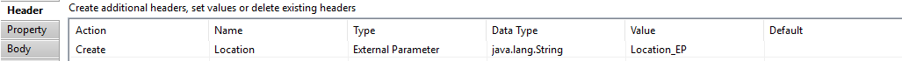
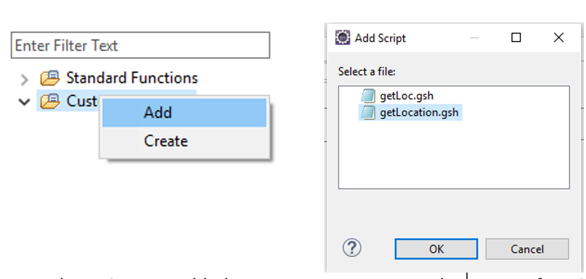
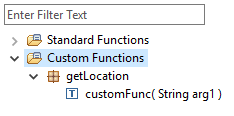
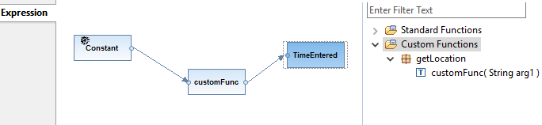

# Accessing header or property or externalized parameter from Message Mapping

\| [Recipes by Topic](../../readme.md ) \| [Recipes by Author](../../author.md ) \| [Request Enhancement](https://github.com/SAP-samples/cloud-integration-flow/issues/new?assignees=&labels=Recipe%20Fix,enhancement&template=recipe-request.md&title=Improve%20Accessing-header-or-property-or-externalized-parameter-from-Message-Mapping ) \| [Report a bug](https://github.com/SAP-samples/cloud-integration-flow/issues/new?assignees=&labels=Recipe%20Fix,bug&template=bug_report.md&title=Issue%20with%20Accessing-header-or-property-or-externalized-parameter-from-Message-Mapping ) \| [Fix documentation](https://github.com/SAP-samples/cloud-integration-flow/issues/new?assignees=&labels=Recipe%20Fix,documentation&template=bug_report.md&title=Docu%20fix%20Accessing-header-or-property-or-externalized-parameter-from-Message-Mapping ) \|

 | [Meghna Shishodiya](https://github.com/author-profile ) |
----|----|

This recipe shows how you can access headers, properties and externalized parameter from a message map

[Download the integration flow Sample](AccessinHeaderProperty&ExternalizedParameterFromMessageMapping.zip)

## Recipe

**Motivation:**
You need to access and set Header, Property and Externalized Parameters in Message Mapping

**Solution:**
Create a script with an extension .gsh in the script folder of your project containing the following code:

`
import com.sap.it.api.mapping.MappingContext`

`def String getProperty(String myProperty, MappingContext context) {
    def myPropertyValue = context.getProperty(myProperty);
    return myPropertyValue;
}`

`def String getHeader(String myHeader, MappingContext context) {
    def myHeaderValue = context.getProperty(myHeader);
    return myHeaderValue;
}
`

For an Externalized Parameter, use a content modifier to assign the value of the externalized parameter to either a property or a header:

Then using the above script, you can use `getHeader/getProperty` to retrieve the value.

Now go to the message mapping and add *Custom function*, browse to the script file that you created above:

Once the script gets added, you see a new entry under Custom function:

Now drag the function to your mapping canvas:

Add a *Const* and assign it the name of the header or property you want to retrieve.

The name of the header or property shall be used to retrieve its value using the custom function and the retrieved value shall be assigned to the target node.
