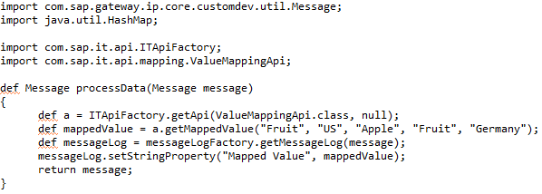
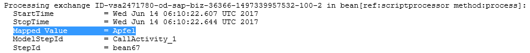

# Accessing valueMaps from a script

\| [Recipes by Topic](../../readme.md ) \| [Recipes by Author](../../author.md ) \| [Request Enhancement](https://github.com/SAP-samples/cloud-integration-flow/issues/new?assignees=&labels=Recipe%20Fix,enhancement&template=recipe-request.md&title=Improve%20Accessing-valueMaps-from-a-script ) \| [Report a bug](https://github.com/SAP-samples/cloud-integration-flow/issues/new?assignees=&labels=Recipe%20Fix,bug&template=bug_report.md&title=Issue%20with%20Accessing-valueMaps-from-a-script ) \| [Fix documentation](https://github.com/SAP-samples/cloud-integration-flow/issues/new?assignees=&labels=Recipe%20Fix,documentation&template=bug_report.md&title=Docu%20fix%20Accessing-valueMaps-from-a-script ) \|

 | [Meghna Shishodiya](https://github.com/author-profile ) |
----|----|

This recipe show how to access the information stored in the valueMaps artifact from scripts

[Download the integration flow Sample](accessValueMapsInScripts.zip)\
[Download the valueMap](TestValueMap.zip)

## Recipe

Valuefrom valueMaps can be accessed programmatically from a script with the help of the `getMappedValue` api of the `ValueMappingApi` class.

**Classes needed:**

`com.sap.it.api.ITApiFactory`
`com.sap.it.api.mapping.ValueMappingApi`

**Method signature:**

`public String getMappedValue(String sourceAgency, String sourceIdentifier, String sourceValue,             String targetAgency, String targetIdentifier);`

**Sample Code:**

Get a handle to the `ValueMappingApi` service:
`def service = ITApiFactory.getApi(ValueMappingApi.class, null);`

Retrieve the target value using:
`def mappedValue = service.getMappedValue(<SrcAgencey>,<SrcSchema>,<SrcValue>,<TargetAgency>, <TargetSchema>); `

**Example:**

The above code will print the retrieved value to the message processing log.

