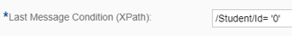
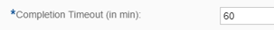
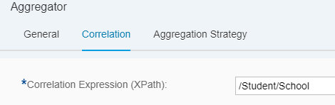
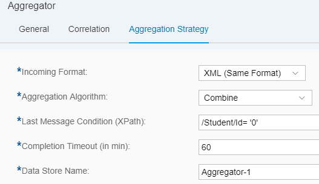
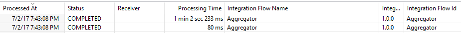
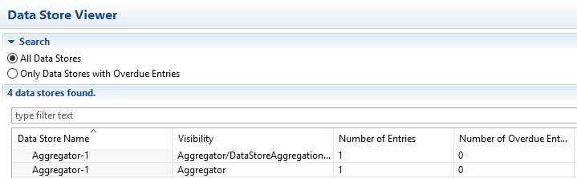

# title-do-some-code-thing

\| [Recipes by Topic](../../readme.md ) \| [Recipes by Author](../../author.md ) \| [Request Enhancement](https://github.com/SAP-samples/cloud-integration-flow/issues/new?assignees=&labels=Recipe%20Fix,enhancement&template=recipe-request.md&title=Improve%20escaped-do-some-code-thing-%20 ) \| [Report a bug](https://github.com/SAP-samples/cloud-integration-flow/issues/new?assignees=&labels=Recipe%20Fix,bug&template=bug_report.md&title=Issue%20with%20escaped-do-some-code-thing-%20 ) \| [Fix documentation](https://github.com/SAP-samples/cloud-integration-flow/issues/new?assignees=&labels=Recipe%20Fix,documentation&template=bug_report.md&title=Docu%20fix%20escaped-do-some-code-thing-%20 ) \|

 | [author-name](https://github.com/author-profile ) |
----|----|

two-sentence-description-of-the-value-add-of-the-recipe

[Download the integration flow Sample](Aggregator.zip)

## Recipe

**Aggregator:**

An Aggregator is a process step used for collecting messages until a condition is met.

It can collect messages across many execution of an integration flow, not only one. If the integration flow receives 5 messages, all the messages are collected by the same instance of the Aggregator.
The Aggregator collects the messages in a data store.
You can only aggregate XML messages.


The pipeline processing does not proceed any further than the Aggregator until either of the following happen:
1.	The Aggregator receives a message that satisfies the condition mentioned in Last Message Condition parameter of the Aggregator configuration.


2.	The Completion Timeout occurs.

  


All steps configured after the Aggregator steps will only be processed after one of the above conditions are satisfied.

**Configuring the Aggregator:**

The first tab is the General tab and it allows you to assign a name to the Aggregator.

The second tab is the Correlation tab – here you provide the field based on which you relate the messages. All messages that have the same value for the field mention here will be grouped in the same list.



You can provide many student records to the Aggregator. All the students that belong to the same School will be clubbed in the same list. Other students that belong to a different school will be collected in the same Aggregator but part of a different list. See details in the example section mentioned below.

The third tab is where you can define the Aggregation Strategy.



**Incoming Format:** The format of the message being aggregated. This is always an XML.

**Aggregation Algorithm:** Here you have 2 options:

  * **Combine:** If this option is selected, the collected messages shall just be concatenated in the order they are received.
  * **Combine in Sequence:** if this option is selected, the collected messages shall be collected and then ordered/sorted on the field selected in the Message Sequence Expression parameter.

**Message Sequence Expression (XPath):** this parameter is only enabled when the Aggregation Algorithm is set to Combine in Sequence. Define the XPath of the field in the messages based on which the Aggregator must sort the messages.

**Last Message Condition (XPath)** define the field in the message and its corresponding value that should mark the end of message collection. For example, if the condition is set to /Student/Id = 0, it means that when the Aggregator receives a message where the Id field is set to 0, the Aggregator shall stop processing.

**Completion Timeout (in min):** the time in minutes after which the system should stop collecting messages in the Aggregator and continue processing the next steps in the pipeline.

**Data Store Name** this field is generally auto-populated. It indicates the name of the data store that will be used to store the messages collected by the Aggregator.


More about Aggregators:

1.	An Aggregator can be used to collect multiple groups of data in the same Aggregator.
2.	Aggregator is supported in a sub-process or an Exception sub-process.
3.	It can only collect XML messages
4.	An Aggregator step will have an additional entry in the Message Monitor with the same name:

  

5.	The data store viewer can be used to see, download and delete the messages collected by the Aggregator. As you can see below, there will be 2 entries for each Aggregator in the Data Store Viewer:

  

Example:
```
```The message structure is as follows:
<Student>
<Id>1</Id>
<Name>Amit</Name>
<Class>11</Class>
<School>DPS</School>
</Student>
```

The Correlation Expression is /Student/School. This means that all the students who have the same school shall be part of one list. The same aggregator shall hold all the different lists.

This scenario exposes a SOAP endpoint: <tmn-url>/cxf/AggregateMessages.
Post the following messages (one-by-one) to the SOAP endpoint. There are 9 messages containing records of 9 students belonging to 2 different schools. None of these 9 messages satisfy the condition for the Last Message. Later we shall post 2 more messages; one per school to indicate the Aggregator to stop collecting the messages and allow the pipeline to proceed.

```
<soapenv:Envelope xmlns:soapenv="http://schemas.xmlsoap.org/soap/envelope/" xmlns:dis="http://camel.apache.org/cxf/jaxws/dispatch">
   <soapenv:Header/>
   <soapenv:Body>
      <Student>
	<Id>1</Id>
	<Name>Amit</Name>
	<Class>11</Class>
	<School>DPS</School>
</Student>
   </soapenv:Body>
</soapenv:Envelope>

_____________________________________________

<soapenv:Envelope xmlns:soapenv="http://schemas.xmlsoap.org/soap/envelope/" xmlns:dis="http://camel.apache.org/cxf/jaxws/dispatch">
   <soapenv:Header/>
   <soapenv:Body>
      <Student>
	<Id>2</Id>
	<Name>Sumit</Name>
	<Class>12</Class>
	<School>Ekya</School>
</Student>
   </soapenv:Body>
</soapenv:Envelope>

_____________________________________________

<soapenv:Envelope xmlns:soapenv="http://schemas.xmlsoap.org/soap/envelope/" xmlns:dis="http://camel.apache.org/cxf/jaxws/dispatch">
   <soapenv:Header/>
   <soapenv:Body>
      <Student>
	<Id>3</Id>
	<Name>Aman</Name>
	<Class>10</Class>
	<School>DPS</School>
</Student>
   </soapenv:Body>
</soapenv:Envelope>

_____________________________________________

<soapenv:Envelope xmlns:soapenv="http://schemas.xmlsoap.org/soap/envelope/" xmlns:dis="http://camel.apache.org/cxf/jaxws/dispatch">
   <soapenv:Header/>
   <soapenv:Body>
      <Student>
	<Id>4</Id>
	<Name>Ankit</Name>
	<Class>11</Class>
	<School>Ekya</School>
</Student>
   </soapenv:Body>
</soapenv:Envelope>

_____________________________________________

<soapenv:Envelope xmlns:soapenv="http://schemas.xmlsoap.org/soap/envelope/" xmlns:dis="http://camel.apache.org/cxf/jaxws/dispatch">
   <soapenv:Header/>
   <soapenv:Body>
      <Student>
	<Id>5</Id>
	<Name>Ashmit</Name>
	<Class>9</Class>
	<School>DPS</School>
</Student>
   </soapenv:Body>
</soapenv:Envelope>

_____________________________________________

<soapenv:Envelope xmlns:soapenv="http://schemas.xmlsoap.org/soap/envelope/" xmlns:dis="http://camel.apache.org/cxf/jaxws/dispatch">
   <soapenv:Header/>
   <soapenv:Body>
      <Student>
	<Id>6</Id>
	<Name>Namit</Name>
	<Class>10</Class>
	<School>Ekya</School>
</Student>
   </soapenv:Body>
</soapenv:Envelope>

_____________________________________________

<soapenv:Envelope xmlns:soapenv="http://schemas.xmlsoap.org/soap/envelope/" xmlns:dis="http://camel.apache.org/cxf/jaxws/dispatch">
   <soapenv:Header/>
   <soapenv:Body>
      <Student>
	<Id>7</Id>
	<Name>Shobhit</Name>
	<Class>6</Class>
	<School>DPS</School>
</Student>
   </soapenv:Body>
</soapenv:Envelope>

_____________________________________________

<soapenv:Envelope xmlns:soapenv="http://schemas.xmlsoap.org/soap/envelope/" xmlns:dis="http://camel.apache.org/cxf/jaxws/dispatch">
   <soapenv:Header/>
   <soapenv:Body>
      <Student>
	<Id>8</Id>
	<Name>Akhil</Name>
	<Class>7</Class>
	<School>Ekya</School>
</Student>
   </soapenv:Body>
</soapenv:Envelope>

_____________________________________________

<soapenv:Envelope xmlns:soapenv="http://schemas.xmlsoap.org/soap/envelope/" xmlns:dis="http://camel.apache.org/cxf/jaxws/dispatch">
   <soapenv:Header/>
   <soapenv:Body>
      <Student>
	<Id>9</Id>
	<Name>Anil</Name>
	<Class>8</Class>
	<School>DPS</School>
</Student>
   </soapenv:Body>
</soapenv:Envelope>
```
In the above samples, there are entries for 9 students who belong to 2 schools. The Aggregator is collecting all the records.
Now send the following 2 end messages separately.

```
<soapenv:Envelope xmlns:soapenv="http://schemas.xmlsoap.org/soap/envelope/" xmlns:dis="http://camel.apache.org/cxf/jaxws/dispatch">
   <soapenv:Header/>
   <soapenv:Body>
      <Student>
	<Id>0</Id>
	<Name>XXXX</Name>
	<Class>X</Class>
	<School>Ekya</School>
</Student>
   </soapenv:Body>
</soapenv:Envelope>

_____________________________________________

<soapenv:Envelope xmlns:soapenv="http://schemas.xmlsoap.org/soap/envelope/" xmlns:dis="http://camel.apache.org/cxf/jaxws/dispatch">
   <soapenv:Header/>
   <soapenv:Body>
      <Student>
	<Id>0</Id>
	<Name>XXXX</Name>
	<Class>X</Class>
	<School>DPS</School>
</Student>
   </soapenv:Body>
</soapenv:Envelope>
```

The value for Last Message Condition (XPath) is /Student/Id = '0'.
There is one end message for each school, thus, when the Aggregator receives these messages, it will stop collecting the records and send out a mail containing the students of the corresponding school.
One mail will contain all the students for DPS, whereas the other mail will contain the students of the school Ekya.

### Related Recipes
* [upstream-recipe-name](../upstream-recipe-folder-name)
* [alternate-recipe-name](../alternate-recipe-folder-name)

## References
* [Aggregator documentation](https://help.sap.com/viewer/368c481cd6954bdfa5d0435479fd4eaf/Cloud/en-US/aa238166757b4f11878c50b07eb8b4b9.html?q=Aggregator)
