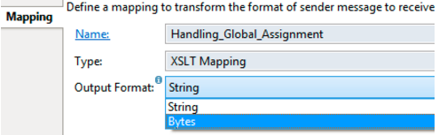

# Common Pitfalls

\| [Recipes by Topic](../../readme.md ) \| [Recipes by Author](../../author.md ) \| [Request Enhancement](https://github.com/SAP-samples/cloud-integration-flow/issues/new?assignees=&labels=Recipe%20Fix,enhancement&template=recipe-request.md&title=Improve%20Common-Pitfalls ) \| [Report a bug](https://github.com/SAP-samples/cloud-integration-flow/issues/new?assignees=&labels=Recipe%20Fix,bug&template=bug_report.md&title=Issue%20with%20Common-Pitfalls ) \| [Fix documentation](https://github.com/SAP-samples/cloud-integration-flow/issues/new?assignees=&labels=Recipe%20Fix,documentation&template=bug_report.md&title=Docu%20fix%20Common-Pitfalls ) \|

 | [Meghna Shishodiya](https://github.com/author-profile ) |
----|----|

Through this recipe, you can learn about the common pitfalls that you must keep in mind while developing integration flows in order to develop performant flows

## Recipe

1.	If you use * as a value for Allowed Headers, all the HTTP headers from the sender are passed to the receiver. This way you will not have any control over what was sent and sometimes it may even confuse the receiver.

2.	Use of Byte instead of String reduces the memory consumption:

3.	Do not access or set a datastore (local variable, global variable or aggregator) from within a parallel multicast. The parallel multicast spawns multiple threads, but a database transaction cannot be shared over multiple threads. Check if a sequential multicast can be used instead.
4.	Global variables make use of headers to perform db persist. Memory to these headers remain allocated even after the flow ends. In case the header is holding a large amount of data, it may fail the integration flow processing. It is important to release the memory allocated to the header (having the same name as the global variable) before the integration flow exits. This however cannot be performed from a content modifier - it will need to be done via a script.
5.	Local variables are alive even after the integration flow execution is over. Even though the local variable is visible only to the integration flow, it is important to note that the memory allocated to the variable is not variable is not released when the integration flow execution is over. It is important to reset the local variable in the beginning of the flow to avoid any values getting used from the previous flow. It is specifically relevant when the previous flow ended abruptly and the variable may be holding invalid data. For better memory management, it also makes sense to reset the local variables before exiting the integration flow.
6.	Never use an Aggregator step in a sub-process. The moment the sub-process exits the handle to the Aggregator is lost but the Aggregator stays allocated. It appears in Message Monitoring. Undeploying the corresponding integration flow does not release the Aggregator. Since Aggregator stores its data in the database, it poses stability and performance threats to the usage of database.
