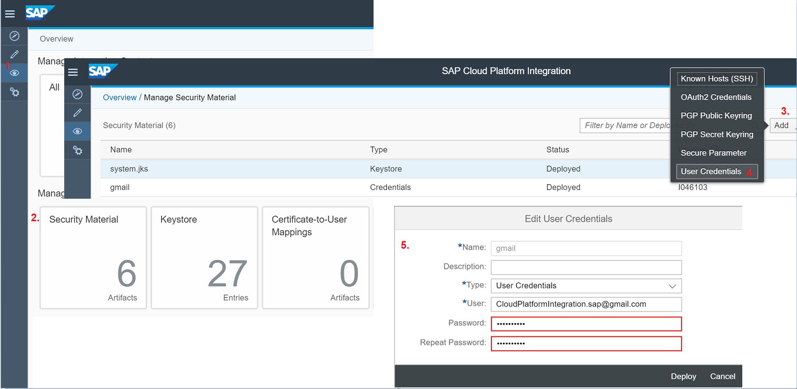
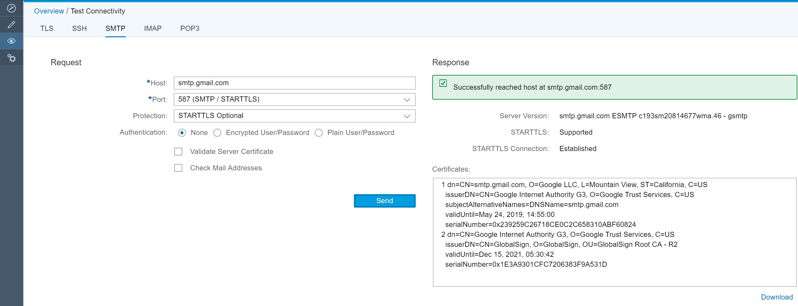
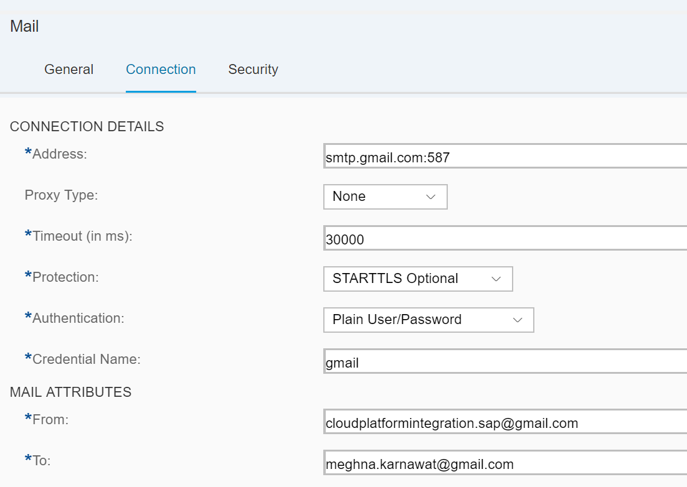

# Connect to Gmail using the mail adapter

\| [Recipes by Topic](../../readme.md ) \| [Recipes by Author](../../author.md ) \| [Request Enhancement](https://github.com/SAP-samples/cloud-integration-flow/issues/new?assignees=&labels=Recipe%20Fix,enhancement&template=recipe-request.md&title=Improve%20Connect-to-Gmail-using-the-mail-adapter ) \| [Report a bug](https://github.com/SAP-samples/cloud-integration-flow/issues/new?assignees=&labels=Recipe%20Fix,bug&template=bug_report.md&title=Issue%20with%20Connect-to-Gmail-using-the-mail-adapter ) \| [Fix documentation](https://github.com/SAP-samples/cloud-integration-flow/issues/new?assignees=&labels=Recipe%20Fix,documentation&template=bug_report.md&title=Docu%20fix%20Connect-to-Gmail-using-the-mail-adapter ) \|

 | [Meghna Shishodiya](https://github.com/author-profile ) |
----|----|

This recipe provides steps to send mails on behalf of your Gmail account from SAP Cloud Platform Integration.

[Download the integration flow Sample](zip-file-name.zip)
[Download the reuseable integration flow](zip-file-name.zip)

## Recipe

**Motivation:**
You want to send a mail on behalf of Gmail from Cloud Platform Integration.

Pre-requisites:

Step|Code|Why?
----|----|----
1. Create and deploy a credential for accessing sender mail account.  Go to the Operations view -> Security Material -> Add User Credential: |   | Here I am using a gmail account, so I will need to create a credential carrying the corresponding user and password. |
2. Add the certificates of gmail into the tenant keystore. Go to Operations View -> Connection test -> SMTP: configure the settings as mentioned below and hit send.  | |You can see the corresponding certificate at the bottom of the response on the right-hand side. Download it and upload the 2 certificates(available in the downloaded zip) into the tenant keystore. |
3. Ensure that your gmail account can accept less secure access.   | In order to do this, goto https://www.google.com/settings/security/lesssecureapps  and click on “Turn On”.| |
4.	Allow Gmail to accept access from a non-browser device or application or a non-human interaction. | You can accomplish this by unlocking the captcha. Goto https://accounts.google.com/b/0/DisplayUnlockCaptcha and hit "Continue".| |
5.	Now configure a mail receiver and use the credential created above. Once configured, this account shall be used to send outgoing mails.   | | |

Use the following setting while you configure the receiver mail adapter:

### Related Recipes
* [upstream-recipe-name](../upstream-recipe-folder-name)
* [alternate-recipe-name](../alternate-recipe-folder-name)
