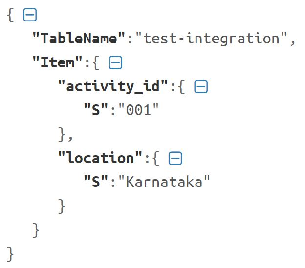
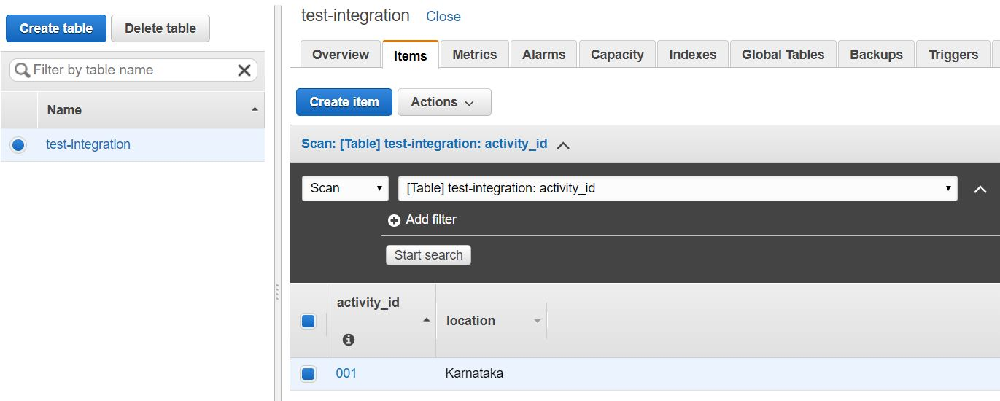

# Connect to Amazon DynamoDB
\| [Recipes by Topic](../../readme.md ) \| [Recipes by Author](../../author.md ) \| [Request Enhancement](https://github.com/SAP-samples/cloud-integration-flow/issues/new?assignees=&labels=Recipe%20Fix,enhancement&template=recipe-request.md&title=Improve%20Connect%20to%20Amazon%20DynamoDB ) \| [Report a bug](https://github.com/SAP-samples/cloud-integration-flow/issues/new?assignees=&labels=Recipe%20Fix,bug&template=bug_report.md&title=Issue%20with%20Connect%20to%20Amazon%20DynamoDB ) \| [Fix documentation](https://github.com/SAP-samples/cloud-integration-flow/issues/new?assignees=&labels=Recipe%20Fix,documentation&template=bug_report.md&title=Docu%20fix%20Connect%20to%20Amazon%20DynamoDB ) \|

|[Sunny Kapoor](https://github.com/simplykapoor)|
----|----|

Amazon DynamoDB is a fully managed non-relational database service that provides fast and predictable performance with seamless scalability. It is a schema-less database that only requires a table name and primary key.

To achieve the integration with Amazon DynamoDB, SAP CPI needs to make a rest call to DynamoDB endpoint.

[Download the Sample Integration Flow](Amazon_DynamoDB_Connectivity.zip)

## Recipe

Step|Code|Why?
----|----|----
Set Headers and Body| Sample Payload | These settings are specific to [Amazon DynamoDB - API PutItem](https://docs.aws.amazon.com/amazondynamodb/latest/APIReference/API_PutItem.html)
Set HTTP Authorization header with AWS4-HMAC-SHA256 signature| |Call [Generate AWS4-HMAC-SHA256 Authorization Header](..\GenerateAWS4_HMAC_SHA256\Generate_AWS4-HMAC-SHA256_Authorization_Header.zip) using Process Direct Adapter
Make a Rest POST Call to DynamoDB endpoint| | It may possible the you get the SSL handshake exception. To prevent this, do the TLS Connectivity Test to DynamoDB endpoint and upload the root certificate in CPI using Keystore manager as described in [SAP Cloud Platform Integration Connectivity Tests](https://www.youtube.com/watch?v=DQjSN6x8Kug&list=PLkzo92owKnVwUoypV34RbxBZihYqi6eE3)

### Related Recipes
* [Generate AWS4-HMAC-SHA256 Authorization Header](../GenerateAWS4_HMAC_SHA256)

## References
* [Amazon DynamoDB - API PutItem](https://docs.aws.amazon.com/amazondynamodb/latest/APIReference/API_PutItem.html)
* [SAP Cloud Platform Integration Connectivity Tests](https://www.youtube.com/watch?v=DQjSN6x8Kug&list=PLkzo92owKnVwUoypV34RbxBZihYqi6eE3)
* [Blog - Integrating C4C with AWS DynamoDB via CPI](https://blogs.sap.com/2018/09/20/integrating-c4c-with-aws-dynamodb-via-cpi/)

## Sample Integration Flow

We have a scheduler set at "Run Once". With each deployment it create/update a new/existing item in an Amazon DynamoDB table

[Download the Sample Integration Flow](Amazon_DynamoDB_Connectivity.zip)

### Sample Output

After the successful execution of an integration flow, new/existing item gets added/updated in the given DynamoDB table.
