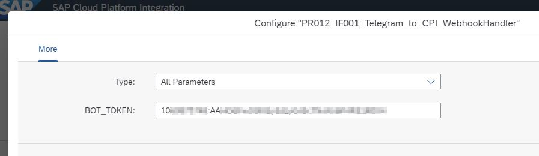
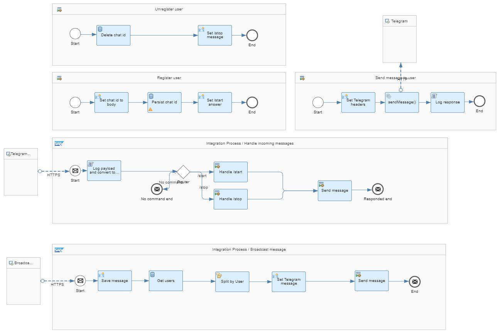

# Connect to Telegram Bot API (via Webhook)
\| [Recipes by Topic](../../readme.md ) \| [Recipes by Author](../../author.md ) \| [Request Enhancement](https://github.com/SAP-samples/cloud-integration-flow/issues/new?assignees=&labels=Recipe%20Fix,enhancement&template=recipe-request.md&title=Improve%20Connect%20to%20Amazon%20DynamoDB ) \| [Report a bug](https://github.com/SAP-samples/cloud-integration-flow/issues/new?assignees=&labels=Recipe%20Fix,bug&template=bug_report.md&title=Issue%20with%20Connect%20to%20Amazon%20DynamoDB ) \| [Fix documentation](https://github.com/SAP-samples/cloud-integration-flow/issues/new?assignees=&labels=Recipe%20Fix,documentation&template=bug_report.md&title=Docu%20fix%20Connect%20to%20Amazon%20DynamoDB ) \|

|[Raffael Herrmann](https://people.sap.com/r_herrmann)|
----|----|

Amazon DynamoDB is a fully managed non-relational database service that provides fast and predictable performance with seamless scalability. It is a schema-less database that only requires a table name and primary key.

To achieve the integration with Amazon DynamoDB, SAP CPI needs to make a rest call to DynamoDB endpoint.

[Download the Sample Integration Flow](Amazon_DynamoDB_Connectivity.zip)

## Recipe

Step|Code|Why?
----|----|----
Create Telegram bot and retrieve bot token | n/a | You need a Telegram bot to communicate with. It's not possible to connect directly to users without using a bot. Please follow the "How to create a Telegram bot" section in [this tutorial](https://blogs.sap.com/2019/12/14/how-to-broadcast-telegram-messages-via-sap-cpi-and-telegram-bots/#).
Configure bot token in the IFlow via the configuration screen | Sample configuration:  | The bot token is needed to identify yourself/target your bot via Telegram's api.
Deploy the IFlow & register the webhook | `https://api.telegram.org/bot{telegram_api_token}/setWebhook?url=https://{cpi_user}:{cpi_pass}@{iflow_endpoint}` | Telegram needs to know where to push the message at, the users send to your bot. Replace the {pattern} parts of the url with actual values and call the url in a webbrowser. The {telegram_api_token} is the one you received from the botfather when initially setting up your bot. The {cpi_user} and {cpi_pass} are user credentials of a user which is able to access your interface. (I know, it seems like bad practice, but Telegram doesn’t support another way of accessing secured endpoints right now…). The {iflow_endpoint} is your IFlows "webhookhandler"-endpoint url, but without the trailing “https://” part.

### Related Recipes
* none for now

## References
* [How to broadcast Telegram messages via SAP CPI and Telegram Bots](https://blogs.sap.com/2019/12/14/how-to-broadcast-telegram-messages-via-sap-cpi-and-telegram-bots/#)
* [Telegram Bot API reference](https://core.telegram.org/bots/api)

## Sample Integration Flow

After you registered the Webhookhandler as described in step 2 of the recipe, your IFlow is triggered everytime a user sends a message to your Telegram bot. If a user sends the command `/start` he will be registered for the boardcast list. If a user sends `/stop` he will be removed from the broadcast list.
If you want to broadcast a message to all of your bot users, you just have to HTTP/POST a plaintext to the `/telegram/broadcast`-endpoint of your IFlow.

[Download the Sample Integration Flow](Telegram_to_CPI_WebhookHandler.zip)

### Sample Output
n/a
