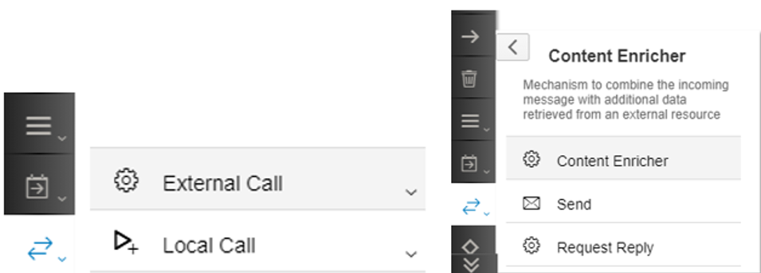
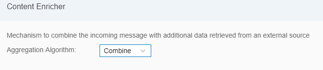
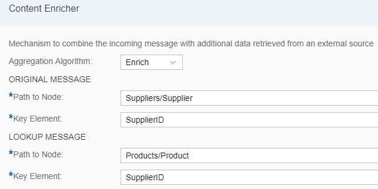
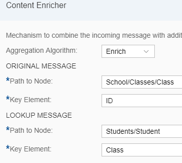

# Content Enricher

\| [Recipes by Topic](../../readme.md ) \| [Recipes by Author](../../author.md ) \| [Request Enhancement](https://github.com/SAP-samples/cloud-integration-flow/issues/new?assignees=&labels=Recipe%20Fix,enhancement&template=recipe-request.md&title=Improve%20Content-Enricher ) \| [Report a bug](https://github.com/SAP-samples/cloud-integration-flow/issues/new?assignees=&labels=Recipe%20Fix,bug&template=bug_report.md&title=Issue%20with%20Content-Enricher ) \| [Fix documentation](https://github.com/SAP-samples/cloud-integration-flow/issues/new?assignees=&labels=Recipe%20Fix,documentation&template=bug_report.md&title=Docu%20fix%20Content-Enricher ) \|

 | [Meghna Shishodiya](https://github.com/author-profile ) |
----|----|

This recipe talks about the purpose and details of the Content Enricher

[Download the integration flow Sample](zip-file-name.zip)\
2 integration flows are embedded here. The Subject of the outgoing mail will help you identify which mail belongs to which integration flow as both will get triggered when you deploy this flow.

## Recipe

A **Content Enricher** step allows you to enhance the message in the pipeline with additional information that is pulled from an external system.

The message in the pipeline is called *Original Message* and the message coming from the external system is called *Lookup Message*. The final message is referred to as the *Enriched Message*.

You can connect to the external system using the following *protocols*: SuccessFactors, SOAP 1.x and OData.

The Content Enricher allows you to combine the original message and lookup message in 2 ways:

1.	**Combine**:

  

  This concatenates the lookup message at the end of the original message creating a multimap structure:

`<?xml version="1.0" encoding="UTF-8"?>
<multimap:Messages xmlns:multimap="http://sap.com/xi/XI/SplitAndMerge">
<multimap:Message1>
<Original Message>
</multimap:Message1>
<multimap:Message2>
<Lookup Message>
</multimap:Message2>
</multimap:Messages>
`

2.	**Enrich:** Allows you to interleave the original message with the data from the lookup message based on a matching key value

  *Original Message/Path in Node:* The node of the original message in which the data from the lookup message will be nestled.

  *Original Message/Key Element:* The element whose value must be compared with an element from the lookup message to establish the correlation. This element must me referenced from the node specified in the previous field and not from the root element.

  *Lookup Message/Path in Node:* The node of the lookup message that gets embedded into the node of the original message specified above.

  *Lookup Message/Key Element:* The element whose value must be compared with an element from the original message to establish the correlation. This element must me referenced from the node specified in the previous field and not from the root element.

  

Assume the following messages:

Original Message

`<School>
  <Classes>
    <Class>
      <ID>1</ID>
      <ClassTeacher>Sita</ClassTeacher>
    </Class>
    <Class>
      <ID>2</ID>
      <ClassTeacher>Gita</ClassTeacher>
    </Class>
    <Class>
      <ID>3</ID>
      <ClassTeacher>Rita</ClassTeacher>
    </Class>
  </Classes>
</School>`

LookUp Message

`<Students>
  <Student>
    <Name> Amit</Name>
    <Class> 1</Class>
  </Student>
  <Student>
    <Name> Sumit</Name>
    <Class> 2</Class>
  </Student>
  <Student>
    <Name> Shamit</Name>
    <Class> 3</Class>
  </Student>
  <Student>
    <Name> Namit</Name>
    <Class> 1</Class>
  </Student>
  <Student>
    <Name> Gamit</Name>
    <Class> 2</Class>
  </Student>
</Students>`

**Output of Combine:**

`<?xml version="1.0" encoding="UTF-8"?>
<multimap:Messages xmlns:multimap="http://sap.com/xi/XI/SplitAndMerge">
<multimap:Message1>
<School>
  <Classes>
    <Class>
      <ID>1</ID>
      <ClassTeacher>Sita</ClassTeacher>
    </Class>
    <Class>
      <ID>2</ID>
      <ClassTeacher>Gita</ClassTeacher>
    </Class>
    <Class>
      <ID>3</ID>
      <ClassTeacher>Rita</ClassTeacher>
    </Class>
  </Classes>
</School></multimap:Message1>
<multimap:Message2>
<Students>
  <Student>
    <Name> Amit</Name>
    <Class> 1</Class>
  </Student>
  <Student>
    <Name> Sumit</Name>
    <Class> 2</Class>
  </Student>
  <Student>
    <Name> Shamit</Name>
    <Class> 3</Class>
  </Student>
  <Student>
    <Name> Namit</Name>
    <Class> 1</Class>
  </Student>
  <Student>
    <Name> Gamit</Name>
    <Class> 2</Class>
  </Student>
</Students</multimap:Message2>
</multimap:Messages>
`

**Output of Enrich:**

This setting means: Embed the Student node of the Lookup Message inside the Class node of the Original Message where the ID of the Class in the Original Message is equal to the Class of the Student in the Lookup Message.

`<School>
  <Classes>
    <Class>
      <ID>1</ID>
      <ClassTeacher>Sita</ClassTeacher>
      <Student>
        <Name> Amit</Name>
        <Class> 1</Class>
      </Student>
      <Student>
        <Name> Namit</Name>
        <Class> 1</Class>
      </Student>
    </Class>
    <Class>
      <ID>2</ID>
      <ClassTeacher>Gita</ClassTeacher>
      <Student>
        <Name> Sumit</Name>
        <Class> 2</Class>
      </Student>
      <Student>
        <Name> Gamit</Name>
        <Class> 2</Class>
      </Student>
    </Class>
    <Class>
      <ID>3</ID>
      <ClassTeacher>Rita</ClassTeacher>
      <Student>
        <Name> Shamit</Name>
        <Class> 3</Class>
    	</Student>
    </Class>
  </Classes>
</School>`
