Data Store Operations

\| [Recipes by Topic](../../readme.md ) \| [Recipes by Author](../../author.md ) \| [Request Enhancement](https://github.com/SAP-samples/cloud-integration-flow/issues/new?assignees=&labels=Recipe%20Fix,enhancement&template=recipe-request.md&title=Improve%20Data-Store-Operations ) \| [Report a bug](https://github.com/SAP-samples/cloud-integration-flow/issues/new?assignees=&labels=Recipe%20Fix,bug&template=bug_report.md&title=Issue%20with%20Data-Store-Operations ) \| [Fix documentation](https://github.com/SAP-samples/cloud-integration-flow/issues/new?assignees=&labels=Recipe%20Fix,documentation&template=bug_report.md&title=Docu%20fix%20Data-Store-Operations ) \|

 | [Meghna Shishodiya](https://github.com/author-profile ) |
----|----|

This recipe helps you understand the various operations that you can execute on a data store

[Download the integration flow Sample](DataStoreOperationse.zip)

## Recipe

**Data Store** is a collection of operations to allow you to store and retrieve messages into/from the database. You can use these operations to store, retrieve or delete entries from the data store.

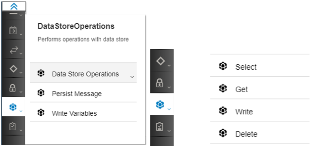

It provides the following 4 operations:
1.	Write – allows to store entries in the data store:
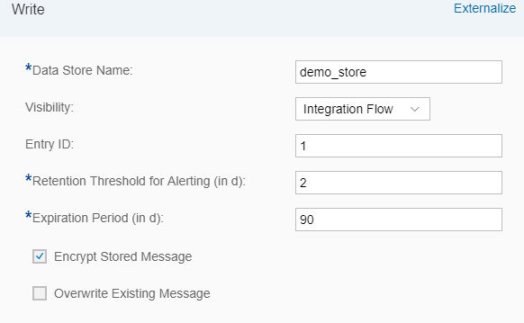
Data Store Name: The name of the data store where you would like to store this message. The name should not contain any white spaces and can be 20 characters long.
Visibility: indicates if the data store is only visible within the integration flow where it is defined or to all the integration flows that are deployed on that tenant.
Entry ID: a unique identifier to identify the entry. It can be picked from a header or from the message using XPath. If nothing is provided, the system generates a random GUID for this entry.
Retention Threshold for Alerting (in d): defines the number of days by when the entry must be read. Else an alert is generated in the cloud platform account. Default – 2days.
Expiration Period (in d): the number of days (from when the entry is written into the data store) after which the entry must be deleted from the data store.
Encrypt Stored Message: check this if you want to encrypt the message before storing.
Overwrite Existing Message:  check this if you want to overwrite a message (if one already exists) with the same Entry ID in this data store.

2.	Get – is used to retrieve one entry from the data store:
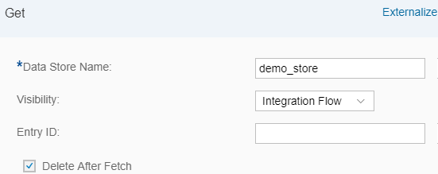
Data Store Name:  The name of the data store from where the entry needs to be retrieved.
Visibility: indicates if the data store is visible only to this integration flow or to all the integration flows on the tenant.
Entry ID: the unique identifier of the entry you want to retrieve from the data store. If this is left empty, the last entry that was added to the data store is retrieved. It can also be picked from a header or from the message using XPath.
Delta After Fetch: check this if you want to delete the entry from the data store after retrieving.

3.	Select – is used to retrieve multiple messages from the data store in one bulk:
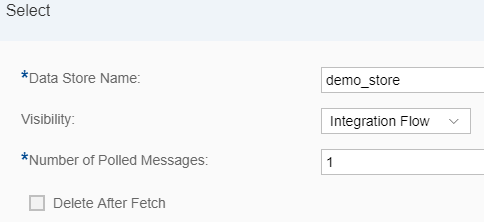
Data Store Name: The name of the data store from where the entries need to be retrieved
Visibility: indicates if the data store is visible only to this integration flow or to all the integration flows on the tenant.
Number of Polled Messages: enter the number of messages that you would like to retrieve from the data store.
Delta After Fetch: check this if you want to delete the entry from the data store after retrieving.

4.	Delete – allows you to delete messages from the data store
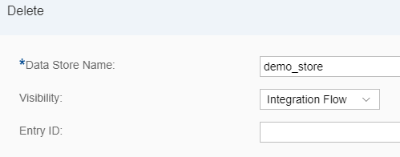
Data Store Name:  The name of the data store from where an entry needs to be deleted.
Visibility: indicates if the data store is visible only to this integration flow or to all the integration flows on the tenant.
Entry ID: the unique identifier of the entry you want to delete from the data store. If this is left empty, the last entry that was added to the data store is retrieved. It can also be picked from a header or from the message using XPath.

**Additional Information:**
1.	A data store works with the entire message, not part of it. It will write, read or delete an entire message.
2.	Never use the name sap_global_store for your data store as it is used by the system to store variables created by the Write Variable step.
3.	If the message processing fails, the transaction is rolled back and the entry added to the data store shall be deleted.
4.	If you try to Write an entry to the data store with an entry ID that already exists and “Overwrite Existing Message” is not checked, the message processing will fail.

**Example:**

Write 1:

`<Greeting>Hello from HCI</Greeting>`

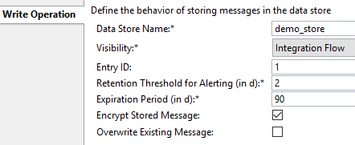

Select:

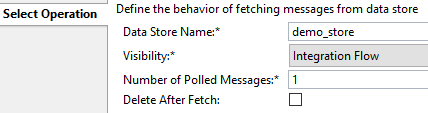

`<?xml version="1.0" encoding="UTF-8"?>
<messages><message id="1">
<Greeting>Hello from HCI</Greeting>
</message></messages>`

Write 2:

`<Greeting>Hello from Cloud Platform Integration</Greeting>`

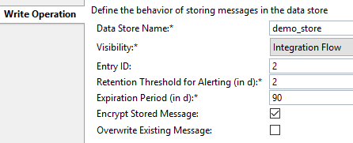

Get:

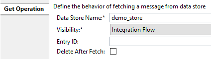

`<Greeting>Hello from Cloud Platform Integration</Greeting>`

Write 3:

`<Greeting>Cloud Platform Integration is the new name of HCI</Greeting>`

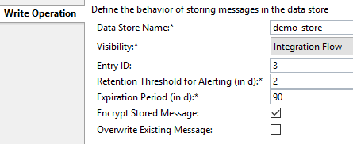

Select:

`<?xml version="1.0" encoding="UTF-8"?>
<messages>
<message id="1"><Greeting>Hello from HCI</Greeting></message>
<message id="2"><Greeting>Hello from Cloud Platform Integration</Greeting></message>
<message id="3"><Greeting>Cloud Platform Integration is the new name of HCI</Greeting></message>
</messages>`

Delete:

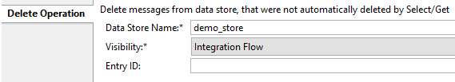

`<?xml version="1.0" encoding="UTF-8"?>
<messages>
<message id="1"><Greeting>Hello from HCI</Greeting></message>
<message id="2"><Greeting>Hello from Cloud Platform Integration</Greeting></message>
</messages>`

**Data Store viewer:**

The Data Store viewer is an interface to view and perform operations on the data store. It lists all the data stores created by any integration flow on a tenant.

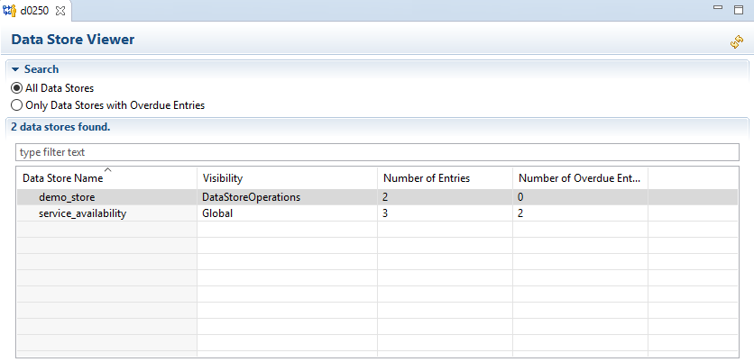

Click on a data store and go to the Properties tab to list details about the entries stored in that data store:

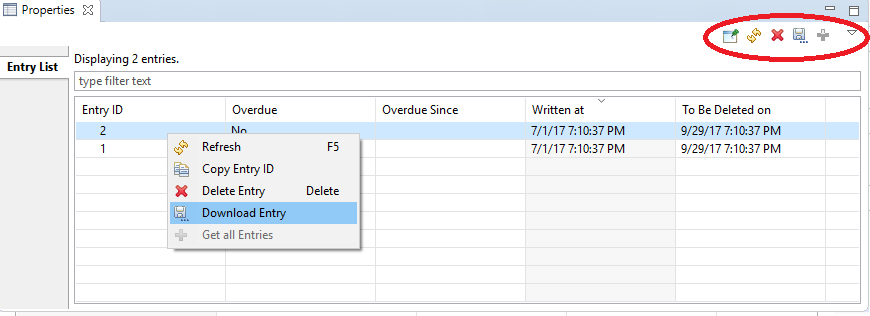

You can perform the following operations from this view:
*	Delete one or multiple entries
*	Download an entry
*	Copy the Entry ID of an Entry

Users assigned to the following authorization groups can access the Data Store Viewer:
*	AuthGroup.IntegrationDeveloper
*	AuthGroup.Administrator
*	AuthGroup.ReadOnly (read-only)
*	AuthGroup.SystemDeveloper (read-only)
