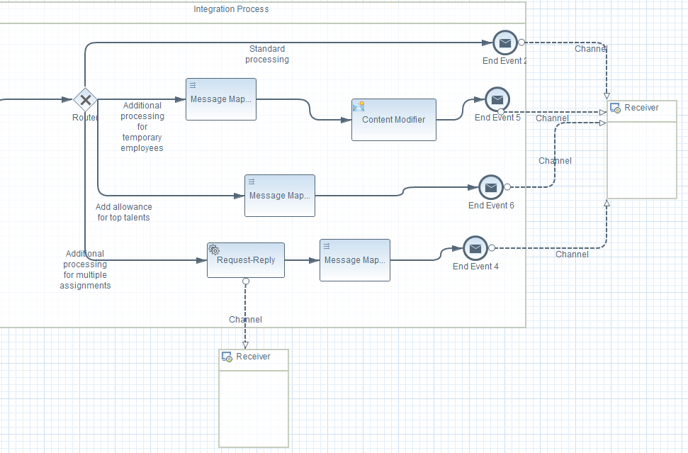
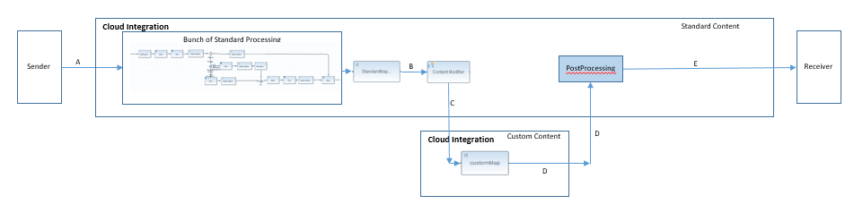
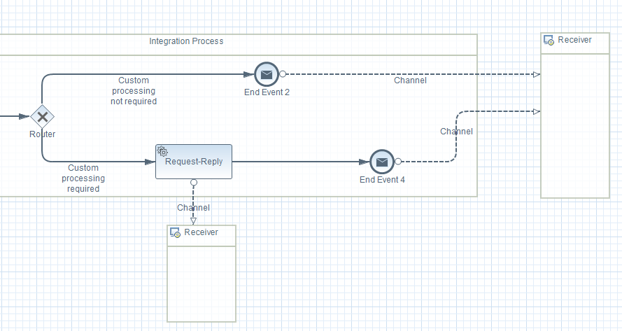

# Dealing with extensions to standard content delivered by SAP

\| [Recipes by Topic](../../readme.md ) \| [Recipes by Author](../../author.md ) \| [Request Enhancement](https://github.com/SAP-samples/cloud-integration-flow/issues/new?assignees=&labels=Recipe%20Fix,enhancement&template=recipe-request.md&title=Improve%20Dealing-with-extensions-to-standard-content-delivered-by-SAP ) \| [Report a bug](https://github.com/SAP-samples/cloud-integration-flow/issues/new?assignees=&labels=Recipe%20Fix,bug&template=bug_report.md&title=Issue%20with%20Dealing-with-extensions-to-standard-content-delivered-by-SAP ) \| [Fix documentation](https://github.com/SAP-samples/cloud-integration-flow/issues/new?assignees=&labels=Recipe%20Fix,documentation&template=bug_report.md&title=Docu%20fix%20Dealing-with-extensions-to-standard-content-delivered-by-SAP ) \|

 | [Meghna Shishodiya](https://github.com/author-profile ) |
----|----|

This recipe shows the different ways of extending standard pre-delivered content.

## Recipe

**Pre-read:**  [FAQ on standard content](https://blogs.sap.com/2017/04/14/sap-cloud-platform-integration-standard-content-update-goverenance/)

From the blog mentioned above, it is clear that adding any change to the standard content will lead to the content package falling out content update contract – this means that any further updates released on that content package by the content developer, although notified will not be implementable, i.e. the content will be marked with the *“Update Available”* tag, but it will not be possible to implement the update.
If you wish to add custom code to the pre-delivered standard content without falling out of the content update contract – request the content developer for either or the following:
1.	Externalize more parameters – this allows the customer to change the configuration of all the process steps used in the integration flow with full flexibility, without being bound by what is configured by the content developer.
2.	Add additional routes in the integration flow and control them using externalized parameters -this allows customer to change the processing pipeline of the integration flow simply through changing the externalized parameters - without marking the artifact as modified. These additional routes can cover (additional)custom processing.

  

3.	Create **custom exits** in the integration flow – the previous options can be used when the custom changes required by the customer as small or basic. However, if the custom changes are more complex, this option comes handy. This can be achieved as follows-

  **a.**	Create an exit point in the flow for custom processing by adding a service call to another integration flow.

  

  **b.**	All standard processing will be added to the calling integration flow (referred to as Standard integration flow) by the content developer, whereas the called integration flow (referred to as Custom integration flow) is where the customer will add all his custom logic.

  **c.**	The standard integration flow will be managed by the content developer. The customer will never update this integration flow.

  **d.**	The content developer can add standard updates to the standard integration flow. Since the customer does not update this flow, he can always update the flow as soon as a standard update is released by the content developer.

  **e.**	The custom flow will enable the customer to add all his custom processing without changing the standard flow.

  **f.**	The address field of the channel in the standard flow that calls the custom flow should be externalized so that the customer can configure the actual endpoint URL of the custom flow.

  **g.**	The call to the custom flow can be controlled via an additional externalized parameter which can be set to indicate whether the standard flow should call the custom flow or not. So, the customers who do not wish to add any custom flow, can simply set this parameter to false – this way the call to the custom flow will not be made.

  

  **h.**	The custom flow will be released by the content developer but managed by the customer. No more updates shall be released by content developer on this integration flow. The most important thing to keep in mind for the customer and content developer here is that the interfaces between the 2 integration flows are always compatible. Once defined, (as demonstrated in the figure 2 above) the input to the custom flow should always be C and the output should always be D – this ensures that when there are message structure changes in the main flow, there is no mandate on the custom flow to change and things will keep working.

  **i.**	If the custom flow needs access to the input message in addition to the output of the standard processing, the content developer should concatenate them and pass the concatenated message to the custom flow.

However, if the content developer does not agree to change his content, copy the content package twice to your design view. Ensure that you keep one copy untouched. Add all your customized changes to the other copy. Whenever a standard update is released by the content developer, update the untouched copy with the latest changes. Then manually merge the custom update to the updated content. Every change from the content developer is backed by a release note – this gives an idea about what has changed in the content with each release. The customer can then decide if he wants to merge the custom changes manually or standard changes based on whichever is less.

Also good to read: [Managing multiple updated versions of content in various tenants](https://blogs.sap.com/2017/04/14/cloud-integration-maintaining-multiple-customized-versions-of-a-standard-content-package/)
