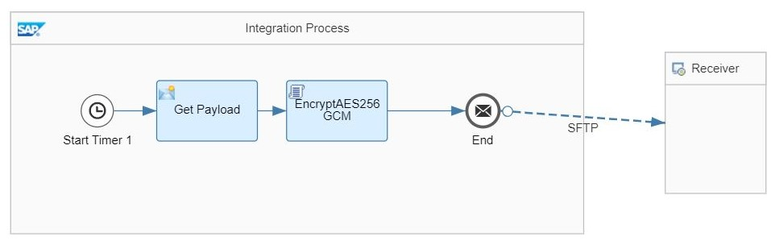

# Encryption with AES256-GCM algorithm using iaik libraries
Standard Encryptor component in CPI doesn't provide an option for Encryption algorithm AES256-GCM. Hence, there was a need to develop this custom encryptor.
The examples available in internet use BouncyCastle as security provider and this needs BouncyCastle registration as security provider on CPI tenant, which is not recommended.
Hence we chose to do this using iaik which is the default security provider for CPI

[Download the integration flow Sample](CMS_AES256GCM_Encryption_iaik.zip)\
[Download the reuseable integration flow](<<Name>>.zip) -[How to consume a reusable integration flow?](<<Full path>>)

## Recipe

Step|Code|Why?
----|----|----
Define encryption algorithm | ```AlgorithmID contentEA = (AlgorithmID)AlgorithmID.aes256_GCM.clone();```|
Generate initialization vector(iv) | ```SecureRandom random;/random = SecRandom.getDefault();/byte[] iv = new byte[12];/random.nextBytes(iv);```|
Generate content encryption key(Block size for AES-GCM algorithm is 128 bits) | ```KeyGenerator key_gen = KeyGenerator.getInstance("AES");/key_gen.init(128);```|
Generate new secret key(Secret key is used to encrypt data. Secret key itself is then encrypted using RSA public key(certificate)) | ```SecretKey secretKey = key_gen.generateKey();```|
Define GCM ParameterSpec | ```GCMParameterSpec params = new GCMParameterSpec(128, iv);```|
Get Public certificate info from RecipientInfo object | ```recipients[0] = new KeyTransRecipientInfo(cert, (AlgorithmID)AlgorithmID.rsaEncryption.clone());```|
Encrypt generated secret key with RSA public certificate | ```recipients[0].encryptKey(secretKey);```|

### Related Recipes
* [Decryption with AES256-GCM algorithm using iaik libraries](../Decryption_using_AES_GCM_iaik/readme.md)
* [Accessing keystore artifacts using a Groovy script](../AccessTenantKeystoreusingScript/readme.md)

## References
* Blogs
* Specs
* [Galois/Counter Mode](https://en.wikipedia.org/wiki/Galois/Counter_Mode)

## Sample integration flow


This sample integration flow is used to encrypt data with AES256-GCM algorithm using iaik libraries

### Sample Script
This is the script used in the sample
```
import com.sap.gateway.ip.core.customdev.util.Message;
import java.util.HashMap;

import com.sap.it.api.ITApiFactory;
import com.sap.it.api.securestore.SecureStoreService;
import com.sap.it.api.securestore.UserCredential;

import java.io.ByteArrayOutputStream;
import java.io.File;
import java.io.InputStream;
import java.net.URISyntaxException;
import java.net.URL;
import java.util.Enumeration;
import java.util.zip.ZipEntry;
import java.util.zip.ZipFile;
import java.util.zip.ZipOutputStream;
import java.util.zip.CRC32;
import java.security.DigestOutputStream;
import java.security.MessageDigest;
import no.difi.asic.*;
import no.difi.asic.extras.*;
import java.security.KeyStore; 
import java.security.cert.X509Certificate;

//Java keystore
import com.sap.it.api.keystore.KeystoreService;
import com.sap.it.api.keystore.exception.KeystoreException;
import java.security.*;
import java.security.cert.*;
import javax.crypto.SecretKey;
import javax.crypto.KeyGenerator;
import javax.crypto.spec.GCMParameterSpec;

import iaik.cms.KeyTransRecipientInfo;
import iaik.cms.RecipientInfo;
import iaik.cms.EncryptedContentInfo;
import iaik.cms.EncryptedContentInfoStream;
import iaik.cms.EnvelopedDataStream;
import iaik.cms.ContentInfoStream;
import iaik.asn1.structures.AlgorithmID;
import org.apache.commons.codec.binary.Base64;
import iaik.asn1.ObjectID;
import iaik.asn1.INTEGER;
import iaik.asn1.OCTET_STRING;
import iaik.asn1.SEQUENCE;
import iaik.security.random.SecRandom;
import iaik.x509.X509Certificate;

import com.google.common.io.ByteStreams;

def Message processData(Message message) {
    
    try {
        def map = message.getProperties();
        
        def clientSignKeyAlias = "sap_cloudintegrationcertificate";
        
        def service = ITApiFactory.getApi(KeystoreService.class, null);   
        if( service == null) {
            throw new IllegalStateException("Keystore Store Service is not available.");
        }
        
        //Get Private Key from the system.jks
        PrivateKey privateSignKey = (PrivateKey)service.getKey(clientSignKeyAlias);
    	if( privateSignKey == null) {
           	throw new IllegalStateException("privateSignKey is not available.");
        }
        
        //Get Public certificate from the system.jks	
        X509Certificate encryptCert = (X509Certificate)service.getCertificate(clientSignKeyAlias);
       
        if(encryptCert == null) {
            throw new IllegalStateException("signCert is not available.");
        }
        encryptCert.checkValidity();
    	
    	def body_bytes = message.getBody(byte[].class); 
    	
    	InputStream inputStream = new ByteArrayInputStream(body_bytes);
        
        // the stream to which to write the EnvelopedData
        ByteArrayOutputStream resultStream = new ByteArrayOutputStream();
        EnvelopedDataStream envelopedData;
        
        AlgorithmID contentEA = (AlgorithmID)AlgorithmID.aes256_GCM.clone(); 
        
        // generate parameters (iv and key length)
        // create iv
        SecureRandom random;
        random = SecRandom.getDefault();
        byte[] iv = new byte[12];
        random.nextBytes(iv);
        SEQUENCE parameter = new SEQUENCE();
        parameter.addComponent(new OCTET_STRING(iv));
        parameter.addComponent(new INTEGER(16));
        contentEA.setParameter(parameter);
        //generate the content encryption key
        KeyGenerator key_gen = KeyGenerator.getInstance("AES");
        key_gen.init(128);
        // generate a new key
        SecretKey secretKey = key_gen.generateKey();
        
        //GCMParameterSpec params = new GCMParameterSpec(secretKey.getEncoded().length, iv);
        GCMParameterSpec params = new GCMParameterSpec(128, iv);
        
        iaik.x509.X509Certificate cert = new iaik.x509.X509Certificate(encryptCert.getEncoded());
    
        // create the EncryptedContentInfo for the content to be encrypted
        EncryptedContentInfoStream eci = new EncryptedContentInfoStream(ObjectID.cms_data, inputStream);
        // setup the cipher for encryption
        eci.setupCipher(contentEA, secretKey, params);
        RecipientInfo[] recipients = new RecipientInfo[1];
        recipients[0] = new KeyTransRecipientInfo(cert, (AlgorithmID)AlgorithmID.rsaEncryption.clone());
        recipients[0].encryptKey(secretKey);
        envelopedData = new EnvelopedDataStream(recipients, eci);
        ContentInfoStream cis = new ContentInfoStream(envelopedData);   
        cis.writeTo(resultStream);  

        
        byte[] encoding = resultStream.toByteArray();
        message.setBody(encoding);
    } catch (Exception e) {
        throw new IOException(e.getMessage(), e);
    }
        
    return message;
}
```
### Sample input 
[Sample input XML](input_payload_to_be_encrypted.xml)
### Sample output
[Encrypted output](aes256_gcm_encrypted_payload.p7m)