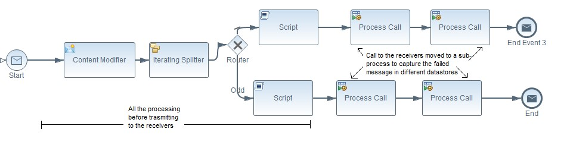
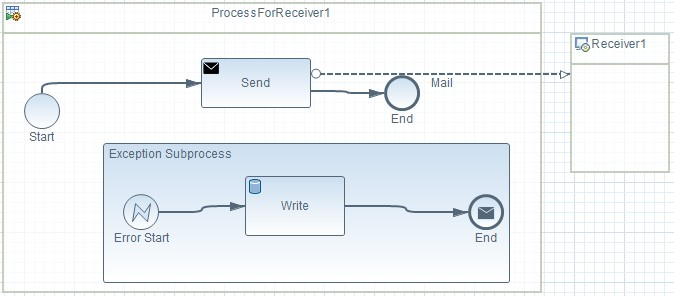
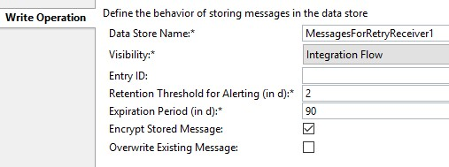
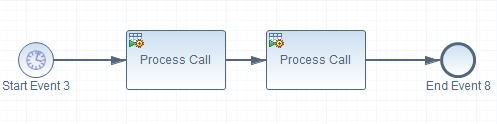
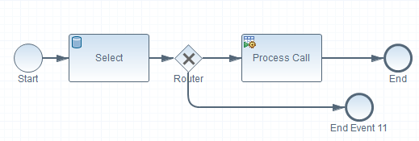

# ExactlyOnce handling in Cloud Platform Integration

\| [Recipes by Topic](../../readme.md ) \| [Recipes by Author](../../author.md ) \| [Request Enhancement](https://github.com/SAP-samples/cloud-integration-flow/issues/new?assignees=&labels=Recipe%20Fix,enhancement&template=recipe-request.md&title=Improve%20ExactlyOnce-handling-in-Cloud-Platform-Integration ) \| [Report a bug](https://github.com/SAP-samples/cloud-integration-flow/issues/new?assignees=&labels=Recipe%20Fix,bug&template=bug_report.md&title=Issue%20with%20ExactlyOnce-handling-in-Cloud-Platform-Integration ) \| [Fix documentation](https://github.com/SAP-samples/cloud-integration-flow/issues/new?assignees=&labels=Recipe%20Fix,documentation&template=bug_report.md&title=Docu%20fix%20ExactlyOnce-handling-in-Cloud-Platform-Integration ) \|

 | [Meghna Shishodiya](https://github.com/author-profile ) |
----|----|

In this recipe we will show, how enable ExactlyOnce message processing through modelling.

[Download the integration flow Sample](ExactlyOnce.zip)

## Recipe

**Motivation:**

In Cloud Platform Integration, when message processing fails, there is no means to retry the message processing automatically by the system out-of-the-box. It has to resent from the source system. In cases where the incoming message contains multiple records and some were successfully processed before the message processing failed, retriggering the entire message from the sender results in not optimal.

The issue worsens when there are multiple receivers and the message is successfully delivered to some receivers. In this case, it is not possible to resend the message from the source system.

SAP Cloud Platform Integration does not support Quality of Service (QoS) Exactly Once (EO) as a standard feature, however it is on the roadmap.

Nonetheless, Exactly Once handling can be simulated by modeling the integration process in a way that ensures that we record and retry only failed messages and deliver them only to the desired receivers.

In order to accomplish this, we make use of a permanent persistence in the Cloud Integration stack’s own database.
Here we can make use of a datastore which can be kept in the persistence layer for a large number of days (as configured in the process step – default being 90 days); or a variable which stays in the database for 400 days after the last access. As the name suggests, datastore is used to store messages or group of messages, whereas variables can be used to store information points.

**Design** your flows as follows:

**First flow:**

The main processing of the message happens here.
Once all the processing is over, add process calls, one per receiver. You need one datastore per receiver.

In order to put messages for different Receivers into different datastores, create a sub-process for transmitting the message to each receiver – the exception sub-process of the sub-process will push the message to the corresponding datastore. Ensure that you use different names for datastore of each receiver –each sub-process must write to a different datastore.
Please note that this explanation does not cover the specifics of exception handling.
For more details, please refer to Discover --> Cloud Integration – Exemplars --> Documents --> Exception Handling.

 

  

  

**Second Flow:**

Have a second scheduled flow that runs every hour or 5 mins, depending on your business requirement. This process will trigger **other sub-processes** – one per receiver of the previous flow.

Each sub-process shall check if there is an entry for the corresponding receiver in the datastore for that receiver:

If none, the flow would exit.

If the system finds a datastore entry, the sub-flow will try to resend the message. On successful transmission of the message, the sub-flow shall delete the message from its datastore. Else, it will stay in the datastore for the next retry.

 

Alternatively, in the Select step, you can choose to delete the datastore entry and then reenter the record in the datastore from the sub-process if it fails again.

### Related Recipes
* [upstream-recipe-name](../upstream-recipe-folder-name)
* [alternate-recipe-name](../alternate-recipe-folder-name)
