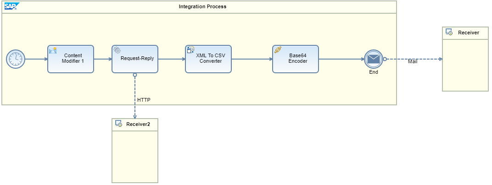

# Exposing SOAP or HTTP endpoint from a Scheduled flow

\| [Recipes by Topic](../../readme.md ) \| [Recipes by Author](../../author.md ) \| [Request Enhancement](https://github.com/SAP-samples/cloud-integration-flow/issues/new?assignees=&labels=Recipe%20Fix,enhancement&template=recipe-request.md&title=Improve%20Exposing-SOAP-or-HTTP-endpoint-from-a-Scheduled-flow ) \| [Report a bug](https://github.com/SAP-samples/cloud-integration-flow/issues/new?assignees=&labels=Recipe%20Fix,bug&template=bug_report.md&title=Issue%20with%20Exposing-SOAP-or-HTTP-endpoint-from-a-Scheduled-flow ) \| [Fix documentation](https://github.com/SAP-samples/cloud-integration-flow/issues/new?assignees=&labels=Recipe%20Fix,documentation&template=bug_report.md&title=Docu%20fix%20Exposing-SOAP-or-HTTP-endpoint-from-a-Scheduled-flow ) \|

 | [Meghna Shishodiya](https://github.com/author-profile ) |
----|----|

This recipe provides steps to expose callable end-points on scheduled flows.

[Download the integration flow sample](Adding_an_endpoint_to_a_scheduled_flow.zip)

## Recipe

**Motivation:**
You have a scheduled flow and now you want to trigger it explicitly via an endpoint for adhoc or test runs.

**Solution:**

Assume you have the following scheduled run that runs every day at 9am:

Now you also want to be able to trigger this flow through an endpoint.
Create a local sub-process and move all the above logic to it.
Now create 2 main integration flows:
1.	Scheduled flow: will get triggered every day at 9am and pass the control to the sub process.
2.	Externally triggerable flow: will receive the call and pass the control to the above sub-process

Both will then receive the request and pass it to the common sub-process for processing.
Add an Exception Sub-process to the sub-process and end it with Error End Event so that the Exception state is sent back to the main process.

Note that in monitoring, both the integration flow executions will have the same name.

You can move these into different integration flow artifacts and call each other via the ProcessDirect adapter.

### Related Recipes
* [upstream-recipe-name](../upstream-recipe-folder-name)
* [alternate-recipe-name](../alternate-recipe-folder-name)
