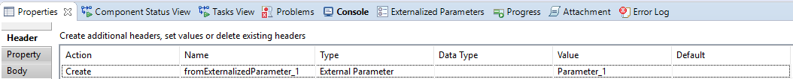
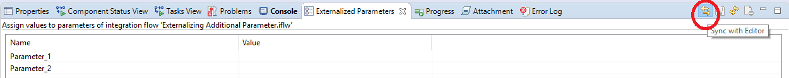

# Externalizing additional parameters

\| [Recipes by Topic](../../readme.md ) \| [Recipes by Author](../../author.md ) \| [Request Enhancement](https://github.com/SAP-samples/cloud-integration-flow/issues/new?assignees=&labels=Recipe%20Fix,enhancement&template=recipe-request.md&title=Improve%20Externalizing-additional-parameters ) \| [Report a bug](https://github.com/SAP-samples/cloud-integration-flow/issues/new?assignees=&labels=Recipe%20Fix,bug&template=bug_report.md&title=Issue%20with%20Externalizing-additional-parameters ) \| [Fix documentation](https://github.com/SAP-samples/cloud-integration-flow/issues/new?assignees=&labels=Recipe%20Fix,documentation&template=bug_report.md&title=Docu%20fix%20Externalizing-additional-parameters ) \|

 | [Meghna Shishodiya](https://github.com/author-profile ) |
----|----|

This recipe how to create externalized parameters apart from the configuration parameters that are part of channel configuration or process steps.

[Download the integration flow Sample](ExternalizingAdditionalParameter.zip)

## Recipe

Add a *Content Modifier* to the message pipeline. Add a new header and property as follows:

In the above example, the header *fromExternalizedParameter_1* takes its value from an external parameter *Parameter_1*. In the second screenshot, the property *fromExternalizedParameter_2* takes its value from external parameter *Parameter_2*.
The external parameters do not exist before this step, but when the system sees that the header and property take their values from these external parameters, it automatically creates 2 entries in the list of externalized parameters.
Go to the *Externalized Parameters* view and click on *Sync with Editor*:

You will see *Parameter_1* and *Parameter_2* are added as externalized parameters to the integration flow.

They will also be added to the configure page of the integration flow.

Now you can use the value of header *fromExternalizedParameter_1* and property *fromExternalizedParameter_2* in your integration flow. They value entered by the user to the externalized parameters Parameter_1 and Parameter_2 will be assigned to the corresponding header and property.
