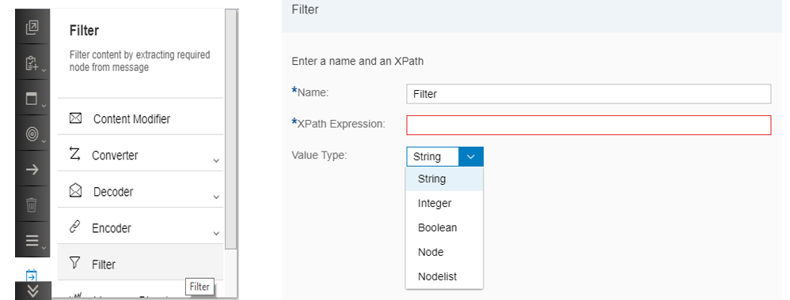

# Filter

\| [Recipes by Topic](../../readme.md ) \| [Recipes by Author](../../author.md ) \| [Request Enhancement](https://github.com/SAP-samples/cloud-integration-flow/issues/new?assignees=&labels=Recipe%20Fix,enhancement&template=recipe-request.md&title=Improve%20Filter ) \| [Report a bug](https://github.com/SAP-samples/cloud-integration-flow/issues/new?assignees=&labels=Recipe%20Fix,bug&template=bug_report.md&title=Issue%20with%20Filter ) \| [Fix documentation](https://github.com/SAP-samples/cloud-integration-flow/issues/new?assignees=&labels=Recipe%20Fix,documentation&template=bug_report.md&title=Docu%20fix%20Filter ) \|

 | [Meghna Shishodiya](https://github.com/author-profile ) |
----|----|

This recipe provides details about the purpose and usage of the Filter step

[Download the integration flow Sample](ContentFilter.zip)

## Recipe

A **Filter step** is used to retrieve a part of the message. After the filter steps, only the retrieved data is available on the pipeline. The rest of the message is lost.

**Configuring the filter:**

*Name:* A name to identify the filter – it can be any alpha-numeric name.

*XPath Expression:* is the XPath of the data that you need to filter out.

*Value Type:* the type of data you want to retrive from the message.

Consider the following message:

`<Students>
<Student>
<Id>1</Id>
<Name>Amit</Name>
<Class>10</Class>
</Student>
<Student>
<Id>10</Id>
<Name>Rahul</Name>
<Class>11</Class>
</Student>
<Student>
<Id>2</Id>
<Name>Varun</Name>
<Class>10</Class>
</Student>
<Student>
<Id>3</Id>
<Name>Vijay</Name>
<Class>4</Class>
</Student>
<Student>
<Id>4</Id>
<Name>Raj</Name>
<Class>12</Class>
</Student>
<Student>
<Id>5</Id>
<Name>Arjun</Name>
<Class>9</Class>
</Student>
<Student>
<Id>6</Id>
<Name>Aditya</Name>
<Class>5</Class>
</Student>
<Student>
<Id>7</Id>
<Name>Arun</Name>
<Class>11</Class>
</Student>
<Student>
<Id>8</Id>
<Name>Naveen</Name>
<Class>1</Class>
</Student>
<Student>
<Id>9</Id>
<Name>Akhil</Name>
<Class>7</Class>
</Student>
</Students>`

|XPath Expression	|Value Type	|Output|
|---	|---	|---|
|`/Students/Student/Class`	|Node	|`<Class>10</Class>`|
|`/Students/Student/Id`	|String	|`1`|
|`/Students/Student[Id=1]`	|Node	|`<Student><Id>1</Id><Name>Amit</Name><Class>10</Class></Student>`|
|`/Students [Student/Id=1]`	|Node	|`<Students><Student><Id>1</Id><Name>Amit</Name>	<Class>10</Class></Student></Students>`|
|`/Students/Student/Id`	|Nodelist	|`<Id>1</Id><Id>10</Id><Id>2</Id><Id>3</Id><Id>4</Id><Id>5</Id><Id>6</Id><Id>7</Id><Id>8</Id><Id>9</Id>`|
|`/Students/Student`	|Nodelist	|`<Student><Id>1</Id>	<Name>Amit</Name>	<Class>10</Class></Student><Student>	<Id>10</Id>	<Name>Rahul</Name>	<Class>11</Class></Student><Student>	<Id>2</Id>	<Name>Varun</Name>	<Class>10</Class></Student><Student>	<Id>3</Id><Name>Vijay</Name><Class>4</Class></Student><Student><Id>4</Id><Name>Raj</Name><Class>12</Class></Student><Student><Id>5</Id><Name>Arjun</Name>	<Class>9</Class></Student><Student>	<Id>6</Id>	<Name>Aditya</Name>	<Class>5</Class></Student><Student>	<Id>7</Id>	<Name>Arun</Name>	<Class>11</Class></Student><Student>	<Id>8</Id>		<Name>Naveen</Name>	<Class>1</Class></Student><Student><Id>9</Id><Name>Akhil</Name>	<Class>7</Class></Student>`|
