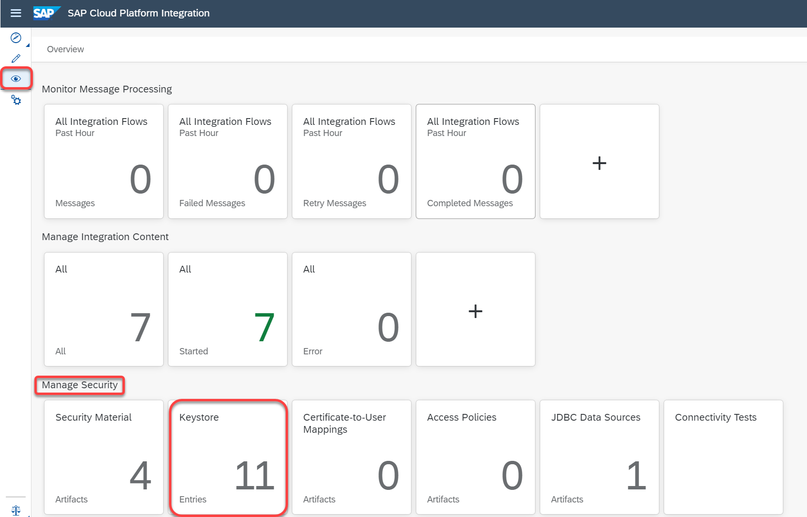
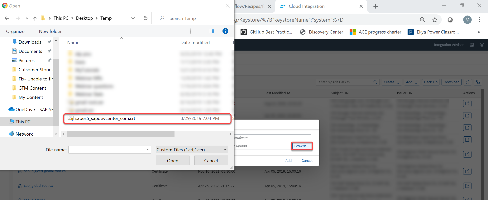
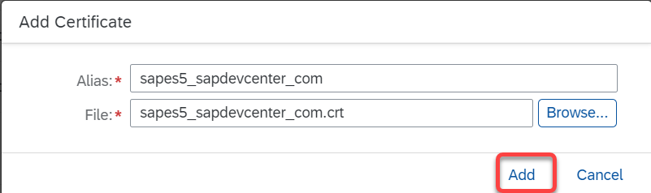

# Fix- Unable to find valid certification path to requested target

\| [Recipes by Topic](../../readme.md ) \| [Recipes by Author](../../author.md ) \| [Request Enhancement](https://github.com/SAP-samples/cloud-integration-flow/issues/new?assignees=&labels=Recipe%20Fix,enhancement&template=recipe-request.md&title=Improve%20Fix-Unable-to-find-valid-certification-path-to-requested-target ) \| [Report a bug](https://github.com/SAP-samples/cloud-integration-flow/issues/new?assignees=&labels=Recipe%20Fix,bug&template=bug_report.md&title=Issue%20with%20Fix-Unable-to-find-valid-certification-path-to-requested-target ) \| [Fix documentation](https://github.com/SAP-samples/cloud-integration-flow/issues/new?assignees=&labels=Recipe%20Fix,documentation&template=bug_report.md&title=Docu%20fix%20Fix-Unable-to-find-valid-certification-path-to-requested-target ) \|

 | [Meghna Shishodiya](https://github.com/author-profile ) |
----|----|

This recipe helps resolve when a message processing execution fails with “Unable to find valid certification path to requested target”

## Recipe

In order to allow Cloud Platform Integration trust the corresponding backend system, add the system’s certificate into the keystore of Cloud Platform Integration.

From Cloud Platform Integration server 2.x onwards, it is possible for the customers to manage the keystore by themselves.
Follow the below steps if you wish to add additional certificates to the Cloud Platform Integration's keystore:

1.	Go to the _Operation's View_, _Manage Security_. Click on the _Keystore_ tile.

  

2. Click on _Add_

  

3. Browse to the certificate and click on _Add_.

  

  

Try to re-process the message.
