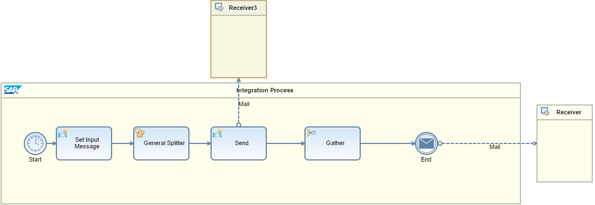

# How to determine when all split messages are processed

\| [Recipes by Topic](../../readme.md ) \| [Recipes by Author](../../author.md ) \| [Request Enhancement](https://github.com/SAP-samples/cloud-integration-flow/issues/new?assignees=&labels=Recipe%20Fix,enhancement&template=recipe-request.md&title=Improve%20How-to-determine-when-all-split-messages-are-processed ) \| [Report a bug](https://github.com/SAP-samples/cloud-integration-flow/issues/new?assignees=&labels=Recipe%20Fix,bug&template=bug_report.md&title=Issue%20with%20How-to-determine-when-all-split-messages-are-processed ) \| [Fix documentation](https://github.com/SAP-samples/cloud-integration-flow/issues/new?assignees=&labels=Recipe%20Fix,documentation&template=bug_report.md&title=Docu%20fix%20How-to-determine-when-all-split-messages-are-processed ) \|

 | [Meghna Shishodiya](https://github.com/author-profile ) |
----|----|

This recipe shares ways to know when all split messages are individually processed

[Sample flow for knowing when the split records are finished processing](KnowingWhenTheSplitRecordsAreFinishedProcessing.zip)

[Sample flow to collect Split Messages](CollectSplitMessages.zip)

## Recipe

**Motivation:**
An incoming message has 2 records. You use a splitter to separate individual records. You process the individual records. Now you want to perform some additional processing after all the split records have been processed. How to know when all the split messages are done processing.

**Solution:**
Using a Gather –

The Splitter and a Gather are internally sync’d - the splitter intrinsically indicates to the Gather, either that there more messages to be processed or that all the split messages are processed. Accordingly, the Gather step either passes the control back to the Splitter (in case there are more records) or moves to the next processing step (in case all the split messages are processed).

So the Gather will continue to collect all the Split messages until the Splitter indicates that all the split messages are processed, following which, the Gather will send the gathered messages to the End Message step.

We also have a standard Camel header that can be used to check this: `CamelSplitComplete`. This header indicates if the message is the last split message.
