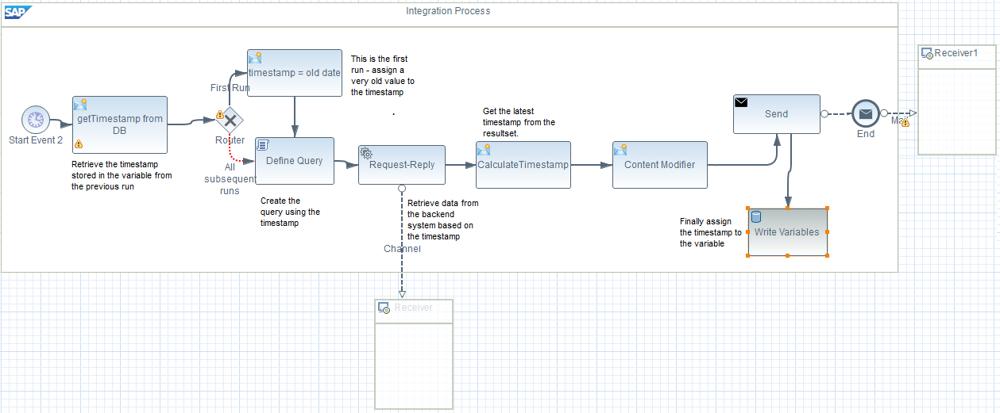
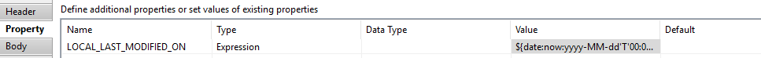

# Implementing DeltaSync

\| [Recipes by Topic](../../readme.md ) \| [Recipes by Author](../../author.md ) \| [Request Enhancement](https://github.com/SAP-samples/cloud-integration-flow/issues/new?assignees=&labels=Recipe%20Fix,enhancement&template=recipe-request.md&title=Improve%20Implementing-DeltaSync ) \| [Report a bug](https://github.com/SAP-samples/cloud-integration-flow/issues/new?assignees=&labels=Recipe%20Fix,bug&template=bug_report.md&title=Issue%20with%20Implementing-DeltaSync ) \| [Fix documentation](https://github.com/SAP-samples/cloud-integration-flow/issues/new?assignees=&labels=Recipe%20Fix,documentation&template=bug_report.md&title=Docu%20fix%20Implementing-DeltaSync ) \|

 | [Meghna Shishodiya](https://github.com/author-profile ) |
----|----|

This recipe

[Download the reuseable integration flow](DeltaSync.zip)

## Recipe

__Problem:__
While retrieving data first time, we need all the records. However, all subsequent runs should retrieve only the delta records.

__Solution:__
You have a process that runs at regular intervals. You do not want to retrieve all the records during every run since this result set will keep growing, whereas the relevant part of the data set is the data that has changed (added, deleted, updated) since the last run – the delta data. There can be many parameters to filter in the relevant data. The steps below consider __timestamp__. With the help of the timestamp, you can define your query of data retrieval to pull only the data that has changed since the last run.

In order to keep track of the timestamp across runs, you need a location that holds the data even after the process execution is over. For this purpose, we make use of __variables__.

Variables are stored in the database of the Cloud Integration stack for 400 days after the last update. A local variable is visible only to the integration flow that creates it whereas a global variable is accessible to all the integration flows on the tenant. Choose the type of variable according to the usecase.

The __mandate__ to perform delta sync is that the backend system records the time when each record is added or deleted or updated. It may or may not be in the same table as the actual data, but it should be query-able.

There are 2 ways in which the timestamp can be used to retrieve data:

1.	The resultset contains the timestamp:

  *	For the first run of the process, use a timestamp, old enough to ensures that all the records are picked, like 1970-12-31T00:00:00. Create the query using this timestamp. As a result, the first run will pick up all the records from the backend system. For all other subsequent scheduled execution of the process, we shall use a timestamp stored in a persistent variable – this is explained in the next step.
  * Retrieve the timestamp with the highest value from the resultset. This indicates that the records updated until the value of the highest timestamp have been retrieved. The next run must only consider those records who have the update timestamp greater than this value. So only the delta change between the 2 runs would qualify for retrieval in the next run. This can be done using an XPATH or a script step for more complex structures.
  * Create a variable using the write step and assign it the value of highest timestamp retrieved in the previous step.
  * Now every time the process runs, it will first check if the value of the variable is null. A null value of the variable indicates that the process is running for the first time. In this case, the query uses an old date as mentioned in steps 1 above.
  If the value of the variable is not null, it indicates that the process needs to only retrieve delta data. So, the query should say – retrieve all records, where the timestamp of the record > timestamp stored in the variable.
  * It is important to note that you set the variable with the new timestamp at the end of the process. It can be retrieved from the result set and kept in a header/property, but assigned to the persistent variable only at the end of the process. This ensures that in case of an exception during the flow, the current resultset also get retrieved again for processing, else those records will get missed.

          

2.	The resultset contains does not contain the timestamp
   * The procedure is exactly the same as above, however, the calculation of timestamp and definition of the query differ. This is explained in the next step.
   * The first run would use an old date to retrieve all the data stored in the backend.
   * __Before__ retrieval of the dataset, the system makes a note of the current timestamp and stores it in a header/property. This can be done using a content modifier using a value ${date:now:yyyy-MM-dd'T'00:00:00.000'Z'}:

        

    * Finally, at the end of the flow, assign this value to a persist variable.

    * Now every time the process runs, it will first check if the value of the variable is null. A null value of the variable indicates that the process is running for the first time. In this case, the query uses an old date as mentioned in steps 1 above. If the value of the variable is not null, it indicates that the process needs to only retrieve delta data. So, the query should say – retrieve all records, where the timestamp of the record > timestamp stored in the variable and < the property set in the previous step. In essence, we are retrieving data that changed between __Now__ time and last run’s __Now__ time.

__Additional things to note:__


1.	Scheduled timer start event is used to schedule the execution of the integration flow at definite intervals.
2.	Set the variable at the end of the flow to ensure that any exception during the integration flow execution does not result in records getting missed.
3.	The timestamp used for the first run is a very old date to ensure that all records in the backend are added/deleted/updated after it and hence everything is picked up.
4.	Null value of the variable indicates that the flow is running for the first time.
5.	In order to avoid additional checks for first run, you can create 2 different flow – one for the first run and another one for all the subsequent runs.
6.	For the first procedure above, retrieve the timestamp into a header/property from the dataset soon after the retrieval of the dataset from the backend. In the second option, retrieve the timestamp just before pulling data from the backend.


## Sample integration flow
describe-the-flow-of-the-integration-flow\


### Sample Script
This is the script used in this sample\
``` sample-script-goes-here ```

### Sample Input
Description-of-the-input-file\
[sample-input-file-description](file-name)\


### Sample Output
Description-of-the-output\

