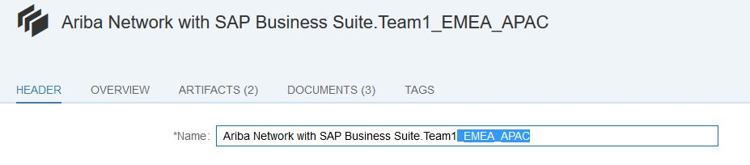
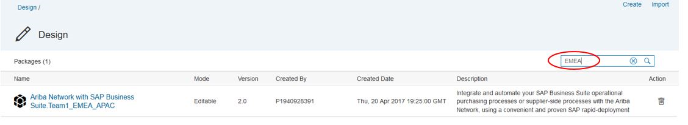

# Keyword based content search in the design view of the SAP Cloud Platform Integration web interface

\| [Recipes by Topic](../../readme.md ) \| [Recipes by Author](../../author.md ) \| [Request Enhancement](https://github.com/SAP-samples/cloud-integration-flow/issues/new?assignees=&labels=Recipe%20Fix,enhancement&template=recipe-request.md&title=Improve%20Keyword-based-content-search-in-the-design-view-of-the-SAP-Cloud-Platform-Integration-web-interface ) \| [Report a bug](https://github.com/SAP-samples/cloud-integration-flow/issues/new?assignees=&labels=Recipe%20Fix,bug&template=bug_report.md&title=Issue%20with%20Keyword-based-content-search-in-the-design-view-of-the-SAP-Cloud-Platform-Integration-web-interface ) \| [Fix documentation](https://github.com/SAP-samples/cloud-integration-flow/issues/new?assignees=&labels=Recipe%20Fix,documentation&template=bug_report.md&title=Docu%20fix%20Keyword-based-content-search-in-the-design-view-of-the-SAP-Cloud-Platform-Integration-web-interface ) \|

 | [Meghna Shishodiya](https://github.com/author-profile ) |
----|----|

This recipe provides a trick to name the package in a way that you can search for relevant keywords

## Recipe

__Motivation__

You want to search an integration package based on the following:
*	Backend system connected to
*	Connectivity types or adapters used
*	Purpose of the integration flow
* Object being acted upon
*	Integration flows for a particular region or line of business

__Solution__

Current search capability of the design view can only search the content package name.

In order to be able to filter out packages based on any categorization, add all the information that you may want to search on to the package’s name – scenario details, categorization information about region, line of business, project, etc., information about the connectors used and all other information that you may need for searching.

Please ensure that you add all this information at the package level. Once the required information is maintained in the system, you can use the search capability in the design view to filter the packages of interest.

Please note that in case of a configure-only content, changing the name of the content package also marks the content as updated and hence you shall not receive any updates or update notifications to such content packages. In such cases, you can make use of the version suffix that gets added to the name when the content is copied from the discover view to the design view. This way the content name gets enriched with the categorization information without getting marked as updated.

Please share your feature requests on search, feedback and issues faced through a ticket raised on __LOD-CHB__.
