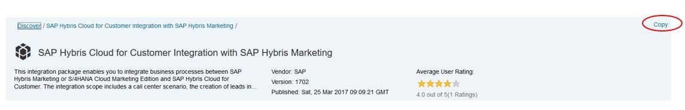
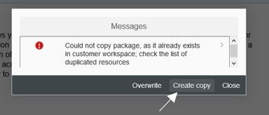
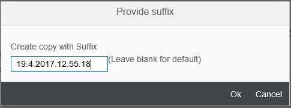
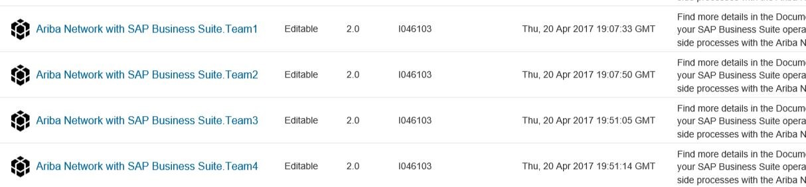
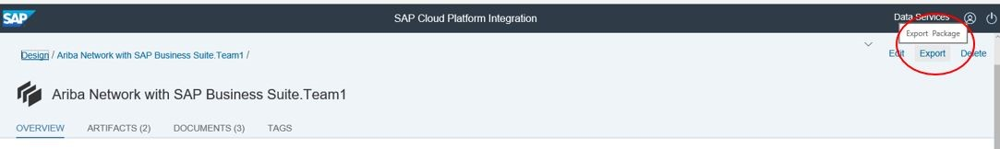
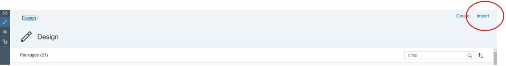
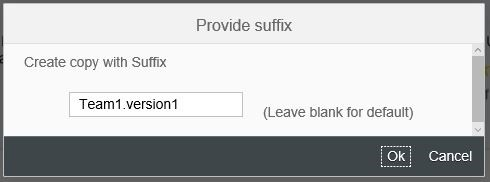
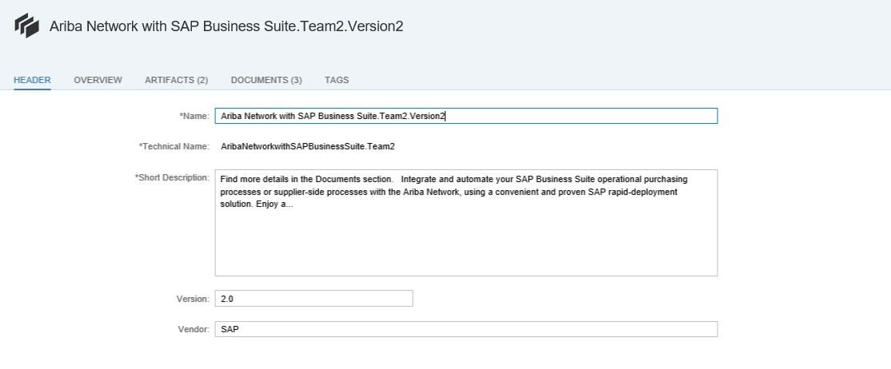

# Maintaining multiple customized versions of a standard content package

\| [Recipes by Topic](../../readme.md ) \| [Recipes by Author](../../author.md ) \| [Request Enhancement](https://github.com/SAP-samples/cloud-integration-flow/issues/new?assignees=&labels=Recipe%20Fix,enhancement&template=recipe-request.md&title=Improve%20Maintaining-multiple-customized-versions-of-a-standard-content-package ) \| [Report a bug](https://github.com/SAP-samples/cloud-integration-flow/issues/new?assignees=&labels=Recipe%20Fix,bug&template=bug_report.md&title=Issue%20with%20Maintaining-multiple-customized-versions-of-a-standard-content-package ) \| [Fix documentation](https://github.com/SAP-samples/cloud-integration-flow/issues/new?assignees=&labels=Recipe%20Fix,documentation&template=bug_report.md&title=Docu%20fix%20Maintaining-multiple-customized-versions-of-a-standard-content-package ) \|

 | [Meghna Shishodiya](https://github.com/author-profile ) |
----|----|

This recipe shares a trick on how to maintain multiple working versions of a standard content package

## Recipe

**Motivation**
Customer copies a standard content package to his design view. He would now like to maintain multiple customized versions of the package for multiple projects.

The customer validates the flows in his development tenant. He must move this content to Quality or Production tenants. There are already older versions of the same package available on the Quality and Production tenants. Customer does not want to overwrite.

**Solution**
Every time you copy a content package from the catalog – the discover view, create a copy and save it as a version to ensure that you create individual, non-interfering instances of the same flow.

 

  

   

When you create a copy and provide a suffix, you also change the system ID of the content package.

Once the content package is imported successfully, with a new version, it will ensure that when you try to import another version of the same package in future (for the other department or team or project), you will neither get a system ID conflict, nor will you overwrite the previously imported flow.

Create as many copies of the content package in your development tenant as you want – one per project/department/team; each time with a different suffix.

   

Maintain, manage and test all updates to these packages in the development tenant.

Once finalized, move the content package to the test or production tenant. This is done using the export and import feature available in the content hub. You need to export the content package to a file system and then load the content package using the import function from the same file system location.

Always import the entire package, not individual artifacts, even if only one artifact was changed.

When you try to import the newer version, you only have the option to overwrite the existing package. If you want to overwrite, just say yes and proceed.

However, if you do not want to overwrite and rather create a copy, that is, you would like to maintain multiple versions of the content package for a team in the test or production tenant as well follow the steps mentioned below:

1.	Create a version of the same team package first in the development tenant – you have the option to change the system ID of a content package only when you copy it from the discover view to the design view.

  

   > PS. The edit function at the package level only allows to change the display name(Name in the screenshot below) (apart from other attributes), not its system ID (Technical Name in the screenshot below). So this procedure will not help.

  

2.	Add all the required updates to the newly created package.
3.	Once done, move it to the other tenants using the export-import capability.

You could alternatively take the package to Eclipse and refactor it there. However, this is not the preferred approach.
