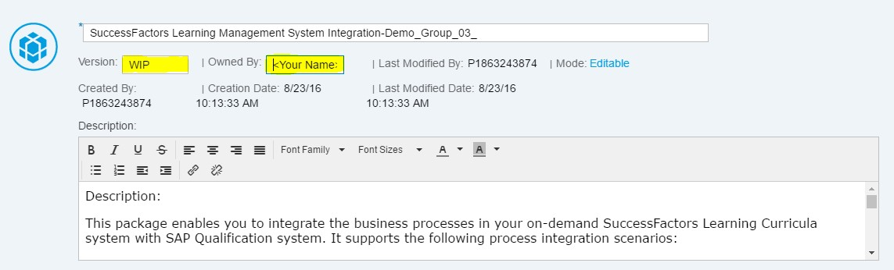

# Managing multiple edits to the same artifact in the web interface of Cloud Platform Integration

\| [Recipes by Topic](../../readme.md ) \| [Recipes by Author](../../author.md ) \| [Request Enhancement](https://github.com/SAP-samples/cloud-integration-flow/issues/new?assignees=&labels=Recipe%20Fix,enhancement&template=recipe-request.md&title=Improve%20Managing-multiple-edits-to-the-same-artifact-in-the-web-interface-of-Cloud-Platform-Integration ) \| [Report a bug](https://github.com/SAP-samples/cloud-integration-flow/issues/new?assignees=&labels=Recipe%20Fix,bug&template=bug_report.md&title=Issue%20with%20Managing-multiple-edits-to-the-same-artifact-in-the-web-interface-of-Cloud-Platform-Integration ) \| [Fix documentation](https://github.com/SAP-samples/cloud-integration-flow/issues/new?assignees=&labels=Recipe%20Fix,documentation&template=bug_report.md&title=Docu%20fix%20Managing-multiple-edits-to-the-same-artifact-in-the-web-interface-of-Cloud-Platform-Integration ) \|

 | [Meghna Shishodiya](https://github.com/author-profile ) |
----|----|

This recipe is a tip on how you can have multiple people working on the same integration artifact without stepping on each other's work

## Recipe

__Motivation:__

The customer has many developers working on SAP Cloud Integration development projects and they do not sync-up on a daily basis. How can the customer manage concurrent development on the same artifact in the webUI?

__Solution:__

Edit the content package.
For _Version_, enter __WIP__ to indicate that the package is work in progress:

Enter you name/team name in the _Owned By_ text box to indicate who should the other team/person contact if they wish to change this package’s artifact.

This way, any person who wishes to change an artifact will first check if the corresponding package is already open for edit and in case yes, then by whom. They can then coordinate on how to edit the artifacts in the package.

Once the edit is done, the save the package as a version. This will change the version of the package from WIP to the next version number.
