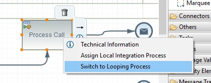
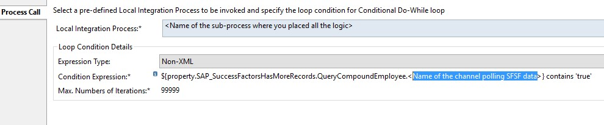
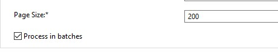

# Processing SuccessFactor records in batches in Cloud Platform Integration

\| [Recipes by Topic](../../readme.md ) \| [Recipes by Author](../../author.md ) \| [Request Enhancement](https://github.com/SAP-samples/cloud-integration-flow/issues/new?assignees=&labels=Recipe%20Fix,enhancement&template=recipe-request.md&title=Improve%20Processing-SuccessFactor-records-in-batches-in-Cloud-Platform-Integration ) \| [Report a bug](https://github.com/SAP-samples/cloud-integration-flow/issues/new?assignees=&labels=Recipe%20Fix,bug&template=bug_report.md&title=Issue%20with%20Processing-SuccessFactor-records-in-batches-in-Cloud-Platform-Integration ) \| [Fix documentation](https://github.com/SAP-samples/cloud-integration-flow/issues/new?assignees=&labels=Recipe%20Fix,documentation&template=bug_report.md&title=Docu%20fix%20Processing-SuccessFactor-records-in-batches-in-Cloud-Platform-Integration ) \|

 | [Meghna Shishodiya](https://github.com/author-profile ) |
----|----|

This recipe shows how to process bilk messages from SuccessFactors in batches

[Download the integration flow Sample](PaginationSFSF.zip)

## Recipe

**Pagination** is a feature implemented in SAP Cloud Platform Integration to be able to process large requests in pages.

When pagination is configured, the sender SFSF system sends only one page to Cloud Integration at a time. When Cloud Integration finishes processing the page, it requests for the next page. You can choose to collate all the pages later before sending out the final response or send the response page by page to the receiver.
As of today, pagination is only supported for SFSF SOAP and OData V2 communication.
In order to enable pagination in your scenario, you need to make the following settings in your integration flow:
1.	Move all the logic of processing the message into a sub-process.
2.	Invoke the sub-process from the main process using a looped process call:

  

 

 The condition expression refers to the name of the SFSF channel that polls request from the SFSF system. `${property.SAP_SuccessFactorsHasMoreRecords.QueryCompoundEmployee.<Name of the channel polling SFSF data>}` contains ‘true’

Set the value for ‘Max. Number of Iterations’ appropriately to ensure that it is not:
1.	Too high – if you know that typical number of expected pages
2.	Too low – that it leads to truncation of incoming pages – it should be able to capture all the data and not get truncated due to a cap on the number of maximum iterations.

The condition expression, together with the Max number of iteration are meant to save the system from going into an endless loop.
1.      The SFSF channel should be configured inside the sub-process using the request-reply pattern.
2.      Configure the following settings in the SFSF channel:
  *	Define a name for the channel that you use for defining the condition expression in step 2
  *	Define a page size keeping in mind:
  *	It should be able to capture all the data and not get truncated due to a cap on the number of maximum iterations
  *	It should not be too big that we encounter OOMs.
  *	Check the checkbox “Process in batches”
  

      If you do not see these options, delete the channel and create a fresh one.
      
5.     Finally, any housekeeping or post-processing tasks should be put in the main process after the call to the looping process.
