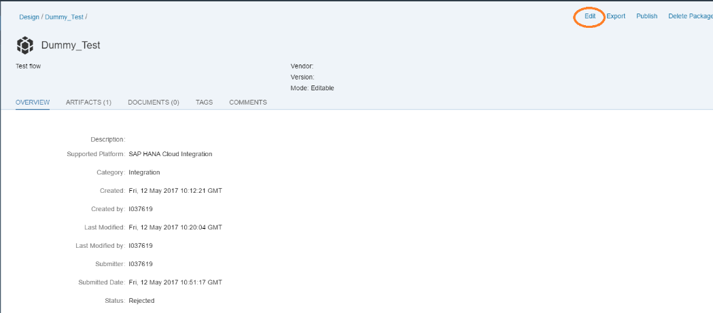
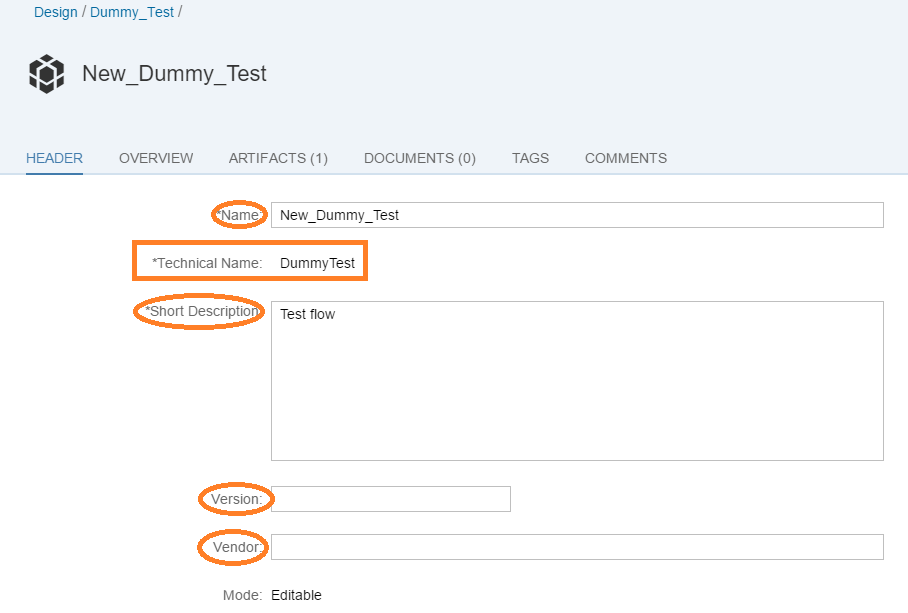
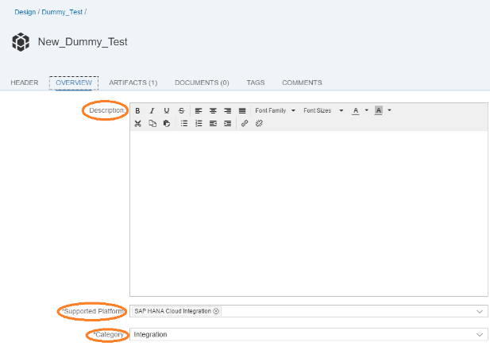
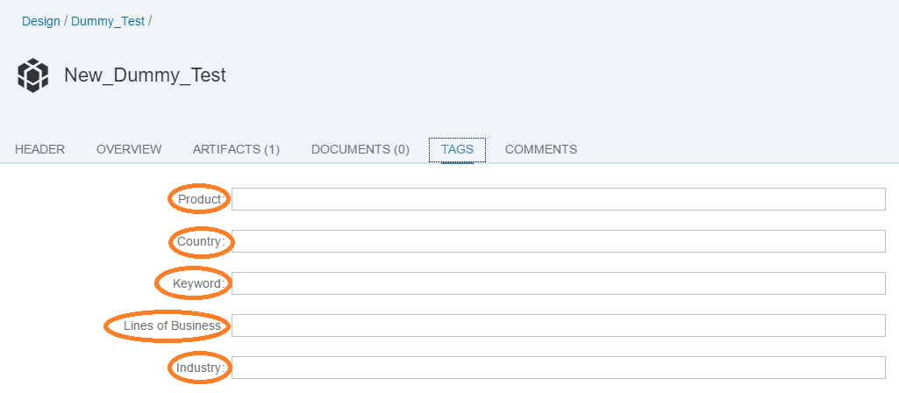
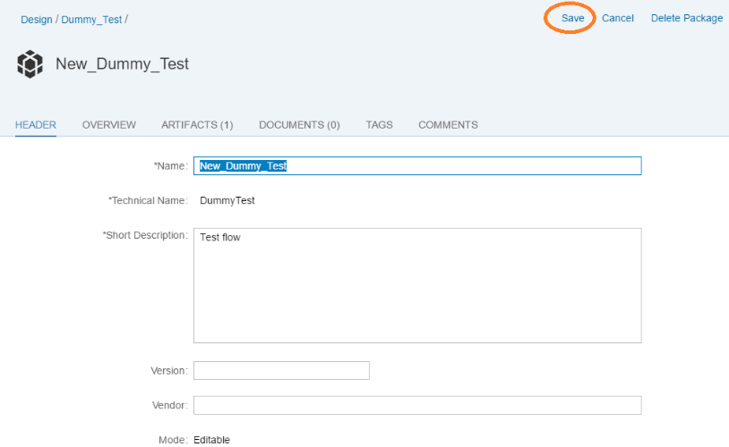
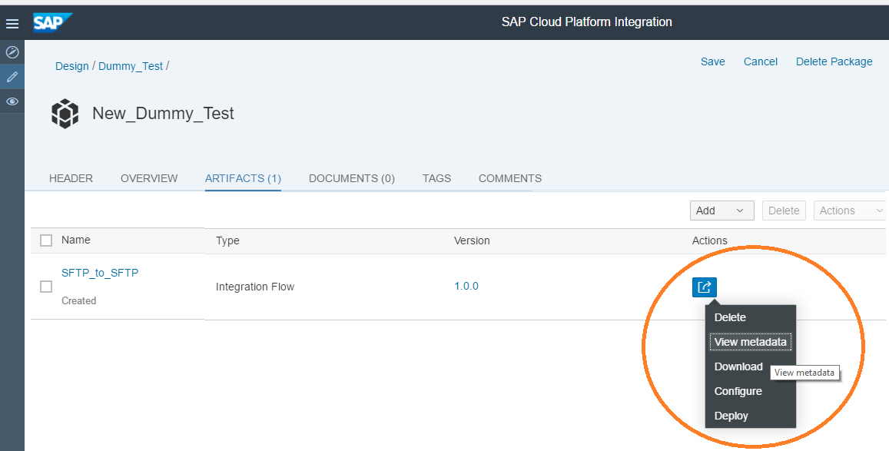
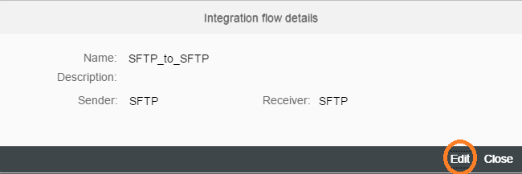
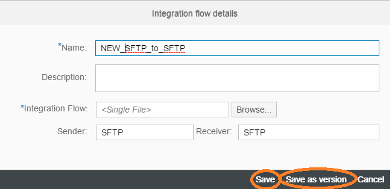
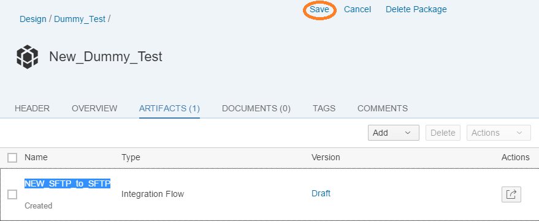

Renaming Package or Artifact or Document in the WebUI

\| [Recipes by Topic](../../readme.md ) \| [Recipes by Author](../../author.md ) \| [Request Enhancement](https://github.com/SAP-samples/cloud-integration-flow/issues/new?assignees=&labels=Recipe%20Fix,enhancement&template=recipe-request.md&title=Improve%20Renaming-Package-or-Artifact-or-Document-in-the-WebUI ) \| [Report a bug](https://github.com/SAP-samples/cloud-integration-flow/issues/new?assignees=&labels=Recipe%20Fix,bug&template=bug_report.md&title=Issue%20with%20Renaming-Package-or-Artifact-or-Document-in-the-WebUI ) \| [Fix documentation](https://github.com/SAP-samples/cloud-integration-flow/issues/new?assignees=&labels=Recipe%20Fix,documentation&template=bug_report.md&title=Docu%20fix%20Renaming-Package-or-Artifact-or-Document-in-the-WebUI ) \|

 | [Meghna Shishodiya](https://github.com/author-profile ) |
----|----|

This recipe shows how you can rename your package, integration artifact or a document from the web interface.

## Recipe

**Motivation:**
Renaming integration artifact or document or package in the web interface

**Solution:**

**Edit Package Name:**

 Go to the Design view of the web interface and open the Package whose name needs to be updated:

Click on *Edit* on the top right side:

Go to the *Header* tab.

Now add the new name in the *Name* field. Note that the technical name cannot be changed. The Technical name can only be defined when you are either creating a new package or copying it from the Discover view:

Other fields that you can change are: Short description, Version and Vendor.

You can move to the other tabs, like *Overview* and *Tags* to change the corresponding fields:

Change the details and click on *Save* on the top right:

**Editing a Document or Artifact Name:**

Go to the Design view of the web interface and open the Package whose document or artifact’s name needs to be updated:

Click on *Edit* on the top right side:

Go to the *Artifacts* or *Documents* tab:

Click on the button under *Actions* for the Artifact whose name needs to be changed. Now click on *View Metadata*.

Now click on *Edit* on the bottom right:

Here you can change the Name, Description, Sender and Receiver.

You can also upload a new Artifact.

Finally, you can either choose to *Save* or *Save as version*.

The corresponding fields shall be changed:

Finally, *Save* the package by clicking on the *Save* button on the top right.
