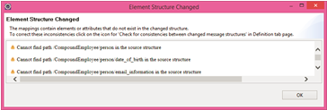
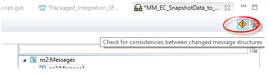
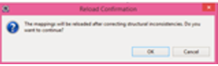
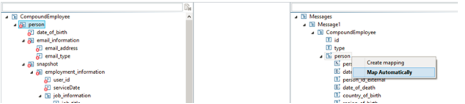

Retaining existing maps in message mapping after adding XSDs to the source or target

\| [Recipes by Topic](../../readme.md ) \| [Recipes by Author](../../author.md ) \| [Request Enhancement](https://github.com/SAP-samples/cloud-integration-flow/issues/new?assignees=&labels=Recipe%20Fix,enhancement&template=recipe-request.md&title=Improve%20Retaining-existing-maps-in-message-mapping-after-adding-XSDs-to-the-source-or-target ) \| [Report a bug](https://github.com/SAP-samples/cloud-integration-flow/issues/new?assignees=&labels=Recipe%20Fix,bug&template=bug_report.md&title=Issue%20with%20Retaining-existing-maps-in-message-mapping-after-adding-XSDs-to-the-source-or-target ) \| [Fix documentation](https://github.com/SAP-samples/cloud-integration-flow/issues/new?assignees=&labels=Recipe%20Fix,documentation&template=bug_report.md&title=Docu%20fix%20Retaining-existing-maps-in-message-mapping-after-adding-XSDs-to-the-source-or-target ) \|

 | [Meghna Shishodiya](https://github.com/author-profile ) |
----|----|

This recipe shows how you can preserve the mapping when you change the structure of the source or the target XSD.

## Recipe
**Motivation:**

Changing an existing message mapping by adding an XSD to the source or target leads to loss of existing maps.

**Guidelines:**

Whenever a simple message mapping is changed and multiple XSDs are added to either the source or the target, the previous mappings are disturbed. This happens because an additional root tag gets added to hold the multiple XSDs, which changes the xpath of all the elements.

 In order to get the older mappings back, follow the following instructions:

Click ok, go to the Definitions tab and click on *“Check for inconsistencies between changed message structures”* on the top right corner.

This will allow you to map the old source to the new source and the old target to the new target. Once you resolve the mapping between the old and new structures, the old mappings automatically get adjusted to the new structures:

Click ok.
Right click on the root from the old source and drag to the same element in the new source and click on *“Map Automatically”*

Do the same for the target structure.

Once done, the older mapping will get restored.
