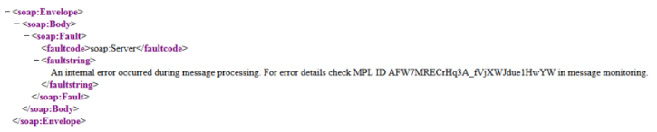
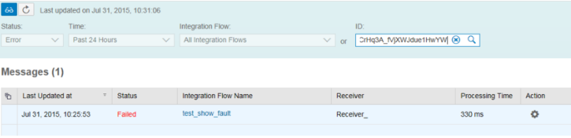
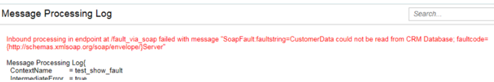
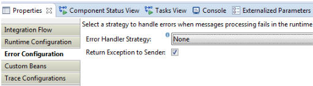
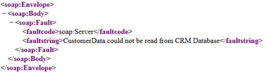

# Returning exception to your SOAP sender

\| [Recipes by Topic](../../readme.md ) \| [Recipes by Author](../../author.md ) \| [Request Enhancement](https://github.com/SAP-samples/cloud-integration-flow/issues/new?assignees=&labels=Recipe%20Fix,enhancement&template=recipe-request.md&title=Improve%20Returning-exception-to-your-SOAP-sender ) \| [Report a bug](https://github.com/SAP-samples/cloud-integration-flow/issues/new?assignees=&labels=Recipe%20Fix,bug&template=bug_report.md&title=Issue%20with%20Returning-exception-to-your-SOAP-sender ) \| [Fix documentation](https://github.com/SAP-samples/cloud-integration-flow/issues/new?assignees=&labels=Recipe%20Fix,documentation&template=bug_report.md&title=Docu%20fix%20Returning-exception-to-your-SOAP-sender ) \|

 | [Meghna Shishodiya](https://github.com/author-profile ) |
----|----|

This recipe explains how you can transmit an exception generated in Cloud Platform Integration back to the sender

## Recipe

Motivation:
How can I control if the exception getting generated in Cloud Platform Integration is transmitted back to the sender?

Solution:
For security reasons, we introduced a feature in Cloud Platform Integration that prevents errors that occur during the processing in Cloud Platform Integration or while transferring messages to a receiver system, back to the SOAP sender.
Reason: the exceptions might also include system information that may allow attackers to find a way to break into the system. With the new mechanism, the sender receives instead a generic error message containing the MPL ID (in case Message Processing Log is enabled at all).

This ID can to searched via Cloud Platform Integration monitoring for the error details:

You can find the details of the exception in the detailed logs:

However, there might be cases where the SOAP sender wants to see the error on its side. In order to enable this, we can use a flag that shall return the exceptions back to the sender. The flag is under "Error Configuration" section of the integration flow:

After re-deploying the integration flow a SOAP call to this service would return:

It is now up to the integration flow developer if errors shall be returned to the sender system or if they shall only be visible inside Cloud Platform Integration.
