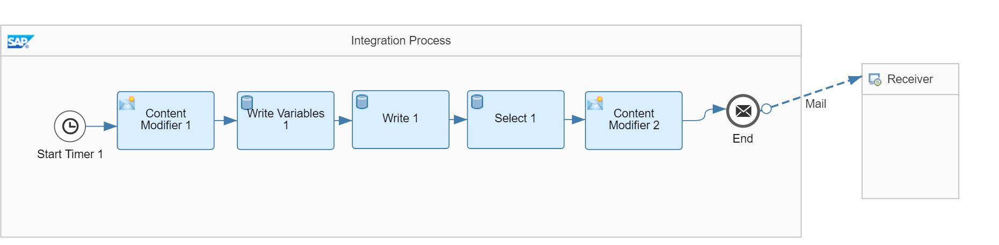
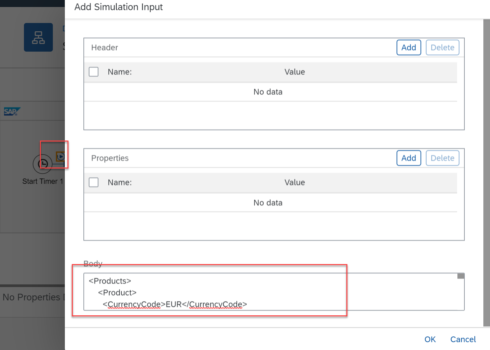
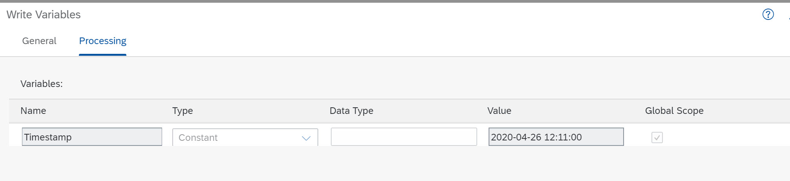
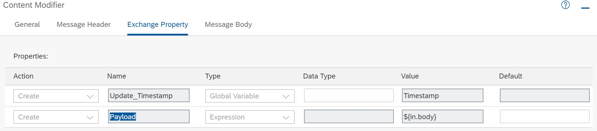
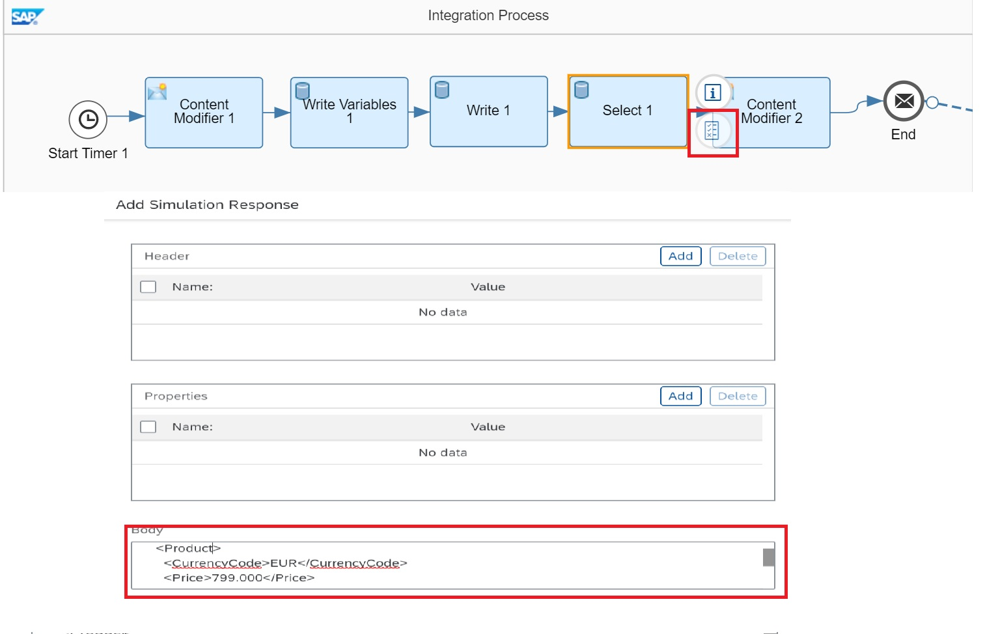
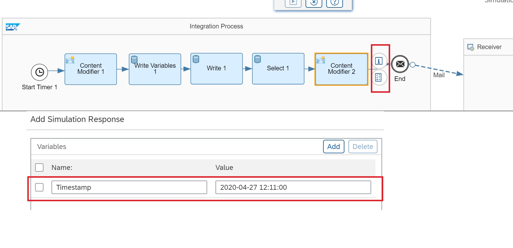
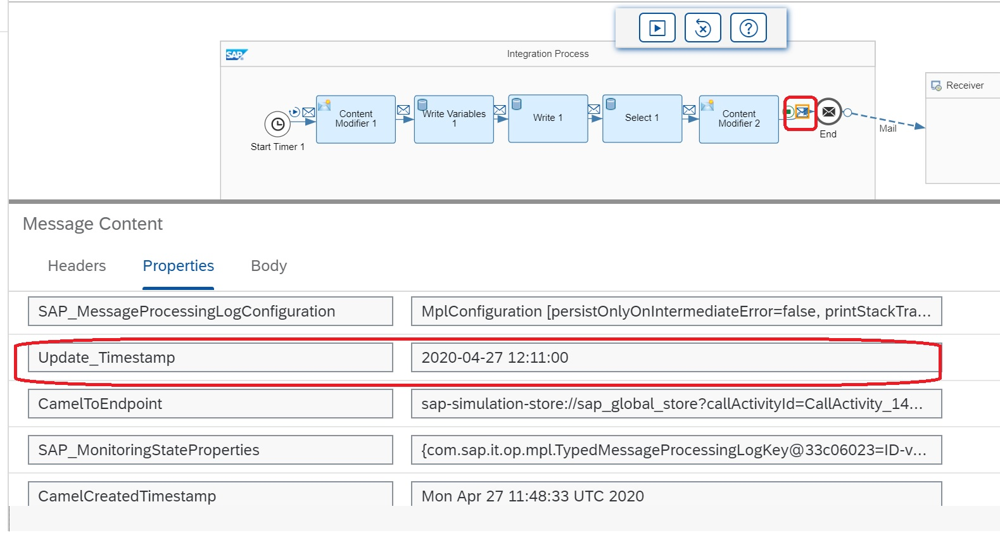
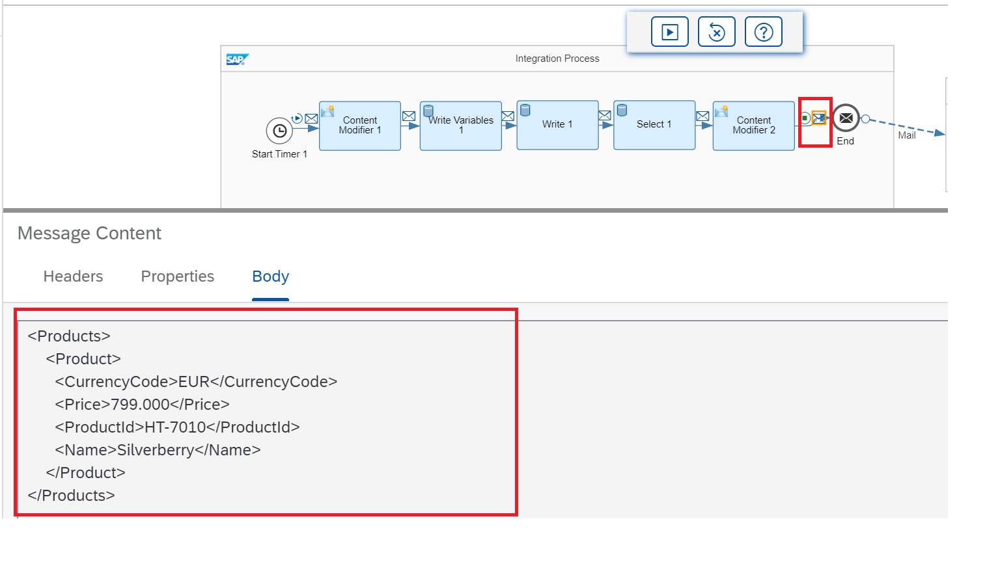

# Simulate Response from Datastore  Select Operation and  Write Variable

|[Abhinav Verma](https://github.com/abhinavverma0501)|
----|----|

This recipe will explain how we can simulate  and read the value of Write Variable in Content Modifer.Also,we will learn to simulate the Datastore Select Operation by leveraging Integration Flow Simulation feature.  

To know more about this feature and various functionalities, please refer the reference section.

The intension of this recipe is to show how to Simulate the Write Variable and Datastore, hence some values are hardcoded.

[Download the integration flow sample](Simulate-Response-from-Write-Variable-and-DataStore-Select.zip)

## Recipe

Step|Code|Why?
----|----|----
Open integration flow in read mode | | Simulation feature as of now is available in the read-mode of integration flow. On the top right corner of the integration flow editor, you see a toggle button that helps you to enable the simulation. It is switched off by default.
 Switch on simulation mode| | On enabling the Simulation button, the simulation tool appears over the integration flow. This tool let you run simulation, clear simulation.
Define start point ||To define the start point of your simulation. Click on the connector line where you need to define the start of your simulation. In our scenario, it will be after start timer event.
Define end point ||To define the end point of your simulation. Click on the connector where you need to define the end of your simulation. Here, it will be before End Message.
Provide an input to simulate the flow||To start simulation, message input is required. Click start point which will open the simulation input dialog.Enter the input payload in the body(provide below).
Simulate response from Datastore Select Operation|| Add the response payload from Datastore Select Operation.Details are below.Add Simulation  Response speed button would appear. On click of this speed button, a dialog would appear to simulate the response Datastore Select Operation.
Read the value of Write Variable in Content Modifier|| Simulate Response to read the value of Write Variable in Content Modifer.
Run Simulation|| Click the Run simulation from the Simulation tool.
Clear Simulation|| In order to clear the simulation input, output and commence to test other subset of integration flow.


## References
* [Integration Flow Simulation product documentation](https://help.sap.com/viewer/368c481cd6954bdfa5d0435479fd4eaf/Cloud/en-US/2e2210b6db0c4fdb937b3a57d952f582.html)
* [Integration Flow Simulation blog post](https://blogs.sap.com/2020/04/13/integration-flow-simulation-in-sap-cloud-platform-integration/)


## Sample integration flow
The scenario will show how we can simulate and read the value of Write  variable in content modifier. Also, it will show how we can simulate the Datastore Select Operation.

Integration flow constitutes of various steps like content modifier, Write variable, Datastore: Write and Select.




### Input Payload
This is the simulation input payload used in the sample integration flow. Select the Start point, the XML payload provide in should be feed in the Simulation Input Dialog.
```
<Products>
    <Product>
      <CurrencyCode>EUR</CurrencyCode>
      <Price>799.000</Price>
      <ProductId>HT-7010</ProductId>
      <Name>Silverberry</Name>
    </Product>
    <Product>
      <CurrencyCode>EUR</CurrencyCode>
      <Price>44.900</Price>
      <ProductId>HT-2025</ProductId>
      <Name>CD/DVD case: 264 capacity</Name>
    </Product>
    <Product>
      <CurrencyCode>EUR</CurrencyCode>
      <Price>1230.000</Price>
      <ProductId>HT-1137</ProductId>
      <Name>Flat X-large II</Name>
    </Product>
    <Product>
      <CurrencyCode>EUR</CurrencyCode>
      <Price>900.000</Price>
      <ProductId>HT-1601</ProductId>
      <Name>Family PC Pro</Name>
    </Product>
    <Product>
      <CurrencyCode>EUR</CurrencyCode>
      <Price>34.000</Price>
      <ProductId>HT-1106</ProductId>
      <Name>Smart Firewall</Name>
    </Product>
</Products>

```



Content Modifier1 will receive the  input payload.

Add the Write variable after the Content Modifier1 define the variable name "Timestamp".We will read the value of Write variable in Content Modifier2 by leveraging Integration Flow Simulation feature.



Add below properties in Content Modifier2
"Update_Timestamp"and "Payload".



### Response payload from Select DataStore
Add this below payload as Simulated response from the Select Datastore flowstep.
```
<Products>
    <Product>
      <CurrencyCode>EUR</CurrencyCode>
      <Price>799.000</Price>
      <ProductId>HT-7010</ProductId>
      <Name>Silverberry</Name>
    </Product>
</Products>
```



### Simulate the value of Write Variable

Go to the Content Modifier2 and click on add Simulation Response.Click on add Variable and write the Variable name i.e "Timestamp"and put the below value.

```
Timestamp 2020-04-27 12:11:00
```


This is how we can simulate and read the value of Write  variable in content modifier.


### Run Simulation

Once all the necessary input and response payload is provided, you can run the simulation. Once the simulation is complete,we can read the simulated value of  Write Variable in Content Modifier2 as property in Trace Envelope.After that click on the Message Body of Trace Envelope of Content Modifer2,you will see the payload updated after simulating the Datastore Select operation.





This ends the recipe of integration flow simulation for Datastore Select and Write Variable.
