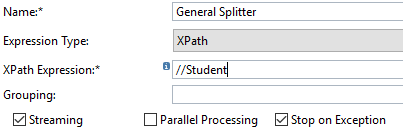
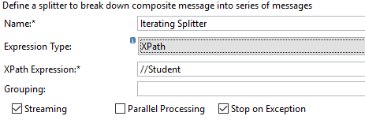
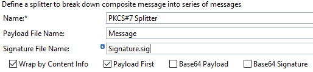
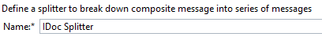
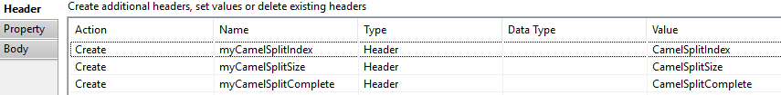
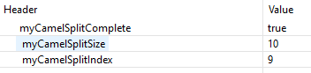

# Understanding Splitters

\| [Recipes by Topic](../../readme.md ) \| [Recipes by Author](../../author.md ) \| [Request Enhancement](https://github.com/SAP-samples/cloud-integration-flow/issues/new?assignees=&labels=Recipe%20Fix,enhancement&template=recipe-request.md&title=Improve%20Working-with-Splitters ) \| [Report a bug](https://github.com/SAP-samples/cloud-integration-flow/issues/new?assignees=&labels=Recipe%20Fix,bug&template=bug_report.md&title=Issue%20with%20Working-with-Splitters ) \| [Fix documentation](https://github.com/SAP-samples/cloud-integration-flow/issues/new?assignees=&labels=Recipe%20Fix,documentation&template=bug_report.md&title=Docu%20fix%20Working-with-Splitters ) \|

 | [Meghna Shishodiya](https://github.com/author-profile ) |
----|----|

This recipe provides details about the how to use the Splitter process step, with special focus on the difference between the working of different splitters.

[General Splitter](General_Splitter.zip) |
[Iterating Splitter](Iterating_Splitter.zip) |
[PKCS Splitter](PKCS_Splitter.zip) |
[IDoc Splitter](IDoc_Splitter.zip)

## Recipe

A Splitter step allows you to break you message into smaller parts, which can be processed independently.

Cloud Platform Integration has 4 types of Splitters:

1.	General Splitter – A splitter that divides a message containing multiple messages into individual messages. This splitter preserves the context of the root nodes with each split message. For clarification, please refer to the example below.

  

* Name – can be any name for the Splitter
* Expression Type – defines how to split the message. It can have 2 value:
    * XPath – XPath of the node that needs to be split. Is relevant for XML messages.
    * Line Break – each line is a new split message. Split when a new line character is encountered. It works on both XML and non-XML inputs.
* XPath Expression – XPath of the node that marks each split message.
* 	Streaming - Enable this if you want to start splitting before the entire big message is loaded into memory. The system will first divide the message into chunks and starts splitting the chunks into split messages. This is only relevant if the splitter is the first step after the step that fetches data – otherwise, the content would have already loaded in memory.
* Parallel Processing – check this if you want to process the split messages parallelly. If this is not checked, all split messages shall be processed serially and the order shall be maintained.
* Stop on Exception – check this if you want to stop processing, the moment a split message encounters an exception. In case Parallel Processing is chosen along with Stop on Exception, then the system will not be able to terminate the threads that are already processing – however, no new threads shall be spawned.

2.	Iterating Splitter – A splitter that divides a message containing multiple messages into individual messages. This splitter considers only the split entity and does not preserve the context of the root nodes. For clarification, please refer to the example below.

  

  This variant supports an additional Expression Type Token. This splits the message (which should be an XML) based on the Keyword mentioned as a token.

3.	PKCS Splitter – Separates the payload from its signature and provides them as split messages.

  

* Name – can be any name for the Splitter
* Payload File Name – Name given to the payload part of the message.
* Signature File Name – Name given to the signature part of the message.
* Wrap by Content Info - if you want to wrap signature that is stored as a signed data type into a content info type. The result will be a signature wrapped in signed data type which in turn is wrapped in content info type.
* Payload first – check this to ensure that the payload is the first split message.
* Base64 Payload – check this if you want to encode the payload before returning it.
* Base64 Signature – check this if you want to encode the signature before returning it.

4.	IDoc Splitter – Divides a group of IDocs into individual IDocs. It only works if either the sender or the receiver channel is an IDoc channel. Here there is no chance to continue processing in case of an exception.

  

* Name – can be any name for the Splitter

Standard Splitter camel headers: We have 3 standard headers that can be used for getting additional details of the split:

Header value in the trace for my test message containing 10 split messages:

### Related Recipes
* [upstream-recipe-name](../upstream-recipe-folder-name)
* [alternate-recipe-name](../alternate-recipe-folder-name)

## References
* [General Splitter Documentation](https://help.sap.com/viewer/368c481cd6954bdfa5d0435479fd4eaf/Cloud/en-US/a6c1916c0bb044b3a084266a83994d4e.html)
* [Iterating Splitter Documentation](https://help.sap.com/viewer/368c481cd6954bdfa5d0435479fd4eaf/Cloud/en-US/d61d6ecc8c8d453baa95c59e85f9cab1.html)
* [PKCS Splitter Documentation](https://help.sap.com/viewer/368c481cd6954bdfa5d0435479fd4eaf/Cloud/en-US/6c1649bdd4d04c6ba3baddd490a42e9e.html)
* [Cloud Integration – Usage of Splitter Flow Steps in Local Process](https://blogs.sap.com/2018/02/07/cloud-integration-usage-of-splitter-flow-steps-in-local-process/)
* [Cloud Integration – Using Parallel Processing in General and Iterating Splitter](https://blogs.sap.com/2018/10/17/cloud-integration-using-parallel-processing-in-general-and-iterating-splitter/)

### Sample Output

Examples with non-XML inputs:

Example with XML input message:

