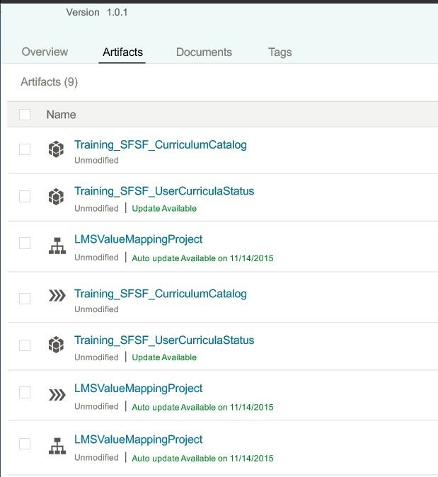
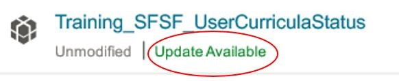
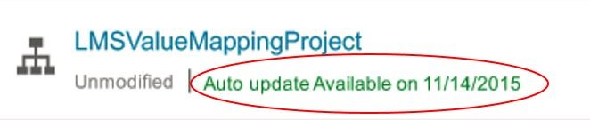
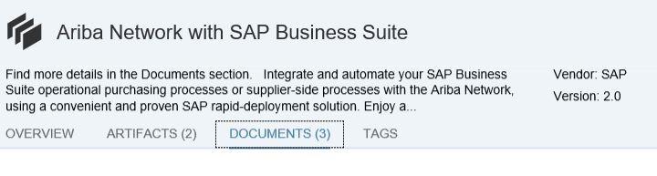

# Standard Content Update Governance

\| [Recipes by Topic](../../readme.md ) \| [Recipes by Author](../../author.md ) \| [Request Enhancement](https://github.com/SAP-samples/cloud-integration-flow/issues/new?assignees=&labels=Recipe%20Fix,enhancement&template=recipe-request.md&title=Improve%20Standard-Content-Update-Governance ) \| [Report a bug](https://github.com/SAP-samples/cloud-integration-flow/issues/new?assignees=&labels=Recipe%20Fix,bug&template=bug_report.md&title=Issue%20with%20Standard-Content-Update-Governance ) \| [Fix documentation](https://github.com/SAP-samples/cloud-integration-flow/issues/new?assignees=&labels=Recipe%20Fix,documentation&template=bug_report.md&title=Docu%20fix%20Standard-Content-Update-Governance ) \|

 | [Meghna Shishodiya](https://github.com/author-profile ) |
----|----|

Understand the nitty-gritty details about Standard Content Governance

## Recipe
**Overview:**

A subscription is created as soon as you copy a package from the Discover view to the Design view.
Each artifact and document bundled inside the package and the package itself will have one subscription entity each. It means that the system records that you have an instance of the corresponding package added to your tenant – so whenever there is an update (planned or available) for that content package (in part or full), you shall be informed via an “Update Available” tag mentioned next to the corresponding artifact(s). The content package need not be deployed on the tenant for this to work.

In case of an artifact is already deployed and an automatic update is released for that content package, the automatic update process also updates the deployed instance of the artifact in addition to stored instance (in the design view).

**Q1.**  When is the notification sent?

**A1.**  When the content publisher updates a package, it gets published to the local Content catalog and is submitted for approval. Once the content gets approved, notifications will be created for all the tenants subscribed for that package.

**Q2.**  Where is the notification sent?

**A2.**  Notification is pulled by each TMN applications while navigating to Design tab every time. The affected artifacts shall be marked with “Update Available”.

 

**Q3.** How long does the customer have for checking the changes?

**A3.** It depends on the update type. For manual update, then it is customers’ choice whether he wishes to implement the update – once he updates his content, the update takes effect immediately. He does not get the chance to check the change before, but he can always revert to an older version. For Automatic update, in case of an immediate update, the customers shall get a window of up to 12 hours before the update is applied. In case of scheduled automatic update, the corresponding artifacts shall be marked with the date when the automatic update will be applied. In both cases – immediate and scheduled, the customer has the option to apply the update before it is automatically done.

 

**Q4.**  Do I receive a notification for all content?

**A4.**  You will see a notification for all updates performed on all standard content packages that have been copied from the discover view to the design view for the tenant.

**Q5.**  How do I subscribe for notification?

**A5.**  A content subscription is created as soon as someone copies the content to his design space.

**Q6.**  Does the customer have an option not to implement a change?

**A6.**  Only in case of a manual update, the customer has the option to not implement the change. He can also implement a change and revert back to an older version later. In case of an automatic update, the update will always be applied – the customer has no control. However, in case of non-configureOnly content, the customer will have an option to revert back to an old version. However, if he does this, he shall not receive any automatic update on this content going forward.

**Q7.**  Can I try the content first on test and then approve if it should go on Factory – I want this process for all my content?

**A7.**  This is possible – the customer has to copy the content only in Test. The content transport from test to prod can be made manual. That way the prod tenant will not have any notification, update etc.

**Q8.**  To whom does a customer raise an issue with the content?

**A8.**  The corresponding contact or component shall be mentioned in the release notes of the content, which can be found under the documents’ tab of the content package.

**Q9.**  How does the update process differ for manual v/s automatic content package update?

**A9.**  For manual update, the user explicitly has to perform the update operation. For automatic update, no user interaction is required.

**Q10.**  Even though the customer is using the standard content, he does not want to get his content auto–updated. How can he control?

**A10.**  This is not possible. If the content is configured for automatic update, he cannot avoid the package form getting updated. However, in case of non-configureOnly content, the customer will have an option to revert back to an old version. However, if he does this, he shall not receive any automatic update on this content going forward.

**Q11.**   How does SAP categorize manual update content and automatic update content?

**A11.**   This is the decision of the content package publisher.

**Q12.**  Under which cases will a customer fall out of the content update contract?

**A12.**   Any change applied to the copied standard content, including change to name or description will cause the content to come out of the content update contract. Assigning values to externalized parameters however is permitted. Also creating a new version during copy from the catalog is also permitted.

**Q13.**  Does the content update contract apply to all the standard content?

**A13.**  The content update contract applies to all the content copied from catalog(or the discover view) into the design view.

**Q14.**  Can I roll back to an old content version?

**A14.**   Yes, rolling back to an older version is possible. However, once the content is rolled back, it is not entitled to receive any updates further.

**Q15.**  How will a customer (having customized content) be notified that a change is coming or has come?

**A15.**   When a content update is available, all the affected artifacts will be marked with “Update  Available”. In case of customized or rolled back content, the customer shall not have the option to apply the update.

**Q16.**  Is there a way he can incorporate the changes. What is the easiest way to merge content change in customized content? Do we have a tool?

**A16.**  There is no tool or means to merge the custom update with standard update on the content package. The only way a customer can get the standard update is to copy the content package again from the catalog ensuring that no ID conflicts happen.

**Q17.**  Is there a way to compare the content to know what has changed?

**A17.**  There is no possibility to compare two flows or package to know what has changed at a technical level. The content documentation will have details about the update. Additionally, the last modified field and last modifiedBy field will be updated. Also, the artifacts version history will be generated with one more entry.

**Q18.**  Can a customer choose the updates?

**A18.**  For manual update packages, the customer can choose whether he wants to update the content, but for auto-update packages, there is no possibility for customer to choose. However, for manual update and for auto-update on non-configureOnly, the customer will have an option to revert back to an old version. Although, if he does this, he shall not be able to perform any update on this content going forward.

**Q19.**  Are there any indications on the iflow through which I can know that my content is outdated?

**A19.**  All outdated artifacts will be marked with “Update Available”.

**Q20.**  How can I request for new requirements on the standard content?

**A20.**  Get in touch with the contact person or create a ticket on the component mentioned in the release notes of that content package.

**Q21.**  How do I customize/download config-only content?

**A21.**  Downloading of configure only content is restricted.

**Q22.**  If I customize an auto-update content, will my content be overwritten after the auto-update?

**A22.**  Once an auto-update content is changed, it will never be updated through automatic-update.

**Q23.**  Can I pick choose changes or I have to apply all the updates?

**A23.**  This is possible for manual updates, but not for automatic updates.

**Q24.**  What happens when I have updated parts of the package and I have an update to the entire package?

**A24.**  In case of manual update, all the affected entities shall be marked with “Update available”, but only the ones that are not customized will be updatable. For automatic update, all the non-customized artifacts shall be automatically updated.

