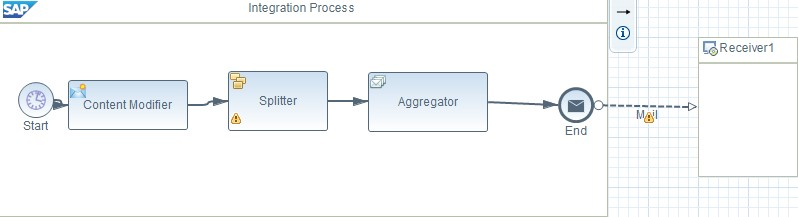
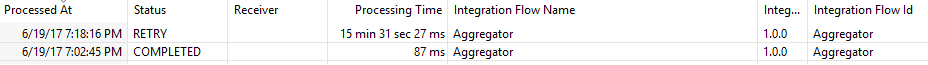
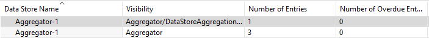
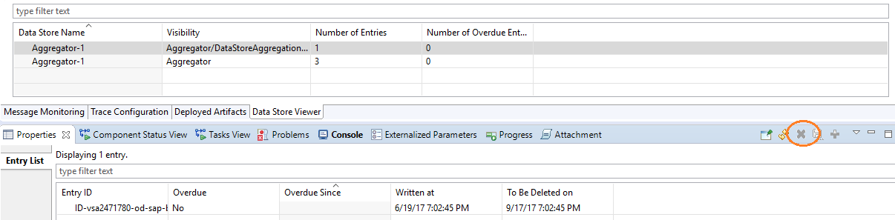
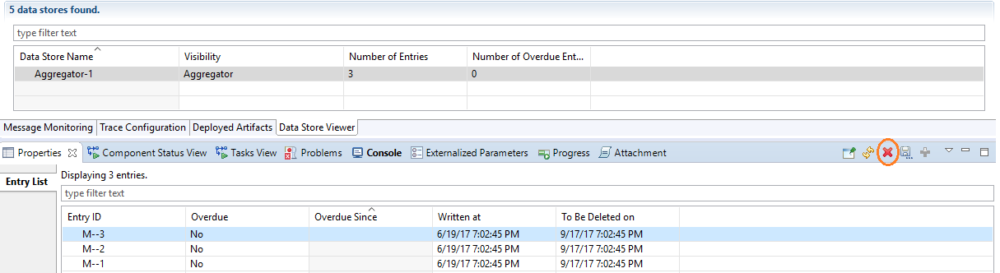

# Stop Aggregator from non-stop retry

\| [Recipes by Topic](../../readme.md ) \| [Recipes by Author](../../author.md ) \| [Request Enhancement](https://github.com/SAP-samples/cloud-integration-flow/issues/new?assignees=&labels=Recipe%20Fix,enhancement&template=recipe-request.md&title=Improve%20Stop-Aggregator-from-non-stop-retry ) \| [Report a bug](https://github.com/SAP-samples/cloud-integration-flow/issues/new?assignees=&labels=Recipe%20Fix,bug&template=bug_report.md&title=Issue%20with%20Stop-Aggregator-from-non-stop-retry ) \| [Fix documentation](https://github.com/SAP-samples/cloud-integration-flow/issues/new?assignees=&labels=Recipe%20Fix,documentation&template=bug_report.md&title=Docu%20fix%20Stop-Aggregator-from-non-stop-retry ) \|

 | [Meghna Shishodiya](https://github.com/author-profile ) |
----|----|

This recipe talks about how we can stop an Aggregator from non-stop retries.

## Recipe

**Motivation:**    
An integration flow containing an Aggregator step encounters a message processing failure. The Aggregator continues to retry the failed message. Since the reason of the message failure is the integration flow configuration, any number of retries do not help.

Even undeploying the integration flow does not remove the datastore reserved by the Aggregator.

The following integration flow fails because of incorrect mail adapter channel configuration:

There are 2 Message Monitoring entries – one for the integration flow and one for the Aggregator step:

Even if the integration flow is undeployed, the retry does not stop.
Every Aggregator uses a datastore behind the scenes. The name of the datastore is the same as the value of the field Data Store Name in the Aggregator configuration. So, in order to release the Aggregator, delete the Datastore explicitly.
Goto the DataStore viewer:

You will find 2 entries for each Aggregator.
Select the first one and go to the Properties tab:

Select the Entry and click on Delete Entry button on the right to delete the entry.

Do the same for the other entry as well.

The retry of message will stop.

### Related Recipes
* [upstream-recipe-name](../upstream-recipe-folder-name)\
* [alternate-recipe-name](../alternate-recipe-folder-name)
