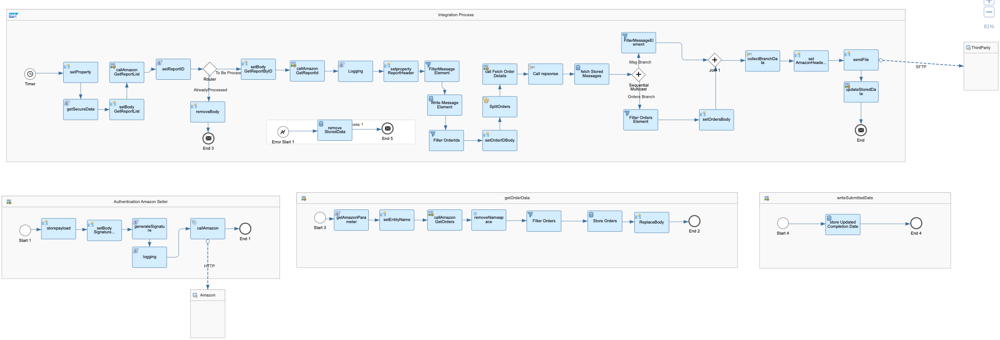

# Amazon Seller Marketplace Integration with Third Party

\| [Recipes by Topic](../../readme.md ) \| [Recipes by Author](../../author.md ) \| [Request Enhancement](https://github.com/SAP-samples/cloud-integration-flow/issues/new?assignees=&labels=Recipe%20Fix,enhancement&template=recipe-request.md&title=ImproveAmazon%20Seller%20Marketplace%20Integration%20with%20Third%20Party ) \| [Report a bug](https://github.com/SAP-samples/cloud-integration-flow/issues/new?assignees=&labels=Recipe%20Fix,bug&template=bug_report.md&title=Issue%20withAmazon%20Seller%20Marketplace%20Integration%20with%20Third%20Party ) \| [Fix documentation](https://github.com/SAP-samples/cloud-integration-flow/issues/new?assignees=&labels=Recipe%20Fix,documentation&template=bug_report.md&title=Docu%20fixAmazon%20Seller%20Marketplace%20Integration%20with%20Third%20Party ) \|

 | [SAP Accelerator Business Hub](https://api.sap.com/allcommunity) |
----|----|

File based integration for sending Sales Transaction data from Amazon Seller Marketplace to Third Party (SAP Vistex template)  

[Download the reuseable integration package](AmazonSellerMarketplaceIntegrationwithThirdParty.zip)\
[View package on the SAP Accelerator Business Hub](https://api.sap.com/package/AmazonSellerMarketplaceIntegrationwithThirdParty/overview)

## Integration flows

### Replicate Sales transactions
Interface for sending Sales Transaction data from Amazon Seller Central to Third Party\
[View on SAP Accelerator Business Hub](https://api.sap.com/integrationflow/Replicate_Sales_Transactions)

