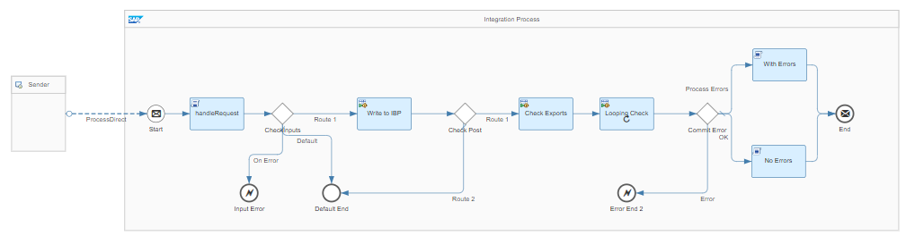
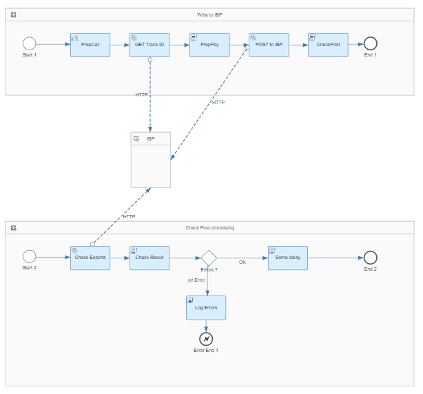
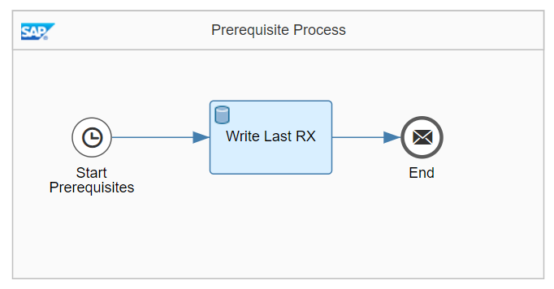
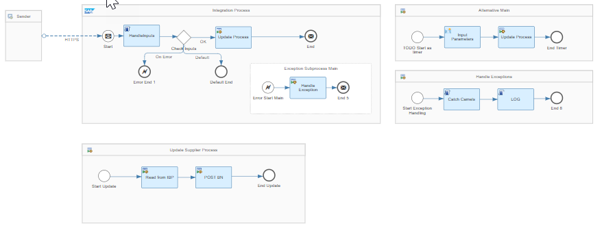
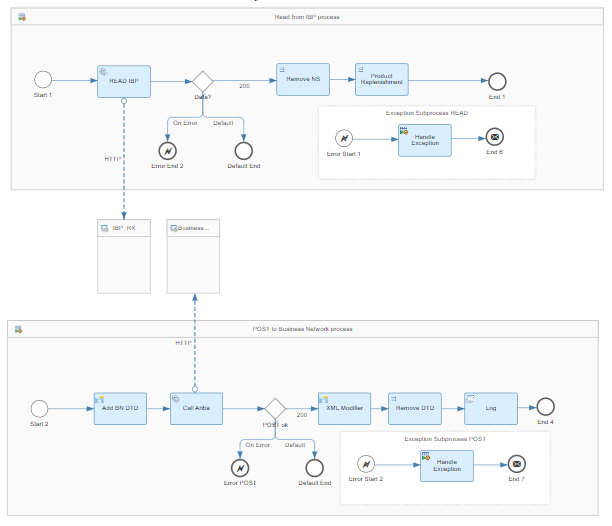
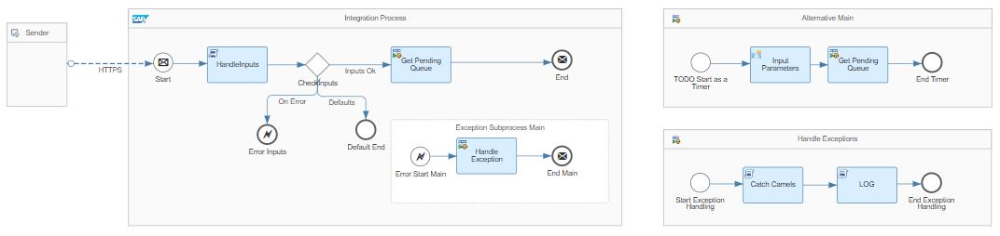
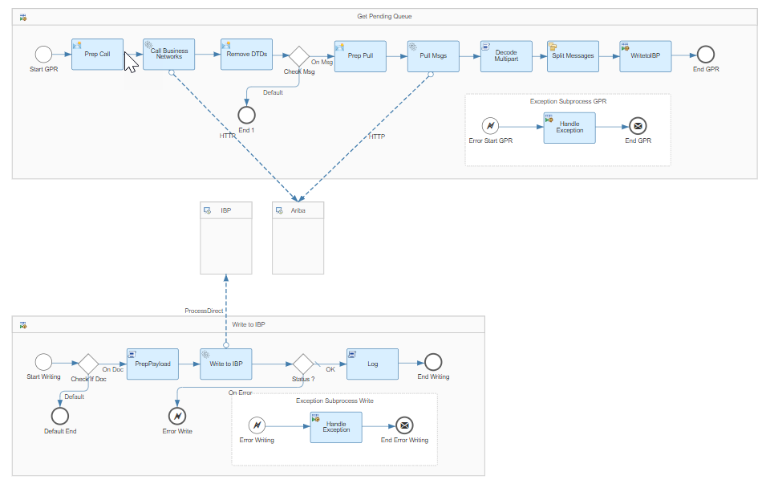

# Supplier Integration between SAP Integrated Business Planning and SAP Business Networks 

\| [Recipes by Topic](../../readme.md ) \| [Recipes by Author](../../author.md ) \| [Request Enhancement](https://github.com/SAP-samples/cloud-integration-flow/issues/new?assignees=&labels=Recipe%20Fix,enhancement&template=recipe-request.md&title=Improve%20Supplier%20Integration%20between%20SAP%20Integrated%20Business%20Planning%20and%20SAP%20Business%20Networks) \| [Report a bug](https://github.com/SAP-samples/cloud-integration-flow/issues/new?assignees=&labels=Recipe%20Fix,bug&template=bug_report.md&title=Issue%20with%20Supplier%20Integration%20between%20SAP%20Integrated%20Business%20Planning%20and%20SAP%20Business%20Networks)\| [Fix documentation](https://github.com/SAP-samples/cloud-integration-flow/issues/new?assignees=&labels=Recipe%20Fix,documentation&template=bug_report.md&title=Docu%20fix%20Supplier%20Integration%20between%20SAP%20Integrated%20Business%20Planning%20and%20SAP%20Business%20Networks) \| 

  | [SAP Business Accelerator Hub](https://api.sap.com/allcommunity) | 
 ----|----| 

Replicate supplier related data between SAP Integrated Business Planning (SAP IBP) and SAP Business Networks.

These iFlows help to exchange data between SAP Integrated Business Planning and SAP Business Networks from a Supplier prespective.

The flows can either be triggered via an REST API or via Timer-based Iflow.

[Download the integration package](AribaSupplierIntegration.zip)\
[View package on the SAP Business Accelerator Hub](https://api.sap.com/package/AribaSupplierIntegration)\
[View documentation](ConfigurationGuide_AribaSupplierIntegration.pdf)\
[View high level effort](effort.md)
## Integration flows
### Process key figure data to SAP IBP 
This iFlow can be used as a standalone flow to write key figure data to SAP Integrated business planning using oData services. \
 
 
### Create Datastore 
This Iflow sets the Datastore entry for the last received Ariba messages. \
 
### Update supplier commit 
This iFlow can be called by an external application or it can be scheduled to run periodically \
 
 
### Replicate buyer forecast data from SAP Ariba to SAP IBP 
An iflow to download the Pending Requests from Business networks. Only Productactivity messages with type= Forecast, are treated. \
 
 
