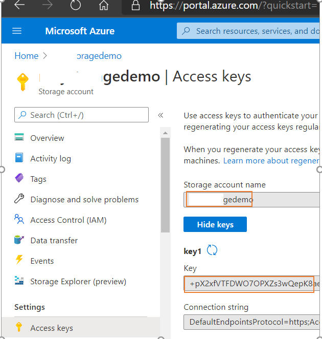
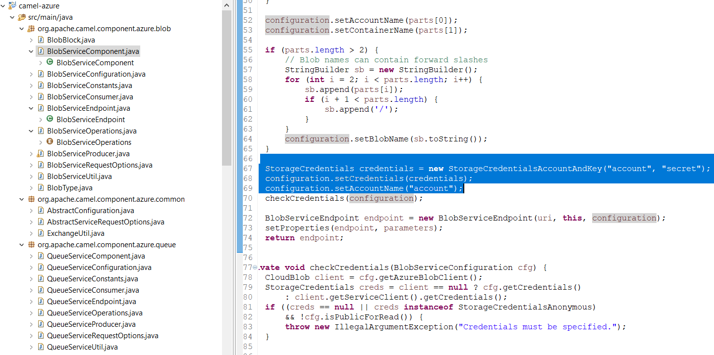
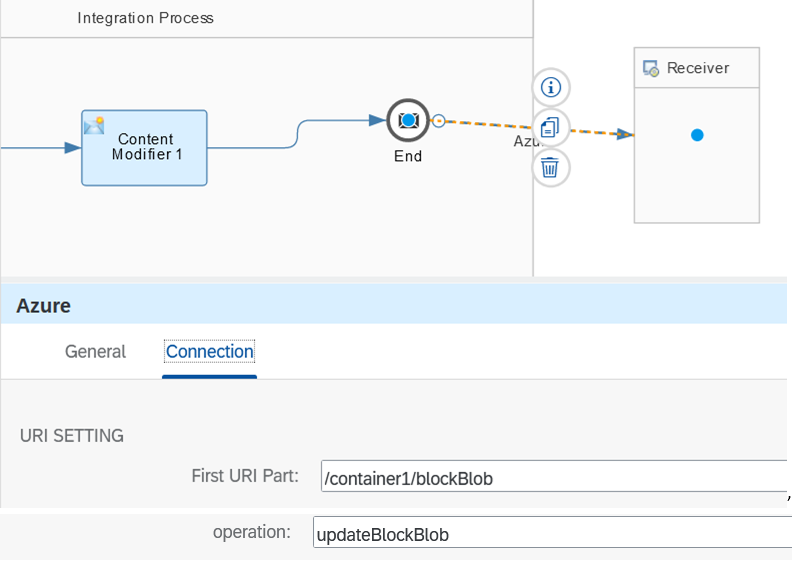
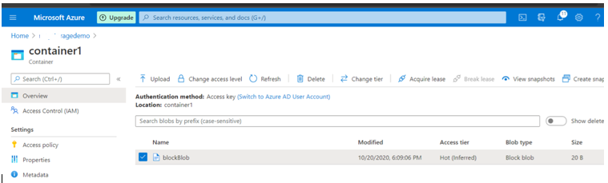
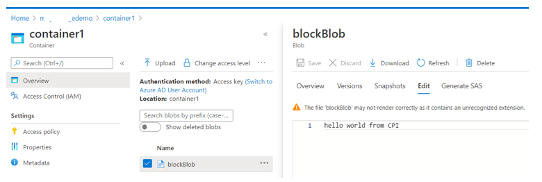

# Build custom Azure Blob Storage integration adapter

\| [Recipes by Topic](../../readme.md ) \| [Recipes by Author](../../author.md ) \| [Request Enhancement](https://github.com/SAP/apibusinesshub-integration-recipes/issues/new?assignees=&labels=Recipe%20Fix,enhancement&template=recipe-request.md&title=Improve%20Azure Blob Storage-integration-adapter%20 ) \| [Report a bug](https://github.com/SAP/apibusinesshub-integration-recipes/issues/new?assignees=&labels=Recipe%20Fix,bug&template=bug_report.md&title=Issue%20with%20Azure Blob Storage-integration-adapter%20 ) \| [Fix documentation](https://github.com/SAP/apibusinesshub-integration-recipes/issues/new?assignees=&labels=Recipe%20Fix,documentation&template=bug_report.md&title=Docu%20fix%20Azure Blob Storage-integration-adapter%20 ) \|

 | [Mayur Mohan Belur](https://github.com/mayurmohan ) |
----|----|

The Azure Blob Storage: Azure Blob Storage is a massively scalable and secure object storage for cloud-native workloads, archives, data lakes, high-performance computing and machine learning. The camel-Azure Blob Storage component stores and retrieves blobs from [Azure Storage Blob Service](https://azure.microsoft.com/services/storage/blobs/) using Azure APIs v12.

This integration adapter enables an integration flow to connect to Azure Blob Storage collection.

[Download the integration flow sample](IntegrationFlow/AzureDemo.zip)

[Instructions to build the adapter](../../build-deploy-camel-community-adapters.md)

## Recipe

Step|Code|Why?
----|----|----
Get Credentials from [Azure Blob Storage Account Portal](https://portal.azure.com) | | You will need to signup, incase you have not already.|
Hard code Azure cloud account credential configuration | | The Apache Camel Azure component looks for a bean to resolve the Azure cloud account credentials details, for the purpose of this recipe we bypass the bean lookup and hard code the credentials|
Build and deploy the ESA file|[Instructions to build the adapter](../../build-deploy-camel-community-adapters.md#download-and-installation)| This adapter needs to be deployed for the [sample integration flow](IntegrationFlow/AzureDemo.zip) to work |

## References
* [Connecting to Azure Blob storage from SAP Cloud Platform Integration using Camel-Azure component](https://blogs.sap.com/2020/10/21/connecting-to-azure-blob-storage-from-sap-cloud-platform-integration-using-camel-azure-component/)
* [Azure Blob Storage Camel component documentation](https://camel.apache.org/components/latest/azure-storage-blob-component.html)
* [Azure Blog Storgae Camel component on MVNRepository](https://mvnrepository.com/artifact/org.apache.camel/camel-azure/2.24.0)

## Sample integration flow
In the Apache Camel Azure component, it looks for a bean to resolve the Azure cloud account credentials details, here in the code that bean lookup is bypassed with the manual credential configuration, which you have to provide in the project source.

### Sample Input
The hard coded message in the content modifier will be stored as a Azure Block blob.

### Sample Output
Here we see the message sent is visible on the Azure Blob Storage server\
\
\

