# B2B Integration Factory - Cloud Integration - Trading Partner Management (TPM)

\| [Recipes by Topic](../../readme.md ) \| [Recipes by Author](../../author.md ) \| [Request Enhancement](https://github.com/SAP-samples/cloud-integration-flow/issues/new?assignees=&labels=Recipe%20Fix,enhancement&template=recipe-request.md&title=Improve%20Cloud%20Integration%20-%20Trading%20Partner%20Management) \| [Report a bug](https://github.com/SAP-samples/cloud-integration-flow/issues/new?assignees=&labels=Recipe%20Fix,bug&template=bug_report.md&title=Issue%20with%20Cloud%20Integration%20-%20Trading%20Partner%20Management)\| [Fix documentation](https://github.com/SAP-samples/cloud-integration-flow/issues/new?assignees=&labels=Recipe%20Fix,documentation&template=bug_report.md&title=Docu%20fix%20Cloud%20Integration%20-%20Trading%20Partner%20Management) \| 

  | [SAP Business Accelerator Hub](https://api.sap.com/allcommunity) | 
 ----|----| 

The B2B Integration Factory - Integration packages  offer additional features that are currently not yet supported by the B2B Capabilities @ SAP Integration Suite and the standard integration package "Cloud Integration - Trading Partner Management V2". These features are implemented through extensions in the integration flows or through scripts incorporated into the flows.

 For more information about the standard integration package "Cloud Integration - Trading Partner Management V2", see:

[Cloud Integration - Trading Partner Management V2 standard package](https://api.sap.com/package/CloudIntegrationTradingPartnerManagementV2/overview)

 The extensions are regularly reviewed against the released standard features in the B2B Capabilities @ SAP
Integration Suite and will be removed once a standard feature covers the exact same use case. The B2B
Integration Factory will also be adding further extensions to the Integration Packages in upcoming releases
based on demand. You can influence this decision by submitting a request on the GitHub page for
the B2B Integration Factory - Integration Packages.

The following generic packages are available: 

[B2B Integration Factory - Communication Receiver Flows (Custom)](../b2bintegrationfactorycommunicationreceiverflowscustom)\
[B2B Integration Factory - Communication Sender Flows](../b2bintegrationfactorycommunicationsenderflows)\
[B2B Integration Factory - Interchange Extraction Flows](../b2bintegrationfactoryinterchangeextractionflows)\
[B2B Integration Factory - Extended Interchange Processing Flows](../b2bintegrationfactoryextendedinterchangeprocessingflows)\
[B2B Integration Factory - Pre and Post-Processing Flows (Custom)](../b2bintegrationfactorypreandpostprocessingflowscustom)

To implement an Order-to-Cash scenario, find the following example package and the documentation:

[Download the order-to-cash integration package](/b2bintegrationfactorycloudintegrationtradingpartnermanagement/ordertocash/Order_To_Cash.zip)\
[View documentation for the order-to-cash scenario](/b2bintegrationfactorycloudintegrationtradingpartnermanagement/ordertocash/Order_to_Cash_-_SAP_IDOC_to_UN-EDIFACT_D.10B.pdf)

## Information about B2B Integration Factory - Cloud Integration - TPM Package

The Main Integration Package replaces the standard integration package, "Cloud Integration - Trading Partner Management V2."    It covers the generic integration flows for "SAP Cloud Integration - Trading Partner Management" and includes additional relevant extension points and custom features that are not provided by the standard solution at this time.   It contains the script collections and integration flows needed for processing messages dynamically between B2B partners, based on configurations done in Trading Partner Management or in additional integration flows that are connected via the provided extension points.   This Integration Package should be used if at least one of the provided custom extensions is required.

[Download Cloud Integration - TPM package](B2BIntegrationFactoryCloudIntegrationTradingPartnerManagement.zip)\
[View Cloud Integration - TPM package on the SAP Business Accelerator Hub](https://api.sap.com/package/B2BIntegrationFactoryCloudIntegrationTradingPartnerManagement)\
[View documentation for Cloud Integration TPM Integration Packages with Custom Extensions](B2B_Integration_Factory_TPM_Integration_Packages.pdf)\
[View high level effort](effort.md)
## Integration flows for Cloud Integration - TPM Package
### Step 1b - Sender Interchange Extraction Flow 
Gets interchange/message payload from sender communication flow via ProcessDirect, identifies type system, calls the appropriate extraction flows or steps and writes the payload together with the extracted header parameters into message queue. \
 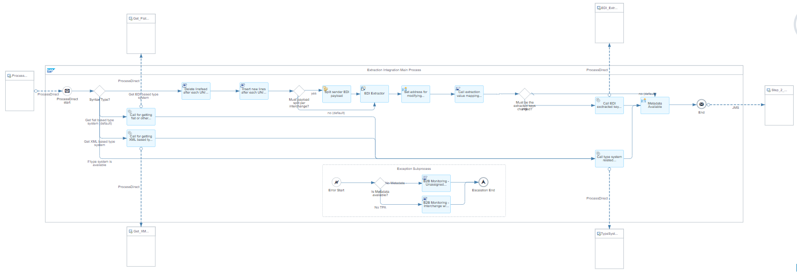
### Extended Groovy Scripts 
Extended script collection with all additional scripts required to support requirements that are not yet part of the Reusable Script Collection \
 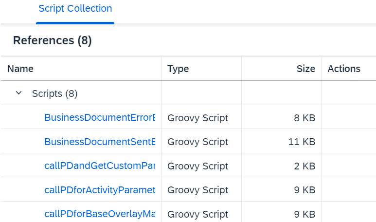
 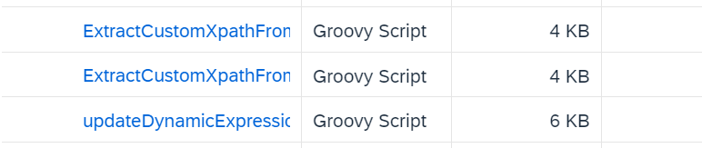
### Step 1a - Sender AS2 MDN Flow 
Receives AS2 MDNs (Message Disposition Notifications), checks if this MDN correlates with a submitted AS2 message and submits the MDN status to the B2B monitoring. \
 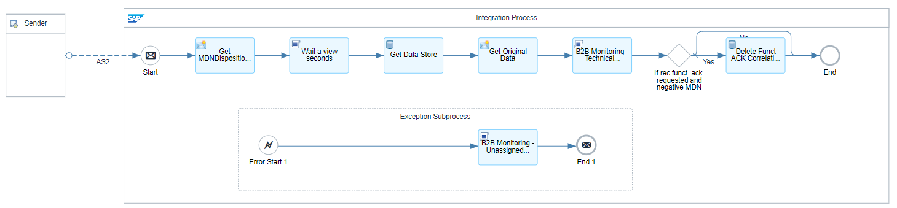
### Step 3 - Receiver Communication Flow 
Picks the assembled interchange/message payloads from outbound queue (SAP_TPM_OUTBOUND_Q) and sends them to the final receiver (either trading partner or company system) by the configured communication protocol.  \
 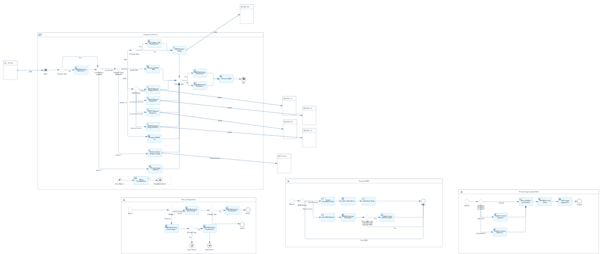
 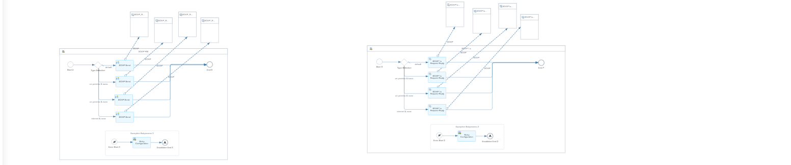
### Reusable Groovy Scripts 
Script collection aligned to SAP standard script collection from "Cloud Integration - Trading Partner Management V2". It provides scripts with the needed reusable functionalities (events, PartnerDirectory lookup, log, B2B monitor, number ranges...) \
 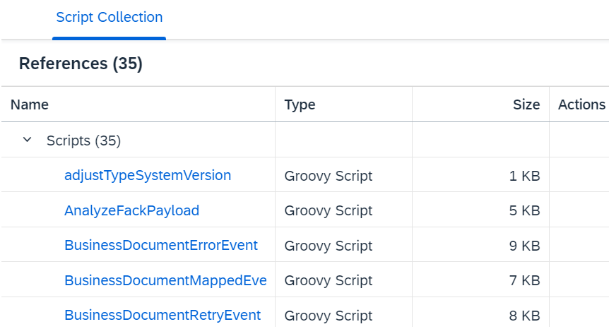
 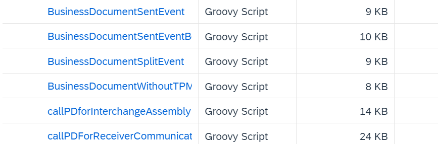
### Step 2 - Interchange Processing Flow 
Picks incoming interchange/message payloads from inbound queue (SAP_TPM_INBOUND_Q) and processes it according the dynamically obtained artefacts from PD. \
 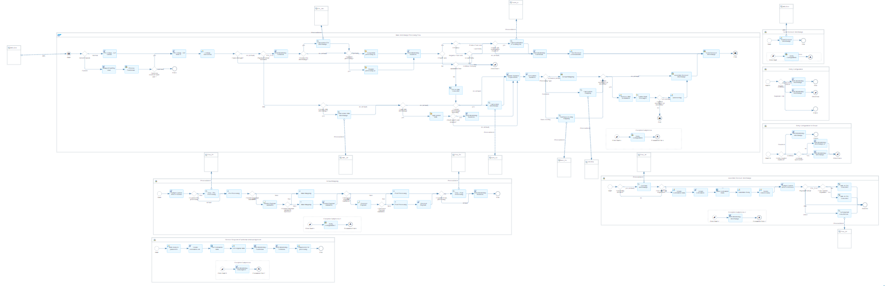
### Step 2b - Interchange Processing Flow - Base-Overlay Mapping Process 
Base-Overlay Mapping is divided into two mapping steps, the base and the overlay-mapping. 
The base mapping generates the common parts of a target payload and the overlay-mapping generates the delta part of it. Both will be merged afterwards. \
 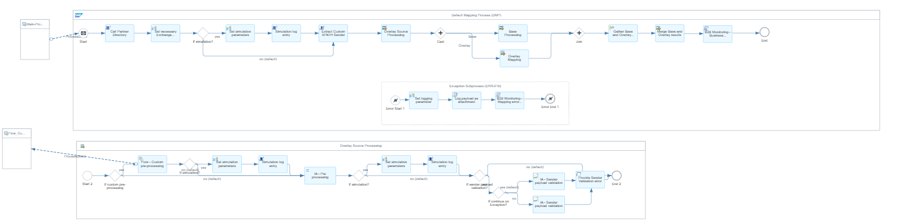
 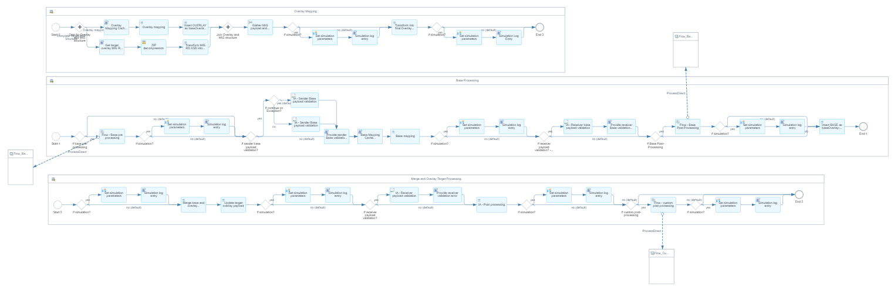

