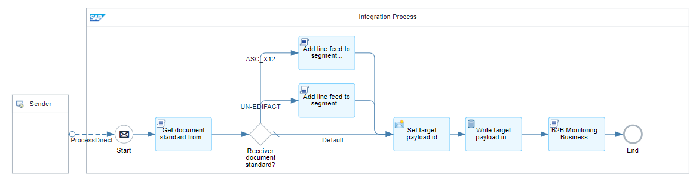
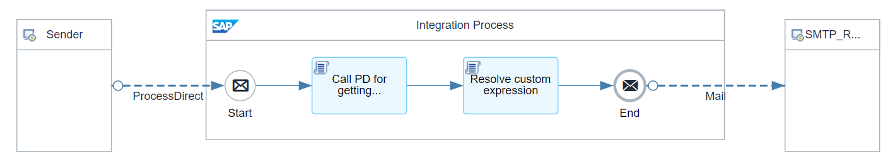
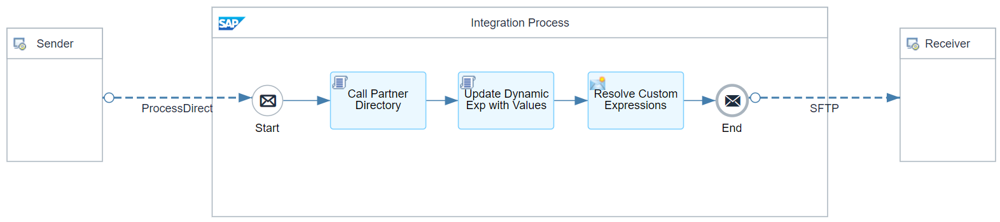
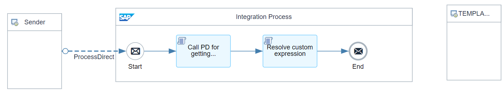

# B2B Integration Factory - Communication Receiver Flows (Custom) 

\| [Recipes by Topic](../../readme.md ) \| [Recipes by Author](../../author.md ) \| [Request Enhancement](https://github.com/SAP-samples/cloud-integration-flow/issues/new?assignees=&labels=Recipe%20Fix,enhancement&template=recipe-request.md&title=Improve%20[B2B%20Integration%20Factory]%20Communication%20Receiver%20Flows%20(Custom)) \| [Report a bug](https://github.com/SAP-samples/cloud-integration-flow/issues/new?assignees=&labels=Recipe%20Fix,bug&template=bug_report.md&title=Issue%20with%20[B2B%20Integration%20Factory]%20Communication%20Receiver%20Flows%20(Custom))\| [Fix documentation](https://github.com/SAP-samples/cloud-integration-flow/issues/new?assignees=&labels=Recipe%20Fix,documentation&template=bug_report.md&title=Docu%20fix%20[B2B%20Integration%20Factory]%20Communication%20Receiver%20Flows%20(Custom)) \| 

  | [SAP Business Accelerator Hub](https://api.sap.com/allcommunity) | 
 ----|----| 

This integration package should cover all custom communication receiver flows, connectable via ProcessDirect at the receiver step of a TPA --> Business Transaction Activity.

This integration package should cover all the custom communication receiver flows, which can be connected via ProcessDirect at the receiver communication step of a TPA --&gt; Business Transaction Activity. SAP provides some example communication flows, such as sending target interchange/message payloads via Email or storing them on an SFTP server.&nbsp;

It also includes an integration flow called "Step 3b - B2B Simulation.Receiver," which is necessary if you want to perform an end-to-end simulation via an API tool where you would like to see the result (target interchange/message payloads) in the HTTP response.&nbsp;

Furthermore, you'll find a template that you can use to create your own communication receiver flow.

[Download the integration package](B2BIntegrationFactoryCommunicationReceiverFlowsCustom.zip)\
[View package on the SAP Business Accelerator Hub](https://api.sap.com/package/B2BIntegrationFactoryCommunicationReceiverFlowsCustom)\
[View documentation, page 16](../b2bintegrationfactorycloudintegrationtradingpartnermanagement/B2B_Integration_Factory_TPM_Integration_Packages.pdf)\
[View high level effort](../b2bintegrationfactorycloudintegrationtradingpartnermanagement/effort.md)

## Integration flows
### Step 3b - B2B Simulation Receiver 
This iflow represents the endpoint that communicates with the sender iflow, accepts incoming data, transforms it if required, and routes it to the appropriate place within the B2B system. \
 
### Step 3b - eMail Receiver 
Picks interchanges from outbound queue and sends them to the final receiver via eMail. Here it is TP specific because a custom header pattern must be passed which is per default not required \
 
### Step 3b - SFTP Receiver 
Picks interchanges from outbound queue and sends them to the final receiver via SFTP. Here it is TP specific because a custom header pattern must be passed which is per default not required. \
 
### Step 3b - TEMPLATE Receiver 
Picks interchanges from outbound queue and sends them to the final receiver by the agreed communication protocols. With this Template receiver iflow, you can create your own iflow using the supported communication protocol.  \
 