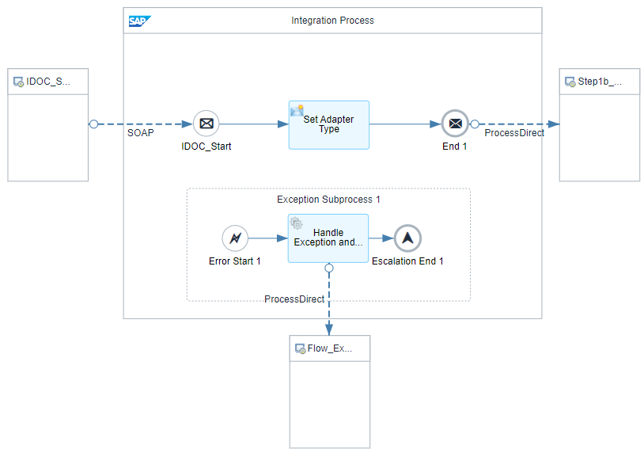
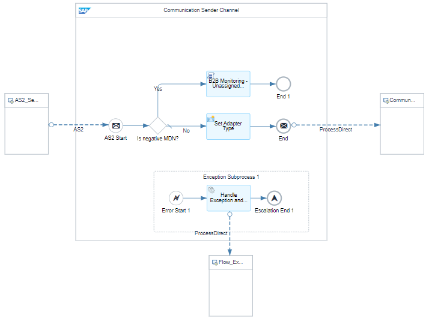
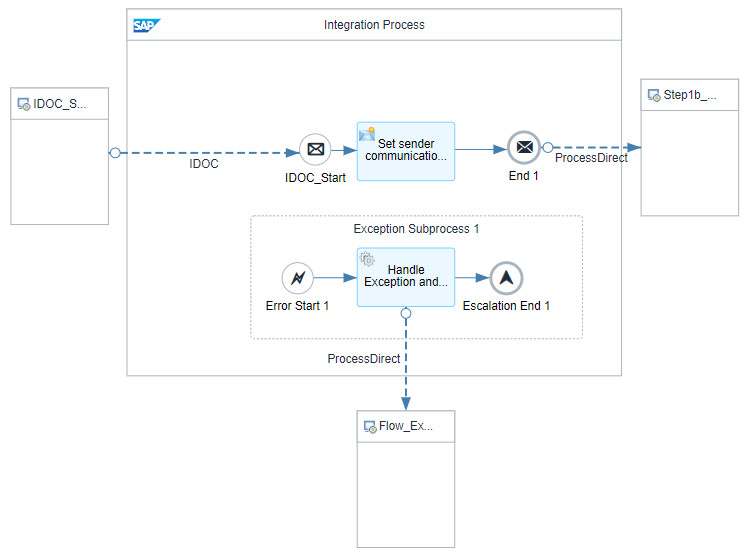
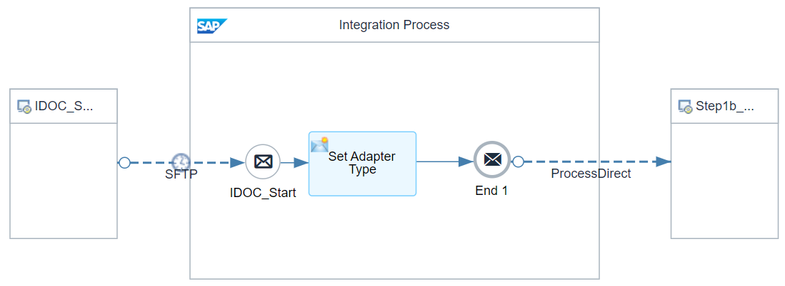
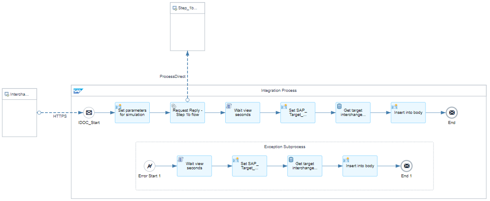
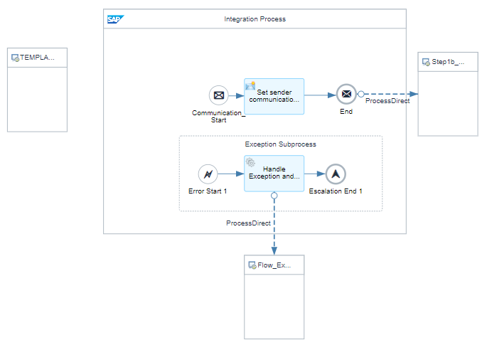
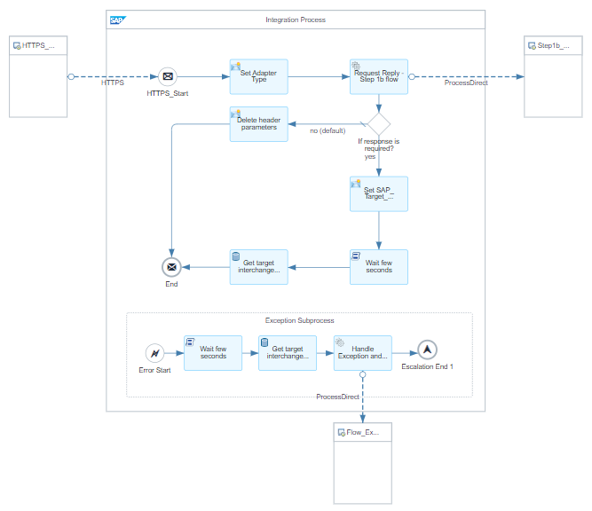

# B2B Integration Factory - Communication Sender Flows 

\| [Recipes by Topic](../../readme.md ) \| [Recipes by Author](../../author.md ) \| [Request Enhancement](https://github.com/SAP-samples/cloud-integration-flow/issues/new?assignees=&labels=Recipe%20Fix,enhancement&template=recipe-request.md&title=Improve%20[B2B%20Integration%20Factory]%20Communication%20Sender%20Flows) \| [Report a bug](https://github.com/SAP-samples/cloud-integration-flow/issues/new?assignees=&labels=Recipe%20Fix,bug&template=bug_report.md&title=Issue%20with%20[B2B%20Integration%20Factory]%20Communication%20Sender%20Flows)\| [Fix documentation](https://github.com/SAP-samples/cloud-integration-flow/issues/new?assignees=&labels=Recipe%20Fix,documentation&template=bug_report.md&title=Docu%20fix%20[B2B%20Integration%20Factory]%20Communication%20Sender%20Flows) \| 

  | [SAP Business Accelerator Hub](https://api.sap.com/allcommunity) | 
 ----|----| 

This integration package provides additional sender communication flows, such as picking up the messages via an SFTP server. Those integration flows are connected via a ProcessDirect Adapter calling the custom integration flow "Step 1b - Sender Interchange Header Extraction Flow".

It also includes an integration flow called "Step 1a - B2B Simulation Sender," which is necessary if you want to perform an end-to-end simulation via an API tool where you would like to see the result (target interchange/message payloads) in the HTTP response. 

Furthermore, you'll find a template that you can use to create your own communication sender flow.

[Download the integration package](B2BIntegrationFactoryCommunicationSenderFlows.zip)\
[View package on the SAP Business Accelerator Hub](https://api.sap.com/package/B2BIntegrationFactoryCommunicationSenderFlows)\
[View documentation, page 14](../b2bintegrationfactorycloudintegrationtradingpartnermanagement/B2B_Integration_Factory_TPM_Integration_Packages.pdf)\
[View high level effort](../b2bintegrationfactorycloudintegrationtradingpartnermanagement/effort.md)
## Integration flows
### Step 1a - SOAP Sender 
Receives messages via SOAP protocol, identifies type system and writes payload and header parameters into message queue \
 
### Step 1a - AS2 Sender 
Receives messages via AS2 protocol, identifies type system and writes payload and header parameters into message queue \
 
### Step 1a - IDOC Sender 
Receives messages via IDoc protocol, identifies type system and writes payload and header parameters into message queue \
 
### Step 1a - SFTP Sender 
Receives messages via SFTP protocol, identifies type system and writes payload and header parameters into message queue \
 
### Step 1a - B2B Simulation Sender 
Receives messages from sender via HTTP/HTTPS protocol and hands over to step 1b flow. \
 
### Step 1a - TEMPLATE Sender 
Receives messages via any supported communication protocol, identifies type system and writes payload and header parameters into message queue \
 
### Step 1a - HTTP Sender 
Receives messages from sender via HTTP/HTTPS protocol and provides a response in synchronous call, if required. \
 