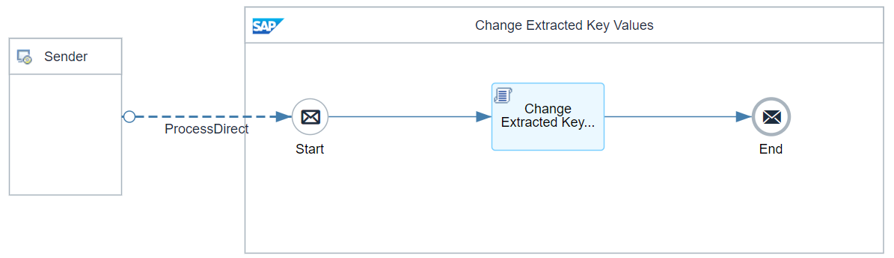
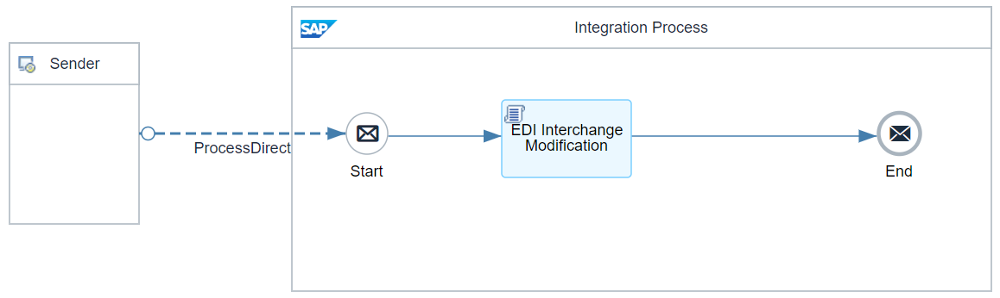
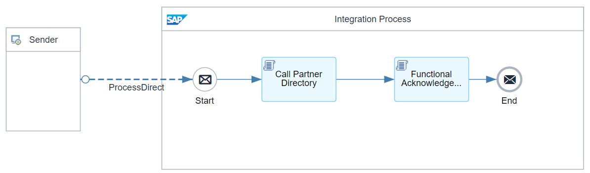

# B2B Integration Factory - Extended Interchange Processing Flows 

\| [Recipes by Topic](../../readme.md ) \| [Recipes by Author](../../author.md ) \| [Request Enhancement](https://github.com/SAP-samples/cloud-integration-flow/issues/new?assignees=&labels=Recipe%20Fix,enhancement&template=recipe-request.md&title=Improve%20[B2B%20Integration%20Factory]%20Extended%20Interchange%20Processing%20Flows) \| [Report a bug](https://github.com/SAP-samples/cloud-integration-flow/issues/new?assignees=&labels=Recipe%20Fix,bug&template=bug_report.md&title=Issue%20with%20[B2B%20Integration%20Factory]%20Extended%20Interchange%20Processing%20Flows)\| [Fix documentation](https://github.com/SAP-samples/cloud-integration-flow/issues/new?assignees=&labels=Recipe%20Fix,documentation&template=bug_report.md&title=Docu%20fix%20[B2B%20Integration%20Factory]%20Extended%20Interchange%20Processing%20Flows) \| 

  | [SAP Business Accelerator Hub](https://api.sap.com/allcommunity) | 
 ----|----| 

This package provides flows and scripts to fulfil additional requirements that are not supported by the standard yet.

It provides additional flows that can be called via ProcessDirect from the main package "B2B Integration Factory - Cloud Integration - Trading Partner Management" flows.&nbsp;

It covers:

<ul>
 <li>Extracted Key Value Change - UN-EDIFACT</li>
 <li>Functional Acknowledgement Interchange Modification - UN-EDIFACT</li>
 <li>Interchange Modification - UN-EDIFACT&nbsp;</li>
</ul>

[Download the integration package](B2BIntegrationFactoryExtendedInterchangeProcessingFlows.zip)\
[View package on the SAP Business Accelerator Hub](https://api.sap.com/package/B2BIntegrationFactoryExtendedInterchangeProcessingFlows)\
[View documentation, page 17](../b2bintegrationfactorycloudintegrationtradingpartnermanagement/B2B_Integration_Factory_TPM_Integration_Packages.pdf)\
[View high level effort](../b2bintegrationfactorycloudintegrationtradingpartnermanagement/effort.md)

## Integration flows
### UN-EDIFACT Extracted Key Value Change 
This Flow is responsible to change the extracted UN-EDIFACT key values, which is needed to match the unique PID. \
 
### UN-EDIFACT Interchange Modification 
This flow is responsible to modify the EDI Interchange payload before they are processed by the EDI Splitter step \
 
### UN-EDIFACT Functional Acknowledgement Interchange Modification 
This Flow is responsible to modify the functional acknowledgement to fit the requirement of the specific partner \
 