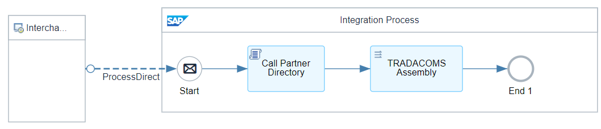
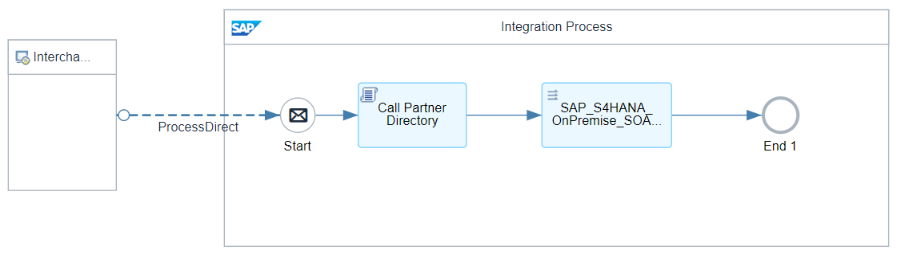
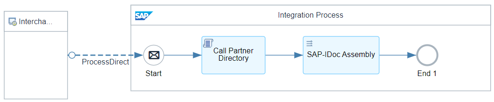
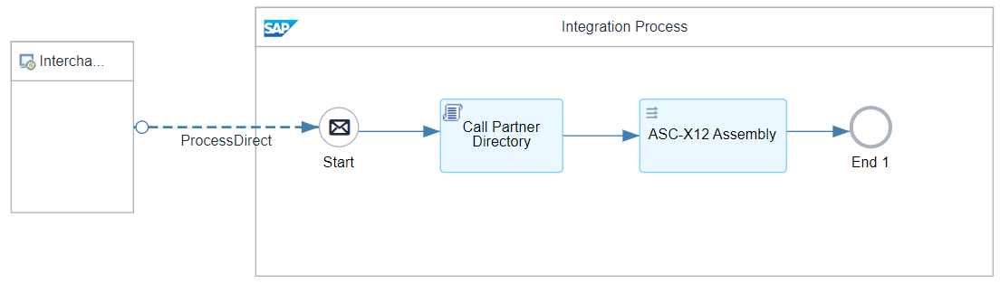
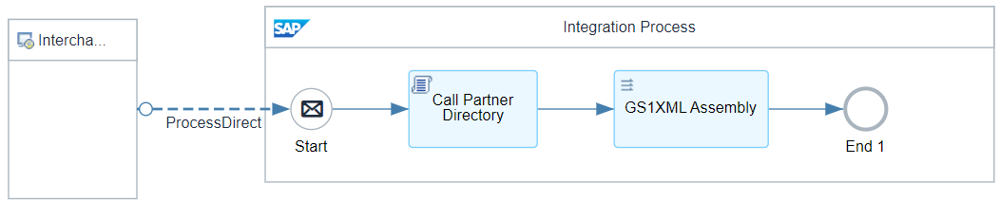
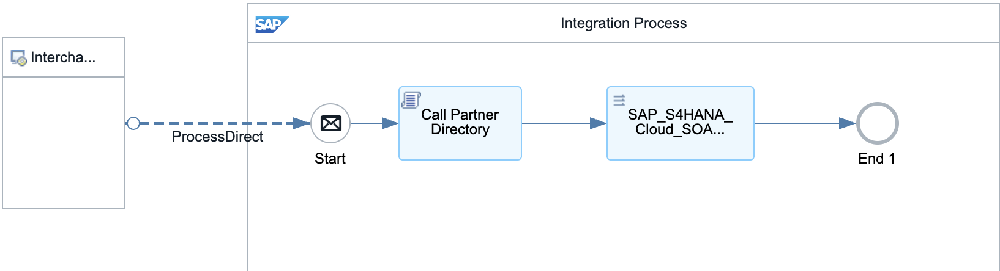
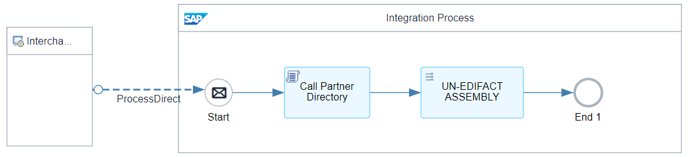

# B2B Integration Factory - Interchange Assembly Flows 

\| [Recipes by Topic](../../readme.md ) \| [Recipes by Author](../../author.md ) \| [Request Enhancement](https://github.com/SAP-samples/cloud-integration-flow/issues/new?assignees=&labels=Recipe%20Fix,enhancement&template=recipe-request.md&title=Improve%20B2B%20Integration%20Factory%20-%20Interchange%20Assembly%20Flows) \| [Report a bug](https://github.com/SAP-samples/cloud-integration-flow/issues/new?assignees=&labels=Recipe%20Fix,bug&template=bug_report.md&title=Issue%20with%20B2B%20Integration%20Factory%20-%20Interchange%20Assembly%20Flows)\| [Fix documentation](https://github.com/SAP-samples/cloud-integration-flow/issues/new?assignees=&labels=Recipe%20Fix,documentation&template=bug_report.md&title=Docu%20fix%20B2B%20Integration%20Factory%20-%20Interchange%20Assembly%20Flows) \| 

  | [SAP Business Accelerator Hub](https://api.sap.com/allcommunity) | 
 ----|----| 

This package includes all integration flows, which are responsible for the final assembly of target (receiver) interchange/message payloads according the conventions of the considered type system.

It provides the relevant Assembly logic for the following type systems:

<ul>
 <li>ASC-X12</li>
 <li>UN-EDIFACT</li>
 <li>TRADACOMS</li>
 <li>SAP-SOAP</li>
 <li>SAP-IDOC</li>
 <li>GS1XML</li>
 <li>TradeXML</li>
</ul>

Furthermore, you'll find a template that you can use to create your own Interchange Assembly flow based upon the type system.

[Download the integration package](B2BIntegrationFactoryInterchangeAssemblyFlows.zip)\
[View package on the SAP Business Accelerator Hub](https://api.sap.com/package/B2BIntegrationFactoryInterchangeAssemblyFlows)\
[View documentation](B2BIntegrationFactoryInterchangeAssemblyFlows.pdf)\
[View high level effort](effort.md)
## Integration flows
### TRADACOMS Interchange Assembly Process 
Assembles the TRADACOMS interchange payload and inserts the TPA Business Transaction Activity parameters into the relevant header elements. \
 
### SAP-S4HANA-OnPremise-SOA Interchange Assembly Process 
Assembles the SAP SOAP message payload and inserts the TPA Business Transaction Activity parameters into the relevant header elements. \
 
### SAP-IDoc Interchange Assembly Process 
Assembles the SAP IDOC message payload and inserts the TPA Business Transaction Activity parameters into the relevant header elements. \
 
### ASC-X12 Interchange Assembly Process 
Assembles the ASC X12 interchange receiver payload and inserts the TPA Business Transaction Activity parameters into the relevant ASC X12 headers. \
 
### GS1XML Interchange Assembly Process 
Assembles the GS1XML interchange payload and inserts the TPA Business Transaction Activity parameters into the relevant header elements. \
 
### SAP-S4HANA-Cloud-SOA Interchange Assembly Process 
Assembles the SAP SOAP message payload and inserts the TPA Business Transaction Activity parameters into the relevant header elements. \
 
### TEMPLATE Interchange Assembly Process 
Assembles the type system's message payload and inserts the TPA Business Transaction Activity parameters into the relevant header elements. \
 
### UN-EDIFACT Interchange Assembly Process 
Assembles the UN/EDIFACT interchange payload and inserts the TPA Business Transaction Activity parameters into the relevant header elements. \
 