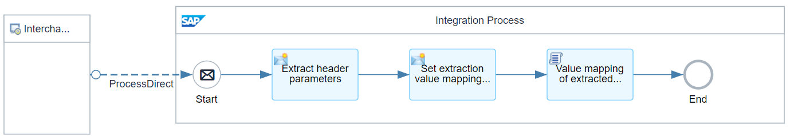
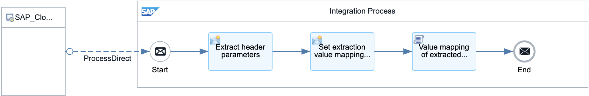
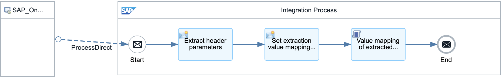
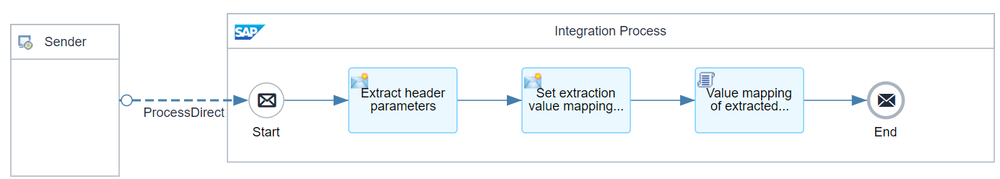
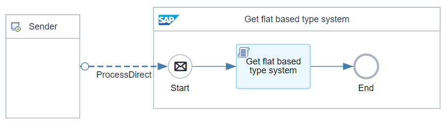
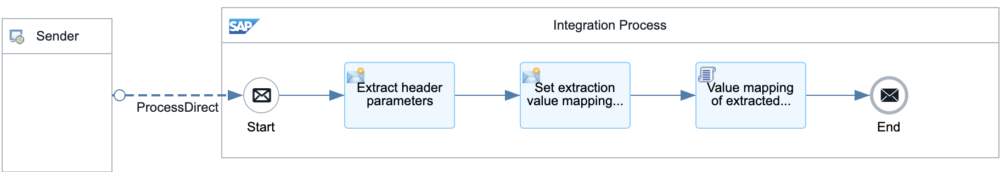
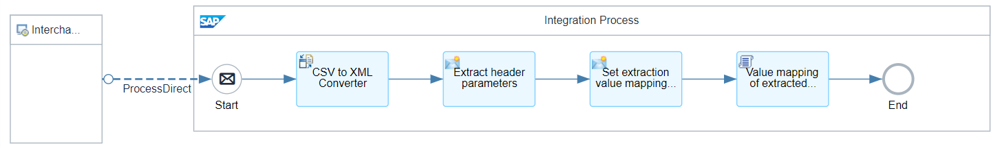
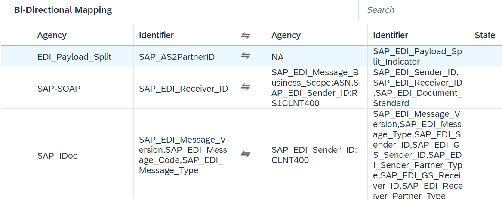
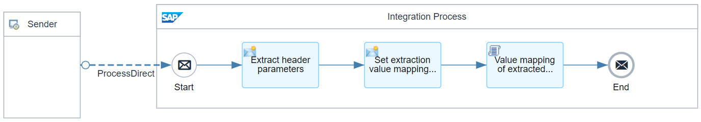
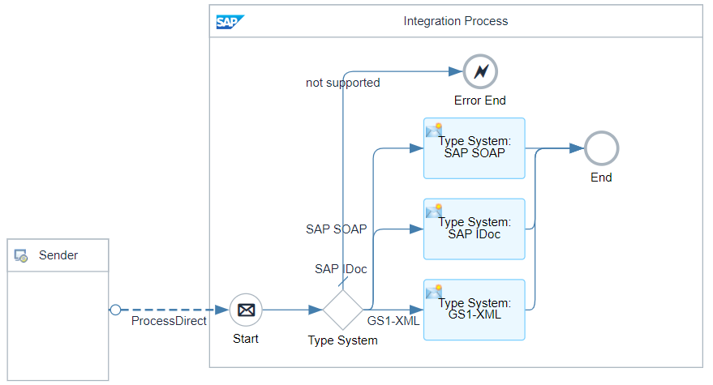

# B2B Integration Factory - Interchange Extraction Flows 

\| [Recipes by Topic](../../readme.md ) \| [Recipes by Author](../../author.md ) \| [Request Enhancement](https://github.com/SAP-samples/cloud-integration-flow/issues/new?assignees=&labels=Recipe%20Fix,enhancement&template=recipe-request.md&title=Improve%20B2B%20Integration%20Factory%20-%20Interchange%20Extraction%20Flows) \| [Report a bug](https://github.com/SAP-samples/cloud-integration-flow/issues/new?assignees=&labels=Recipe%20Fix,bug&template=bug_report.md&title=Issue%20with%20B2B%20Integration%20Factory%20-%20Interchange%20Extraction%20Flows)\| [Fix documentation](https://github.com/SAP-samples/cloud-integration-flow/issues/new?assignees=&labels=Recipe%20Fix,documentation&template=bug_report.md&title=Docu%20fix%20B2B%20Integration%20Factory%20-%20Interchange%20Extraction%20Flows) \| 

  | [SAP Business Accelerator Hub](https://api.sap.com/allcommunity) | 
 ----|----| 

Providing additional integration flows for extracting the relevant parameters and key fields from the headers according to the rules of the different type systems.

It provides the relevant extraction logic as well as the extraction value mapping for the following type systems:

<ul>
 <li>Custom CSV</li>
 <li>Flat File based Type Systems</li>
 <li>XML based Type Systems</li>
 <li>GS1XML</li>
 <li>SAP-IDOC&nbsp;</li>
 <li>SAP-SOAP</li>
</ul>

Furthermore, you'll find a template that you can use to create your own Interchange Extraction flow.

&nbsp;

[Download the integration package](B2BIntegrationFactoryInterchangeExtractionFlows.zip)\
[View package on the SAP Business Accelerator Hub](https://api.sap.com/package/B2BIntegrationFactoryInterchangeExtractionFlows)\
[View documentation](B2BIntegrationFactoryInterchangeExtractionFlows.pdf)\
[View high level effort](effort.md)
## Integration flows
### GS1XML Interchange Extraction Flow 
This flow extracts the necessary parameters from the relevant GS1XML header elements and provides it as exchange header parameters. It also calls the Extraction Value Mapping for substituting parameters that these will fit to the expected PD String. \
 
### SAP-IDOC-Flat Interchange Extraction Flow 
This is the flow that converts IDoc-Flat to IDoc-XML and extracts the necessary parameters from the EDI_DC40 header elements and provides it as exchange header parameters. It also calls the Extraction Value Mapping for substituting parameters. \
 
### SAP-SOAP Cloud Interchange Extraction Flow 
This flow extracts the necessary parameters from the relevant SOAP header elements and provides it as exchange header parameters. It also calls the Extraction Value Mapping for substituting parameters that these will fit to the expected PD String. \
 
### SAP-SOAP On-Premise Interchange Extraction Flow 
This flow extracts the necessary parameters from the relevant SOAP header elements and provides it as exchange header parameters. It also calls the Extraction Value Mapping for substituting parameters that these will fit to the expected PD String. \
 
### TEMPLATE Interchange Extraction Flow 
This flow extracts the necessary parameters from the relevant SOAP header elements and provides it as exchange header parameters. It also calls the Extraction Value Mapping for substituting parameters that these will fit to the expected PD String. \
 
### Get flat based Type System 
This flow identifies the flat based payload based on syntax type, which can't be identified by the EDI extractor or the XPath expression. \
 
### VDA-AUTOMOTIVE-Flat Interchange Extraction Flow 
This flow extracts the necessary parameters from the relevant VDA Flat header elements and provides it as exchange header parameters. It also calls the Extraction Value Mapping for substituting parameters that these will fit to the expected PD String. \
 
### CSV-Custom Interchange Extraction Flow 
This flow extracts the necessary parameters from the relevant CSV header elements and provides it as exchange header parameters. It also calls the Extraction Value Mapping for substituting parameters that these will fit to the expected PD String \
 
### Extraction Value Mapping 
This value mapping includes all value mappings for the diverse type system related extraction rules. For e.g. map several source sender ids to one target sender id which is for calculation of the PID of the corresponding PD entry. \
 
### SAP-IDOC Interchange Extraction Flow 
This is the flow extracts the necessary parameters from the EDI_DC40 header elements and provides it as exchange header parameters. It also calls the Extraction Value Mapping for substituting parameters that these will fit to the expected PD String. \
 
### Get XML based Type System 
This external iflow is called, if the payload is based on XML and a type system is not set by the step 1a flow. \
 