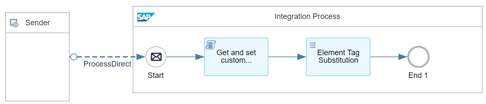
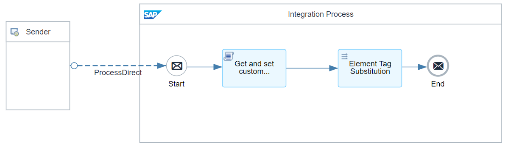
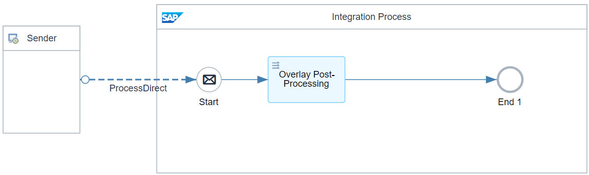
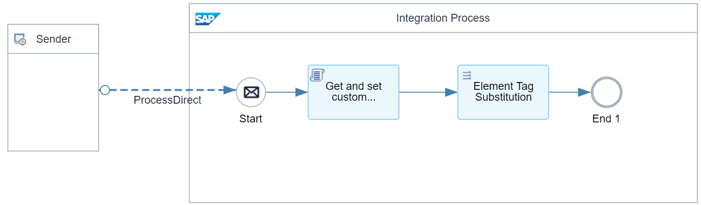
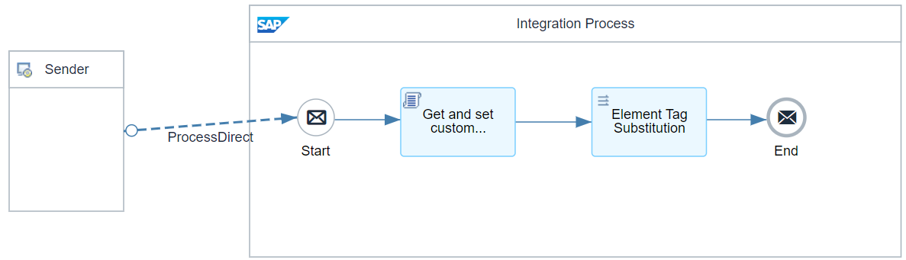

# B2B Integration Factory - Pre and Post-Processing Flows - Custom 

\| [Recipes by Topic](../../readme.md ) \| [Recipes by Author](../../author.md ) \| [Request Enhancement](https://github.com/SAP-samples/cloud-integration-flow/issues/new?assignees=&labels=Recipe%20Fix,enhancement&template=recipe-request.md&title=Improve%20[B2B%20Integration%20Factory]%20Pre%20and%20Post-Processing%20Flows%20-%20Custom) \| [Report a bug](https://github.com/SAP-samples/cloud-integration-flow/issues/new?assignees=&labels=Recipe%20Fix,bug&template=bug_report.md&title=Issue%20with%20[B2B%20Integration%20Factory]%20Pre%20and%20Post-Processing%20Flows%20-%20Custom)\| [Fix documentation](https://github.com/SAP-samples/cloud-integration-flow/issues/new?assignees=&labels=Recipe%20Fix,documentation&template=bug_report.md&title=Docu%20fix%20[B2B%20Integration%20Factory]%20Pre%20and%20Post-Processing%20Flows%20-%20Custom) \| 

  | [SAP Business Accelerator Hub](https://api.sap.com/allcommunity) | 
 ----|----| 

This package provides custom iflows, which are necessary for the required pre-/post-processing in the prepackaged TPAs.

In the Pre-Processing Flow, data can be manipulated, validated, or transformed before it enters the main data processing flow. This upfront manipulation can be useful for data cleansing, format standardization, or other necessary adjustments.

The Post-Processing Flow, on the other hand, takes effect after the main process. It might involve activities such as logging, notification, error handling, or additional formatting.

Both flows serve to enhance the overall efficiency and effectiveness of the main data processing flow, creating a smoothly running, fully customized integration process.

[Download the integration package](B2BIntegrationFactoryPreandPostProcessingFlowsCustom.zip)\
[View package on the SAP Business Accelerator Hub](https://api.sap.com/package/B2BIntegrationFactoryPreandPostProcessingFlowsCustom)\
[View documentation, page 17](../b2bintegrationfactorycloudintegrationtradingpartnermanagement/B2B_Integration_Factory_TPM_Integration_Packages.pdf)\
[View high level effort](../b2bintegrationfactorycloudintegrationtradingpartnermanagement/effort.md)

## Integration flows
### Pre-Processing - BASE - 01 - Purchase Order - Inbound UN-EDIFACT 
Transforms the Overlay Payload into the version of Base Payload.\ 
 
### Post-Processing - BASE - 03 - DeliveryBasedASN - Outbound UN-EDIFACT 
Transforms the Target Structure to the Overlay Target Structure Version for Both Base as well as Overlay. And this is applicable for all BASE Outbound Scripts. \
 
### Post-Processing - BASE - 04 - Invoice - Outbound TRADACOMS 
Transforms the Target Structure to the Overlay Target Structure Version for Both Base as well as Overlay. And this is applicable for all BASE Outbound Scripts. \
 
### Post-Processing - BASE - 04 - Invoice - Outbound UN-EDIFACT 
Transforms the Target Structure to the Overlay Target Structure Version for Both Base as well as Overlay. And this is applicable for all BASE Outbound Scripts. \
 
### Post-Processing - BASE - 02 - OrderConfirmation - Outbound UN-EDIFACT 
Transforms the Target Structure to the Overlay Target Structure Version for Both Base as well as Overlay. And this is applicable for all BASE Outbound Scripts. \
 