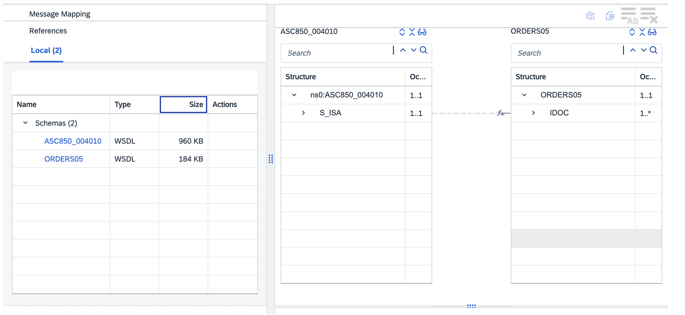

# B2B Interface Migration Accelerator - ASCX12 

\| [Recipes by Topic](../../readme.md ) \| [Recipes by Author](../../author.md ) \| [Request Enhancement](https://github.com/SAP-samples/cloud-integration-flow/issues/new?assignees=&labels=Recipe%20Fix,enhancement&template=recipe-request.md&title=Improve%20B2B%20Interface%20Migration%20Accelerator%20-%20ASCX12) \| [Report a bug](https://github.com/SAP-samples/cloud-integration-flow/issues/new?assignees=&labels=Recipe%20Fix,bug&template=bug_report.md&title=Issue%20with%20B2B%20Interface%20Migration%20Accelerator%20-%20ASCX12)\| [Fix documentation](https://github.com/SAP-samples/cloud-integration-flow/issues/new?assignees=&labels=Recipe%20Fix,documentation&template=bug_report.md&title=Docu%20fix%20B2B%20Interface%20Migration%20Accelerator%20-%20ASCX12) \| 

  | [SAP Business Accelerator Hub](https://api.sap.com/allcommunity) | 
 ----|----| 

This package helps in migrating 1:1 B2B interfaces using ASC X12 message types from SAP PI/PO to SAP Cloud Integration. This includes pre-configured templates that facilitates quick migration process.

To help to migrate the B2B interfaces using ASC X12 messages types from SAP PI/PO to SAP Cloud Integration, this packages provides:

<ul>
 <li>A template integration flow for the inbound interfaces</li>
 <li>A generic integration flow for a structure modification for the inbound scenario</li>
 <li>A sample message mapping for the inbound scenario (ORDERS05)</li>
 <li>A template integration flow for the outbound interfaces</li>
 <li>A generic integration flow for a structure modification for the outbound scenario</li>
 <li>A sample message mapping for the outbound scenario (INVOIC02)</li>
</ul>

[Download the integration package](BIMAB2BInterfaceMigrationAcceleratorASCX12.zip)\
[View package on the SAP Business Accelerator Hub](https://api.sap.com/package/BIMAB2BInterfaceMigrationAcceleratorASCX12)\
[View documentation](BIMAB2BInterfaceMigrationAcceleratorASCX12.pdf)\
[View high level effort](effort.md)
## Integration flows
### MM_INVOIC02_TO_ASC810_4010_Sample 
This is a sample outbound message mapping imported from SAP PI/PO system \
 
### BIMA - ASCX12 Structure Modifier Flow - Outbound 
This generic iFlow contains the logic to modify PI/PO specific ASCX12 XML to Cloud Integration specific XML file and forward it to Converter flow \
 
### BIMA - ASCX12 Essential Scripts 
This script collection includes Groovy Scripts which facilitates B2B ASCX12 Interfaces Migration from PI/PO to Cloud Integration \
 
### MM_ASC850_4010_TO_ORDERS05_Sample 
This is a sample inbound message mapping imported from SAP PI/PO system \
 
### BIMA - ASCX12 Flow - Inbound_TEMPLATE 
This iFlow template can be used to migrate B2B ASCX12 message type inbound interfaces from SAP PI/PO to Cloud Integration \
 
### BIMA - ASCX12 Structure Modifier Flow - Inbound 
This generic iFlow contains the logic to modify Cloud Integration Specific ASCX12 XML to PI/PO specific XML file and forward it to Mapper flow \
 
### BIMA - ASCX12 Flow - Outbound_TEMPLATE 
This iFlow template can be used to migrate B2B ASCX12 message type outbound interfaces from SAP PI/PO to Cloud Integration \
 