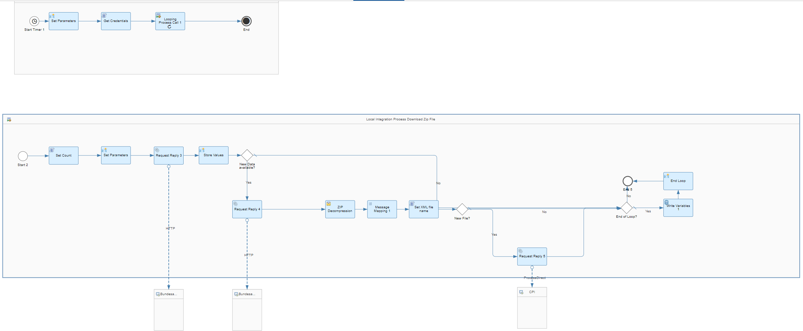
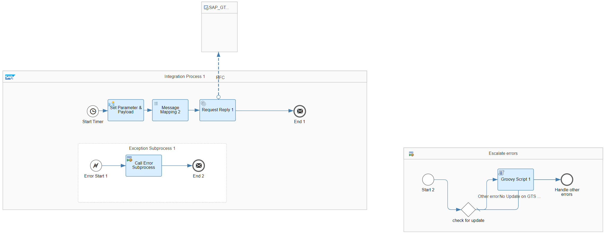

# Bundesanzeiger Integration with SAP S/4HANA GTS OnPremise

\| [Recipes by Topic](../../readme.md ) \| [Recipes by Author](../../author.md ) \| [Request Enhancement](https://github.com/SAP-samples/cloud-integration-flow/issues/new?assignees=&labels=Recipe%20Fix,enhancement&template=recipe-request.md&title=Improve%20Bundesanzeiger%20Integration%20with%20SAP%20S4HANA%20GTS%20OnPremise%20 ) \| [Report a bug](https://github.com/SAP-samples/cloud-integration-flow/issues/new?assignees=&labels=Recipe%20Fix,bug&template=bug_report.md&title=Issue%20with%20Bundesanzeiger%20Integration%20with%20SAP%20S4HANA%20GTS%20OnPremise%20 ) \| [Fix documentation](https://github.com/SAP-samples/cloud-integration-flow/issues/new?assignees=&labels=Recipe%20Fix,documentation&template=bug_report.md&title=Docu%20fix%20Bundesanzeiger%20Integration%20with%20SAP%20S4HANA%20GTS%20OnPremise%20 ) \|

 | [SAP API Business Hub](https://api.sap.com/allcommunity) |
----|----|

Bundesanzeiger Integration with SAP S/4HANA GTS OnPremise provides an Integration with SLP sanction list of the Bundesanzeiger to SAP S/4HANA GTS (Global Trade System) System in order to replicate blocked Business Partners

This package enables consumption of the scenarios below:

1. Query and send SanctionsLists from Bundesanzeiger to SAP S/4HANA GTS
2. Send SanctionsLists to SAP S/4HANA GTS
3. Trigger SanctionsLists processing in SAP S/4HANA GTS

[Download the reuseable integration package](BundesanzeigerIntegrationwithSAPS4HANAGTSOnPremise.zip)\
[View package on the SAP API Business Hub](https://api.sap.com/package/BundesanzeigerIntegrationwithSAPS4HANAGTSOnPremise/overview)\
[View documentation on the SAP API Business Hub](https://api.sap.com/odata/1.0/catalog.svc/Files('e3766d1a584c4e4fb2eaacc5c858b4c0')/$value)\
[View high level effort estimate](effort.md)

## Integration Flows

### Query and send SanctionsLists from Bundesanzeiger to SAP S4HANA GTS
Query SanctionsLists from Bundesanzeiger and mirror to SAP S/4HANA GTS\
[View on SAP API Business Hub](https://api.sap.com/integrationflow/Query_and_send_SanctionsLists_from_Bundesanzeiger_to_SAP_S4_HANA_GTS_copy)

### Send SanctionsLists to SAP S4HANA GTS
Send SanctionsLists from Bundesanzeiger and mirror to SAP S/4HANA GTS\
[View on SAP API Business Hub](https://api.sap.com/integrationflow/Send_SanctionsLists_to_SAP_S4_HANA_GTS_copy)

### Trigger SanctionsLists processing in SAP S4HANA GTS
iFlow to Trigger SanctionsLists processing on SAP S/4HANA GTS side (needs to run after "Query and send SanctionsLists from Bundesanzeiger to SAP S/4HANA GTS" iFlow)\
[View on SAP API Business Hub](https://api.sap.com/integrationflow/Trigger_SanctionsLists_processing_in_SAP_S4_HANA_GTS_copy)

