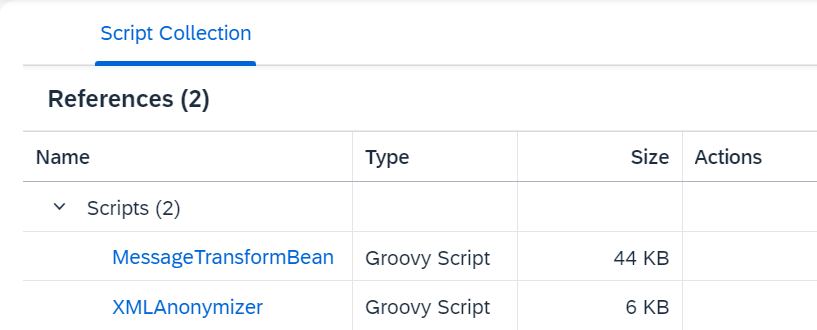
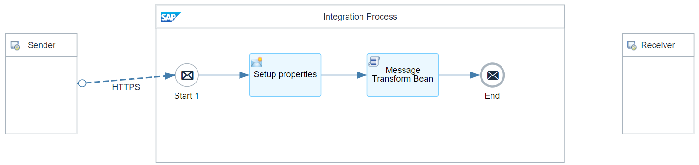
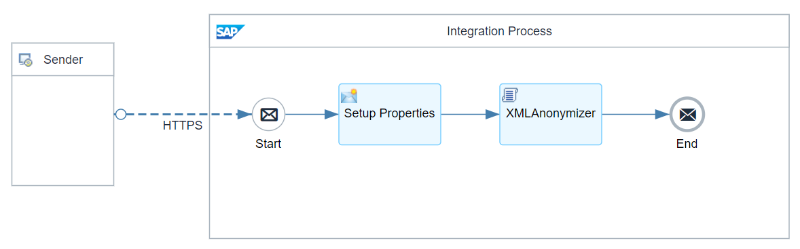
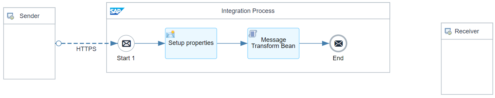
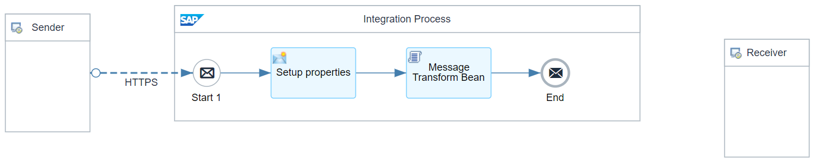
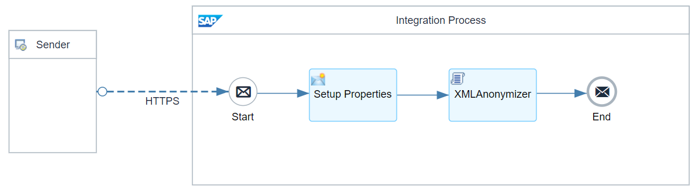
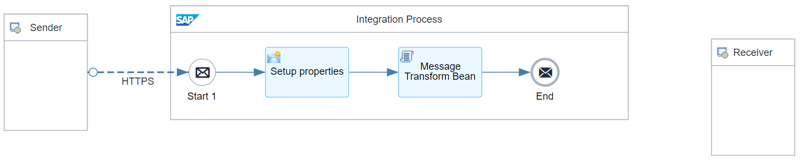
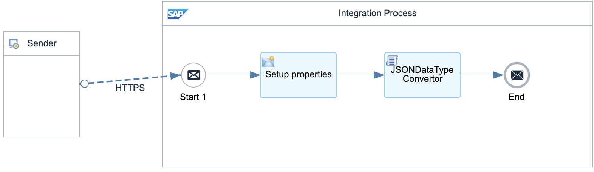
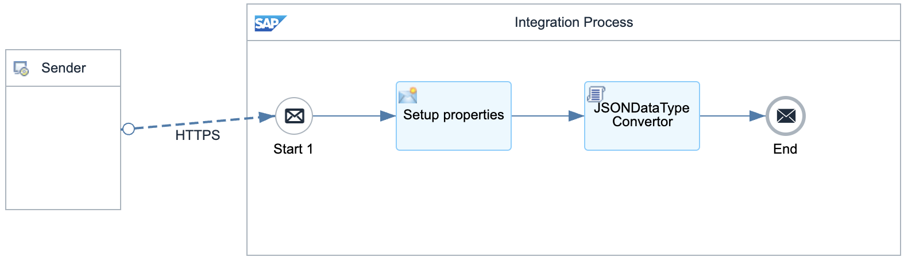
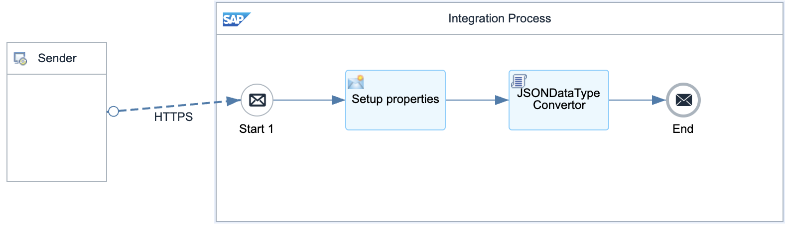

# Message Transformation Utilities 

\| [Recipes by Topic](../../readme.md ) \| [Recipes by Author](../../author.md ) \| [Request Enhancement](https://github.com/SAP-samples/cloud-integration-flow/issues/new?assignees=&labels=Recipe%20Fix,enhancement&template=recipe-request.md&title=Improve%20Message%20Transformation%20Utilities) \| [Report a bug](https://github.com/SAP-samples/cloud-integration-flow/issues/new?assignees=&labels=Recipe%20Fix,bug&template=bug_report.md&title=Issue%20with%20Message%20Transformation%20Utilities)\| [Fix documentation](https://github.com/SAP-samples/cloud-integration-flow/issues/new?assignees=&labels=Recipe%20Fix,documentation&template=bug_report.md&title=Docu%20fix%20Message%20Transformation%20Utilities) \| 

  | [SAP Business Accelerator Hub](https://api.sap.com/allcommunity) | 
 ----|----| 

This package contains artifacts that help transform message payloads between various formats, such as XML, plain text, CSV, and JSON.
The overall aim is to deliver various functionalities that once existed in SAP Process Orchestration as Adapter Modules.

This package is designed to provide an alternative migration solution for adapter modules previously used in SAP Process Orchestration (PO) to the new Cloud Integration. It includes a comprehensive suite of artifacts that facilitate the transformation of message payloads across various formats, such as XML, plain text, CSV, and JSON. The package ensures that the functionalities that were once part of SAP Process Orchestration through Adapter Modules are retained and enhanced in the Cloud Integration. 

The utilities provided are:

<ol>
 <li>MessageTransformBean.</li>
 <li>XMLAnonymizer.</li>
</ol>

[Download the integration package](com.sap.integration.cloud.utilities.MessageTransformations.zip)\
[View package on the SAP Business Accelerator Hub](https://api.sap.com/package/com.sap.integration.cloud.utilities.MessageTransformations)\
[View documentation about MessageTransormBean](MessageTransformBean_community_documentation.pdf)\
[View documentation about XMLAnonymizer](XMLAnonymizerBean_community_documentation.pdf)\
[View Postman collection](MessageTransformations.postman_collection.json)\
[View high level effort](effort.md)
## Integration flows
### MessageTransformBean - StructurePlainToXML - TC1 
Transforming structure plain text messages to XML with a fixed field length, without headers \
 
### MessageTransformBean - SimpleXMLToPlain - TC3 
Transforming XML to plain text messages with a fixed field length, without headers \
 
### MessageTransformBean - SimpleXMLToPlain - TC2 
Transforming XML to plain text messages with a separator and headers payload \
 
### MessageTransformBean - StructureXMLToPlain - TC2 
Transforming structure XML to plain text messages with fixed field length and headers properties. \
 
### MessageTransformations Utilities 
Script Collection containing the converted Adapter Modules from SAP Process Orchestration. \
 
### MessageTransformBean - SimplePlain2XML - TC2 
Transforming plain text messages to XML where there is a fixed field length without headers \
 
### XMLAnonymizer - Remove Prefix 
Remove the prefix of the given namespace from an incoming XML message \
 
### MessageTransformBean - SimplePlain2XML - TC4 
Transforming plain text messages to XML where there is a separator and no headers. \
 
### MessageTransformBean - SimplePlain2XML - TC5 
Transforming plain text messages to XML where there is a separator and with headers.\
 
### MessageTransformBean - StructurePlainToXML - TC7 
Transforming structure plain text messages to XML FFL, Single Object \
 
### MessageTransformBean - StructurePlainToXML - TC3 
Transforming structure plain text messages to XML FFL with a separator, without headers \
 
### MessageTransformBean - StructureXMLToPlain - TC1 
Transforming structure XML to plain text messages with headers payload \
 
### MessageTransformBean - StructurePlainToXML - TC4 
Transforming structure plain text messages to XML FFL with a separator, with headers \
 
### MessageTransformBean - SimpleXMLToPlain - TC1 
Transforming XML to plain text messages with a separator and headers \
 
### XMLAnonymizer - Rename Namespaces 
Rename the prefix of certain namespaces from an incoming XML message \
 
### MessageTransformBean - SimplePlain2XML - TC3 
Transforming plain text messages to XML where there is a fixed field length with headers not available. \
 
### MessageTransformBean - StructurePlainToXML - TC2 
Transforming structure plain text messages to XML with a separator, without headers \
 
### MessageTransformBean - StructurePlainToXML - TC6 
Transforming structure plain text messages to XML FFL , without headers Filter 1E \
 
### MessageTransformBean - SimplePlain2XML - TC1 
Transforming plain text messages to XML where there is a fixed field length with headers. \
 
### MessageTransformBean - StructureXMLToPlain - TC3 
Transforming structure XML to plain text messages with Separator Filter \
 
### MessageTransformBean - StructurePlainToXML - TC5 
Transforming structure plain text messages to XML FFL , without headers Filter 2E \
 
 ### JSONDataTypeConvertor - TC1 - Dynamic Conversion 
Uses script ‘JSONDataTypeConvertor’ to convert JSON properties in a payload from String to Integer, Decimal and Boolean with dynamic determination. \
 
### JSONDataTypeConvertor - TC2 - SpecificTypes 
Uses script ‘JSONDataTypeConvertor’ to convert JSON properties in a payload from String to Integer, Decimal and Boolean. \
 
### JSONDataTypeConvertor - TC3 - Decimal to Integer 
Uses script ‘JSONDataTypeConvertor’ to convert JSON properties in a payload from String to Integer or Decimal. \
 