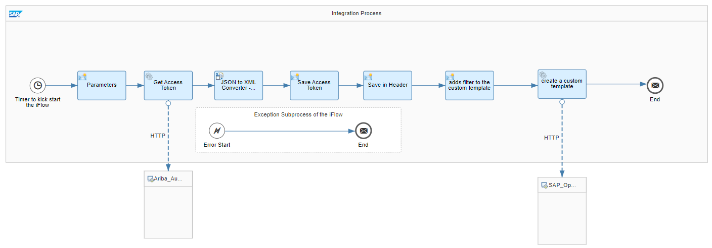
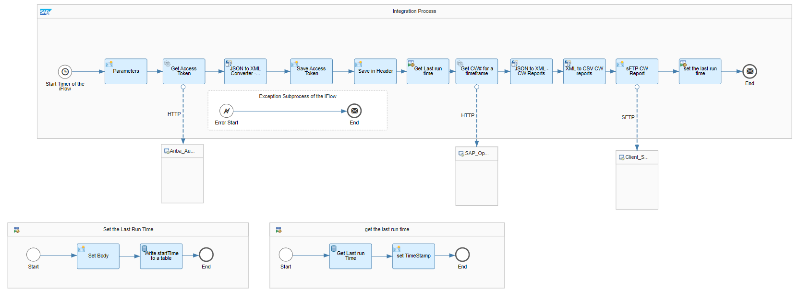

# Contract Line Item Document (CLID) Integration with Third Party System 

\| [Recipes by Topic](../../readme.md ) \| [Recipes by Author](../../author.md ) \| [Request Enhancement](https://github.com/SAP-samples/cloud-integration-flow/issues/new?assignees=&labels=Recipe%20Fix,enhancement&template=recipe-request.md&title=Improve%20Contract%20Line%20Item%20Document%20(CLID)%20Integration%20with%20Third%20Party%20System) \| [Report a bug](https://github.com/SAP-samples/cloud-integration-flow/issues/new?assignees=&labels=Recipe%20Fix,bug&template=bug_report.md&title=Issue%20with%20Contract%20Line%20Item%20Document%20(CLID)%20Integration%20with%20Third%20Party%20System)\| [Fix documentation](https://github.com/SAP-samples/cloud-integration-flow/issues/new?assignees=&labels=Recipe%20Fix,documentation&template=bug_report.md&title=Docu%20fix%20Contract%20Line%20Item%20Document%20(CLID)%20Integration%20with%20Third%20Party%20System) \| 

  | [SAP Business Accelerator Hub](https://api.sap.com/allcommunity) | 
 ----|----| 

This package provides an automated way to replicate documents from SAP Ariba to any Third Party system using SAP Business Technology Platform Integration Suite and SAP Build Process Automation.

This package provides two Iflows:

Step 1 - External Sync Contract template Creation

Step 2 - Contract Workspace Report

&nbsp;

Note that the customer would also need to activate the content on SAP Build Process Automation.

[Download the integration package](ContractLineItemDocumentCLIDIntegrationwithThirdPartySystem.zip)\
[View package on the SAP Business Accelerator Hub](https://api.sap.com/package/ContractLineItemDocumentCLIDIntegrationwithThirdPartySystem)\
[View documentation](ConfigurationGuide_CLIDIntegrationwithThirdParty.pdf)\
[View high level effort](effort.md)
## Integration flows
### Step 1 - External Sync Contract template Creation 
This iFlow creates a custom template (CW_iRPA_Template- as an one time activity) to export report of Contract workspace created on a day timeframe which are pending to push to external system. \
 
### Step 2 - Contract Workspace Report 
This iFlow use the custom template created from step 1 and extract the report which has contract workspaces created on a particular day pending to push to external system. \
 