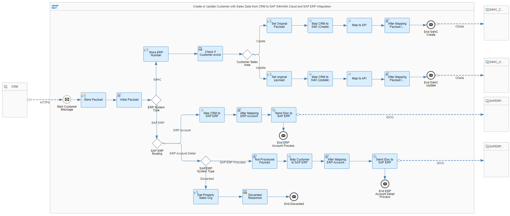
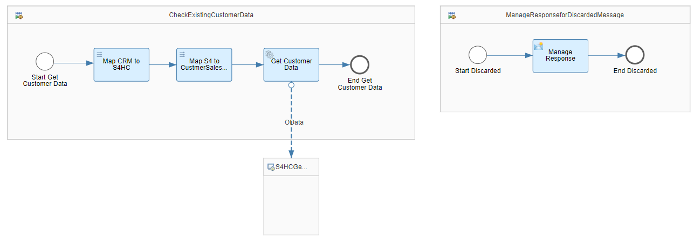
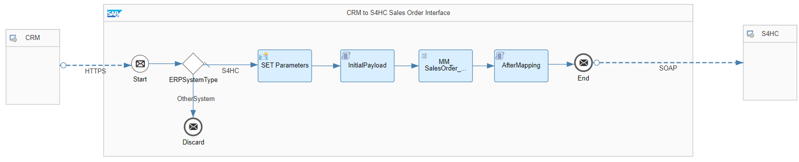

# Microsoft Dynamics CRM Integration with SAP S/4HANA Cloud and SAP ERP 

\| [Recipes by Topic](../../readme.md ) \| [Recipes by Author](../../author.md ) \| [Request Enhancement](https://github.com/SAP-samples/cloud-integration-flow/issues/new?assignees=&labels=Recipe%20Fix,enhancement&template=recipe-request.md&title=Improve%20Microsoft%20Dynamics%20CRM%20Integration%20with%20SAP%20S/4HANA%20Cloud%20and%20SAP%20ERP) \| [Report a bug](https://github.com/SAP-samples/cloud-integration-flow/issues/new?assignees=&labels=Recipe%20Fix,bug&template=bug_report.md&title=Issue%20with%20Microsoft%20Dynamics%20CRM%20Integration%20with%20SAP%20S/4HANA%20Cloud%20and%20SAP%20ERP)\| [Fix documentation](https://github.com/SAP-samples/cloud-integration-flow/issues/new?assignees=&labels=Recipe%20Fix,documentation&template=bug_report.md&title=Docu%20fix%20Microsoft%20Dynamics%20CRM%20Integration%20with%20SAP%20S/4HANA%20Cloud%20and%20SAP%20ERP) \| 

  | [SAP Business Accelerator Hub](https://api.sap.com/allcommunity) | 
 ----|----| 

This package enables creation or change of Customer master and sales data between Microsoft Dynamics CRM, SAP S/4HANA Cloud and SAP ERP.

This package enables creation or change of Customer master data and Customer sales data between CRM, SAP S/4HANA Cloud and SAP ERP.

The integration keeps the data synchronized between all these systems, Customers are synchronized directly from CRM to SAP S/4HANA Cloud system or SAP ERP and the inverse integration should be allowed.

This Package has the following IFlows:&nbsp;

<ul>
 <li>Create or Update Customer with Sales Data from Microsoft Dynamics CRM to SAP S/4HANA Cloud and SAP ERP</li>
 <li>Create Sales Order from Microsoft Dynamics to SAP S4HANA Cloud</li>
</ul>

[Download the integration package](MicrosoftDynamicsCRMIntegrationwithSAPS_4HANACloudandSAPERP.zip)\
[View package on the SAP Business Accelerator Hub](https://api.sap.com/package/CRMIntegrationwithSAPS4HANACloudandSAPERP)\
[View documentation for the creation and update of customer with sales data](CreateorUpdateCustomerwithSalesDatafromCRMtoSAPS4HANACloudandSAPERP.pdf)\
[View documentation for sales order creation](CreateSalesOrderfromCRMtoSAPS4HANACloud.pdf)\
[View high level effort](effort.md)
## Integration flows
### Create or Update Customer with Sales Data from Microsoft Dynamics CRM to SAP S4HANA Cloud and SAP ERP 
Create or update customer with sales data between Microsoft Dynamics CRM to SAP S/4HANA Cloud (via OData) and SAP ERP (via IDoc). \
 \
 
### Create Sales Order from Microsoft Dynamics to SAP S4HANA Cloud
Send sales order data from Microsoft Dynamics to SAP S/4HANA Cloud (via SOAP).\
 